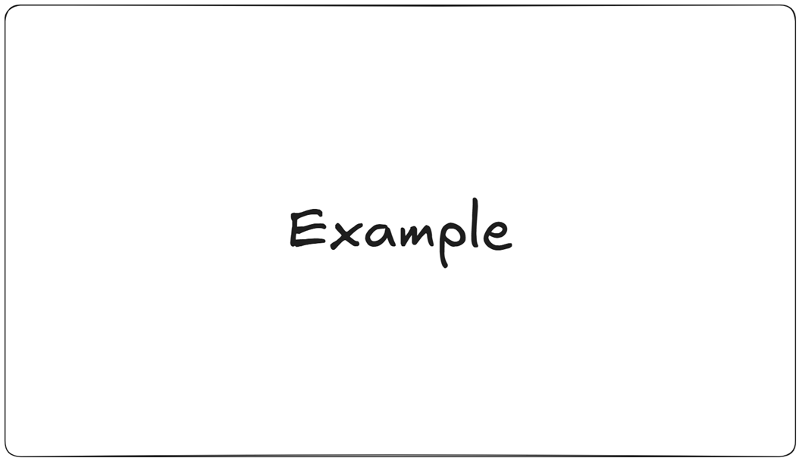

<h1 align="center"> Data Engineering </h1>

# Content

1. [Chapter 1: Introduction to Data Engineering](#chapter1)
    - [Chapter 1 - Part 1: What is Data Engineering?](#chapter1part1)
      - [Chapter 1 - Part 1.1: Core Principles of Data Engineering](#chapter1part1.1)
      - [Chapter 1 - Part 1.2: Key Concepts in Data Engineering](#chapter1part1.2)
      - [Chapter 1 - Part 1.3: Practical Examples and Demonstrations](#chapter1part1.3)
    - [Chapter 1 - Part 2: Data Engineer Roles and Responsibilities](#chapter1part2)
      - [Chapter 1 - Part 2.1: Core Responsibilities of a Data Engineer](#chapter1part2.1)
      - [Chapter 1 - Part 2.2: Specific Roles Within Data Engineering](#chapter1part2.2)
      - [Chapter 1 - Part 2.3: Skills Required for Data Engineering Roles](#chapter1part2.3)
      - [Chapter 1 - Part 2.4: Real-World Application](#chapter1part2.4)
    - [Chapter 1 - Part 3: The Data Engineering Lifecycle](#chapter1part3)
      - [Chapter 1 - Part 3.1: The Data Engineering Lifecycle Stages](#chapter1part3.1)
      - [Chapter 1 - Part 3.2: Real-World Application](#chapter1part3.2)
    - [Chapter 1 - Part 4: Introduction to Data Architecture](#chapter1part4)
      - [Chapter 1 - Part 4.1: What is Data Architecture?](#chapter1part4.1)
      - [Chapter 1 - Part 4.2: Data Architecture Patterns](#chapter1part4.2)
      - [Chapter 1 - Part 4.3: Data Architecture vs. Data Modeling](#chapter1part4.3)
      - [Chapter 1 - Part 4.4: The Role of a Data Architect](#chapter1part4.4)
    - [Chapter 1 - Part 5: Data Engineering vs. Data Science vs. Data Analytics](#chapter1part5)
      - [Chapter 1 - Part 5.1: Defining Data Engineering](#chapter1part5.1)
      - [Chapter 1 - Part 5.2: Defining Data Science](#chapter1part5.2)
      - [Chapter 1 - Part 5.3: Defining Data Analytics](#chapter1part5.3)
      - [Chapter 1 - Part 5.4: Key Differences and Overlaps](#chapter1part5.4)
    - [Chapter 1 - Part 6: Setting up Your Data Engineering Environment (Cloud or Local)](#chapter1part6)
      - [Chapter 1 - Part 6.1: Cloud vs. Local Environments: A Detailed Comparison](#chapter1part6.1)
      - [Chapter 1 - Part 6.2: Setting Up a Local Data Engineering Environment](#chapter1part6.2)
      - [Chapter 1 - Part 6.3: Setting Up a Cloud Data Engineering Environment](#chapter1part6.3)
      - [Chapter 1 - Part 6.4: Practice Activities](#chapter1part6.4)
2. [Chapter 2: Data Storage Fundamentals](#chapter2)
    - [Chapter 2 - Part 1: Introduction to Databases: Relational vs. NoSQL](#chapter2part1)
      - [Chapter 2 - Part 1.1: Relational Databases: Concepts and Characteristics](#chapter2part1.1)
      - [Chapter 2 - Part 1.2: NoSQL Databases: Concepts and Characteristics](#chapter2part1.2)
      - [Chapter 2 - Part 1.3: Choosing Between Relational and NoSQL Databases](#chapter2part1.3)
    - [Chapter 2 - Part 2: Relational Database Concepts: Tables, Schemas, and Keys](#chapter2part2)
      - [Chapter 2 - Part 2.1: Tables: Organizing Data into Rows and Columns](#chapter2part2.1)
      - [Chapter 2 - Part 2.2: Schemas: Organizing Tables and Defining Structure](#chapter2part2.2)
      - [Chapter 2 - Part 2.3: Keys: Establishing Relationships and Ensuring Data Integrity](#chapter2part2.3)
    - [Chapter 2 - Part 3: Introduction to SQL: Querying and Data Manipulation](#chapter2part3)
      - [Chapter 2 - Part 3.1: Relational Database Refresher](#chapter2part3.1)
      - [Chapter 2 - Part 3.2: Different categories of SQL commands: DDL, DML, DCL, TCL, and DQL](#chapter2part3.2)
      - [Chapter 2 - Part 3.3: Basic SQL Syntax and Structure](#chapter2part3.3)
      - [Chapter 2 - Part 3.4: Retrieving Data with SELECT](#chapter2part3.4)
      - [Chapter 2 - Part 3.5: Data Manipulation with INSERT, UPDATE, and DELETE](#chapter2part3.5)
      - [Chapter 2 - Part 3.6: Advanced Filtering with LIKE, IN, and BETWEEN](#chapter2part3.6)
      - [Chapter 2 - Part 3.7: Working with NULL Values](#chapter2part3.7)
      - [Chapter 2 - Part 3.8: Joining Tables](#chapter2part3.8)
      - [Chapter 2 - Part 3.9: Aggregate Functions](#chapter2part3.9)
      - [Chapter 2 - Part 3.10: Scalar Functions](#chapter2part3.10)
      - [Chapter 2 - Part 3.11: Case manipulation Functions](#chapter2part3.11)
      - [Chapter 2 - Part 3.12: Character manipulation Functions](#chapter2part3.12)
      - [Chapter 2 - Part 3.13: Case() Functions](#chapter2part3.13)
      - [Chapter 2 - Part 3.14: Set Operators](#chapter2part3.14)
      - [Chapter 2 - Part 3.15: CTE (Common Table Expression)](#chapter2part3.15)
    - [Chapter 2 - Part 4: NoSQL Database Concepts: Document, Key-Value, and Graph Stores](#chapter2part4)
      - [Chapter 2 - Part 4.1: Document Databases](#chapter2part4.1)
      - [Chapter 2 - Part 4.2: Key-Value Stores](#chapter2part4.2)
      - [Chapter 2 - Part 4.3: Graph Databases](#chapter2part4.3)
      - [Chapter 2 - Part 4.4: Choosing the Right NoSQL Database](#chapter2part4.4)
    - [Chapter 2 - Part 5: Choosing the Right Database for Your Needs](#chapter2part5)
      - [Chapter 2 - Part 5.1: Key Considerations for Database Selection](#chapter2part5.1)
      - [Chapter 2 - Part 5.2: Database Selection Matrix](#chapter2part5.2)
      - [Chapter 2 - Part 5.3: Practical Examples](#chapter2part5.3)
    - [Chapter 2 - Part 6: Introduction to Data Warehouses and Data Lakes](#chapter2part6)
      - [Chapter 2 - Part 6.1: Data Warehouses: Structured Data Repositories](#chapter2part6.1)
      - [Chapter 2 - Part 6.2: Data Lakes: Flexible Data Repositories](#chapter2part6.2)
      - [Chapter 2 - Part 6.3: Data Warehouse vs. Data Lake: Key Differences](#chapter2part6.3)
      - [Chapter 2 - Part 6.4: Choosing Between a Data Warehouse and a Data Lake](#chapter2part6.4)
      - [Chapter 2 - Part 6.5: Real-World Application](#chapter2part6.5)
3. [Chapter 3: Data Ingestion and ETL](#chapter3)
    - [Chapter 3 - Part 1: Introduction to Data Ingestion](#chapter3part1)
      - [Chapter 3 - Part 1.1: Data Ingestion: Core Concepts and Principles](#chapter3part1.1)
      - [Chapter 3 - Part 1.2: Batch vs. Stream Processing](#chapter3part1.2)
      - [Chapter 3 - Part 1.3: Introduction to Data Connectors and APIs](#chapter3part1.3)
    - [Chapter 3 - Part 2: Extract, Transform, Load (ETL) Fundamentals](#chapter3part2)
      - [Chapter 3 - Part 2.1: Understanding the ETL Process](#chapter3part2.1)
      - [Chapter 3 - Part 2.2: ETL Architectures](#chapter3part2.2)
      - [Chapter 3 - Part 2.3: ETL Tools](#chapter3part2.3)
      - [Chapter 3 - Part 2.4: Data Quality Considerations in ETL](#chapter3part2.4)
    - [Chapter 3 - Part 3: Batch vs. Stream Processing](#chapter3part3)
      - [Chapter 3 - Part 3.1: Batch Processing](#chapter3part3.1)
      - [Chapter 3 - Part 3.2: Stream Processing](#chapter3part3.2)
      - [Chapter 3 - Part 3.3: Batch vs. Stream Processing: A Comparison](#chapter3part3.3)
      - [Chapter 3 - Part 3.4: Choosing Between Batch and Stream Processing](#chapter3part3.4)
      - [Chapter 3 - Part 3.5: Hybrid Approach](#chapter3part3.5)
    - [Chapter 3 - Part 4: Introduction to Data Connectors and APIs](#chapter3part4)
      - [Chapter 3 - Part 4.1: Understanding Data Connectors](#chapter3part4.1)
      - [Chapter 3 - Part 4.2: Understanding APIs (Application Programming Interfaces)](#chapter3part4.2)
      - [Chapter 3 - Part 4.3: Data Connector and API Integration in ETL Pipelines](#chapter3part4.3)
      - [Chapter 3 - Part 4.4: Real-World Application](#chapter3part4.4)
    - [Chapter 3 - Part 5: Building a Simple ETL Pipeline with Python](#chapter3part5)
      - [Chapter 3 - Part 5.1: ETL Pipeline Components](#chapter3part5.1)
      - [Chapter 3 - Part 5.2: Building a Simple ETL Pipeline with Python](#chapter3part5.2)
    - [Chapter 3 - Part 6: Data Validation and Quality Checks](#chapter3part6)
      - [Chapter 3 - Part 6.1: Importance of Data Validation](#chapter3part6.1)
      - [Chapter 3 - Part 6.2: Types of Data Validation Checks](#chapter3part6.2)
      - [Chapter 3 - Part 6.3: Implementing Data Validation in an ETL Pipeline](#chapter3part6.3)
      - [Chapter 3 - Part 6.4: Handling Data Validation Errors](#chapter3part6.4)
      - [Chapter 3 - Part 6.5: Data Quality Metrics](#chapter3part6.5)
4. [Chapter 4: Introduction to Cloud Data Platforms](#chapter4)
    - [Chapter 4 - Part 1: Overview of Cloud Computing for Data Engineering](#chapter4part1)
      - [Chapter 4 - Part 1.1: Understanding Cloud Computing](#chapter4part1.1)
      - [Chapter 4 - Part 1.2: Data Engineering in the Cloud: A Practical Example](#chapter4part1.2)
      - [Chapter 4 - Part 1.3: Real-World Application](#chapter4part1.3)
    - [Chapter 4 - Part 2: Introduction to AWS Data Services (S3, EC2, RDS)](#chapter4part2)
      - [Chapter 4 - Part 2.1: Introduction to AWS Data Services](#chapter4part2.1)
      - [Chapter 4 - Part 2.2: Amazon S3 (Simple Storage Service)](#chapter4part2.2)
      - [Chapter 4 - Part 2.3: Amazon EC2 (Elastic Compute Cloud)](#chapter4part2.3)
      - [Chapter 4 - Part 2.4: Amazon RDS (Relational Database Service)](#chapter4part2.4)
      - [Chapter 4 - Part 2.5: Real-World Application](#chapter4part2.5)
    - [Chapter 4 - Part 3: Introduction to Azure Data Services (Blob Storage, VMs, SQL Database)](#chapter4part3)
      - [Chapter 4 - Part 3.1: Azure Blob Storage](#chapter4part3.1)
      - [Chapter 4 - Part 3.2: Azure Virtual Machines (VMs)](#chapter4part3.2)
      - [Chapter 4 - Part 3.3: Azure SQL Database](#chapter4part3.3)
    - [Chapter 4 - Part 4: Introduction to Google Cloud Data Services (Cloud Storage, Compute Engine, Cloud SQL)](#chapter4part4)
      - [Chapter 4 - Part 4.1: Introduction to Google Cloud Storage](#chapter4part4.1)
      - [Chapter 4 - Part 4.2: Introduction to Google Compute Engine](#chapter4part4.2)
      - [Chapter 4 - Part 4.3: Introduction to Cloud SQL](#chapter4part4.3)
      - [Chapter 4 - Part 4.4: Real-World Application](#chapter4part4.4)
    - [Chapter 4 - Part 5: Choosing a Cloud Provider for Your Data Engineering Projects](#chapter4part5)
      - [Chapter 4 - Part 5.1: Key Considerations for Choosing a Cloud Provider](#chapter4part5.1)
      - [Chapter 4 - Part 5.2: Comparing AWS, Azure, and GCP](#chapter4part5.2)
      - [Chapter 4 - Part 5.3: Making the Right Choice](#chapter4part5.3)
    - [Chapter 4 - Part 6: Deploying a Simple Data Pipeline in the Cloud](#chapter4part6)
      - [Chapter 4 - Part 6.1: Understanding the Simple Data Pipeline](#chapter4part6.1)
      - [Chapter 4 - Part 6.2: Deploying a Simple Pipeline: A Step-by-Step Example](#chapter4part6.2)
5. [Chapter 5: Data Modeling and Schema Design](#chapter5)
    - [Chapter 5 - Part 1: Data Modeling Fundamentals: Conceptual, Logical, and Physical Models](#chapter5part1)
      - [Chapter 5 - Part 1.1: Understanding Data Models](#chapter5part1.1)
      - [Chapter 5 - Part 1.2: Conceptual Data Model](#chapter5part1.2)
      - [Chapter 5 - Part 1.3: Logical Data Model](#chapter5part1.3)
      - [Chapter 5 - Part 1.4: Physical Data Model](#chapter5part1.4)
      - [Chapter 5 - Part 1.5: Real-World Application](#chapter5part1.5)
    - [Chapter 5 - Part 2: Schema Design Principles: Normalization and Denormalization](#chapter5part2)
      - [Chapter 5 - Part 2.1: Normalization: Reducing Redundancy and Improving Data Integrity](#chapter5part2.1)
      - [Chapter 5 - Part 2.2: Denormalization: Optimizing for Read Performance](#chapter5part2.2)
      - [Chapter 5 - Part 2.3: Choosing Between Normalization and Denormalization](#chapter5part2.3)
      - [Chapter 5 - Part 2.4: Real-World Application](#chapter5part2.4)
    - [Chapter 5 - Part 3: Data Types and Data Structures](#chapter5part3)
      - [Chapter 5 - Part 3.1: Data Types](#chapter5part3.1)
      - [Chapter 5 - Part 3.2: Data Structures](#chapter5part3.2)
      - [Chapter 5 - Part 3.3: Practical Examples and Demonstrations](#chapter5part3.3)
    - [Chapter 5 - Part 4: Designing a Data Warehouse Schema (Star Schema, Snowflake Schema)](#chapter5part4)
      - [Chapter 5 - Part 4.1: Star Schema](#chapter5part4.1)
      - [Chapter 5 - Part 4.2: Snowflake Schema](#chapter5part4.2)
      - [Chapter 5 - Part 4.3: Star Schema vs. Snowflake Schema: A Comparison](#chapter5part4.3)
      - [Chapter 5 - Part 4.4: Choosing the Right Schema](#chapter5part4.4)
    - [Chapter 5 - Part 5: Designing a Data Lake Schema](#chapter5part5)
      - [Chapter 5 - Part 5.1: Data Lake Schema Fundamentals](#chapter5part5.1)
      - [Chapter 5 - Part 5.2: Data Lake Schema Design Techniques](#chapter5part5.2)
      - [Chapter 5 - Part 5.3: Practical Examples and Demonstrations](#chapter5part5.3)
    - [Chapter 5 - Part 6: Implementing Schema Changes and Data Migration](#chapter5part6)
      - [Chapter 5 - Part 6.1: Understanding Schema Evolution](#chapter5part6.1)
      - [Chapter 5 - Part 6.2: Techniques for Implementing Schema Changes](#chapter5part6.2)
      - [Chapter 5 - Part 6.3: Data Migration Strategies](#chapter5part6.3)
      - [Chapter 5 - Part 6.4: Best Practices for Schema Changes and Data Migration](#chapter5part6.4)
6. [Chapter 6: Data Pipelines and Workflow Orchestration](#chapter6)
    - [Chapter 6 - Part 1: Introduction to Data Pipeline Orchestration](#chapter6part1)
      - [Chapter 6 - Part 1.1: Understanding Data Pipeline Orchestration](#chapter6part1.1)
      - [Chapter 6 - Part 1.2: Core Principles of Data Pipeline Orchestration](#chapter6part1.2)
      - [Chapter 6 - Part 1.3: Practical Examples and Demonstrations](#chapter6part1.3)
    - [Chapter 6 - Part 2: Apache Airflow Fundamentals](#chapter6part2)
      - [Chapter 6 - Part 2.1: Core Concepts of Apache Airflow](#chapter6part2.1)
      - [Chapter 6 - Part 2.2: Airflow Architecture](#chapter6part2.2)
      - [Chapter 6 - Part 2.3: Building a Simple Data Pipeline with Airflow](#chapter6part2.3)
    - [Chapter 6 - Part 3: Building a Data Pipeline with Airflow](#chapter6part3)
      - [Chapter 6 - Part 3.1: Apache Airflow Fundamentals](#chapter6part3.1)
      - [Chapter 6 - Part 3.2: Building a Data Pipeline with Airflow](#chapter6part3.2)
      - [Chapter 6 - Part 3.3: Scheduling and Monitoring Data Pipelines](#chapter6part3.3)
      - [Chapter 6 - Part 3.4: Introduction to Data Pipeline Automation](#chapter6part3.4)
      - [Chapter 6 - Part 3.5: Error Handling and Logging in Data Pipelines](#chapter6part3.5)
    - [Chapter 6 - Part 4: Scheduling and Monitoring Data Pipelines](#chapter6part4)
      - [Chapter 6 - Part 4.1: Scheduling Data Pipelines](#chapter6part4.1)
      - [Chapter 6 - Part 4.2: Monitoring Data Pipelines](#chapter6part4.2)
    - [Chapter 6 - Part 5: Introduction to Data Pipeline Automation](#chapter6part5)
      - [Chapter 6 - Part 5.1: Core Principles of Data Pipeline Automation](#chapter6part5.1)
      - [Chapter 6 - Part 5.2: Benefits of Data Pipeline Automation](#chapter6part5.2)
      - [Chapter 6 - Part 5.3: Tools for Data Pipeline Automation](#chapter6part5.3)
      - [Chapter 6 - Part 5.4: Building Blocks of an Automated Data Pipeline](#chapter6part5.4)
      - [Chapter 6 - Part 5.5: Example Scenario: Automating a Marketing Data Pipeline](#chapter6part5.5)
    - [Chapter 6 - Part 6: Error Handling and Logging in Data Pipelines](#chapter6part6)
      - [Chapter 6 - Part 6.1: Importance of Error Handling in Data Pipelines](#chapter6part6.1)
      - [Chapter 6 - Part 6.2: Types of Errors in Data Pipelines](#chapter6part6.2)
      - [Chapter 6 - Part 6.3: Error Handling Techniques](#chapter6part6.3)
      - [Chapter 6 - Part 6.4: Logging in Data Pipelines](#chapter6part6.4)
      - [Chapter 6 - Part 6.5: Integrating Error Handling and Logging](#chapter6part6.5)
      - [Chapter 6 - Part 6.6: Real-World Application](#chapter6part6.6)
7. [Chapter 7: Data Governance and Security](#chapter7)
    - [Chapter 7 - Part 1: Introduction to Data Governance](#chapter7part1)
      - [Chapter 7 - Part 1.1: Core Principles of Data Governance](#chapter7part1.1)
      - [Chapter 7 - Part 1.2: Implementing Data Governance](#chapter7part1.2)
      - [Chapter 7 - Part 1.3: Data Governance Framework Components](#chapter7part1.3)
      - [Chapter 7 - Part 1.4: Real-World Application](#chapter7part1.4)
    - [Chapter 7 - Part 2: Data Security Best Practices](#chapter7part2)
      - [Chapter 7 - Part 2.1: Core Principles of Data Security](#chapter7part2.1)
      - [Chapter 7 - Part 2.2: Implementing Data Security Best Practices](#chapter7part2.2)
      - [Chapter 7 - Part 2.3: Hypothetical Scenario](#chapter7part2.3)
    - [Chapter 7 - Part 3: Data Privacy and Compliance (GDPR, CCPA)](#chapter7part3)
      - [Chapter 7 - Part 3.1: Understanding Data Privacy Principles](#chapter7part3.1)
      - [Chapter 7 - Part 3.2: GDPR: General Data Protection Regulation](#chapter7part3.2)
      - [Chapter 7 - Part 3.3: CCPA: California Consumer Privacy Act](#chapter7part3.3)
      - [Chapter 7 - Part 3.4: GDPR vs. CCPA: Key Differences](#chapter7part3.4)
    - [Chapter 7 - Part 4: Data Lineage and Metadata Management](#chapter7part4)
      - [Chapter 7 - Part 4.1: Understanding Data Lineage](#chapter7part4.1)
      - [Chapter 7 - Part 4.2: Understanding Metadata Management](#chapter7part4.2)
      - [Chapter 7 - Part 4.3: Integrating Data Lineage and Metadata Management](#chapter7part4.3)
      - [Chapter 7 - Part 4.4: Real-World Application](#chapter7part4.4)
    - [Chapter 7 - Part 5: Data Access Control and Authentication](#chapter7part5)
      - [Chapter 7 - Part 5.1: Core Principles of Data Access Control](#chapter7part5.1)
      - [Chapter 7 - Part 5.2: Data Access Control Models](#chapter7part5.2)
      - [Chapter 7 - Part 5.3: Authentication Methods](#chapter7part5.3)
      - [Chapter 7 - Part 5.4: Implementing Data Access Control](#chapter7part5.4)
      - [Chapter 7 - Part 5.5: Real-World Application](#chapter7part5.5)
    - [Chapter 7 - Part 6: Implementing Data Governance Policies](#chapter7part6)
      - [Chapter 7 - Part 6.1: Key Steps in Implementing Data Governance Policies](#chapter7part6.1)
      - [Chapter 7 - Part 6.2: Practical Examples](#chapter7part6.2)
  
<div align="center"><br><sub>Example - (<a href='https://github.com/vitorstabile'>Work by Vitor Garcia</a>) </sub></div>

|               |                 |                 |                 |                 |                 |                 |                 |                 | 
| :-----------: | :-------------: | :-------------: | :-------------: | :-------------: | :-------------: | :-------------: | :-------------: | :-------------: |
|               |                 |                 |                 |                 |                 |                 |                 |                 |
|               |                 |                 |                 |                 |                 |                 |                 |                 |
|               |                 |                 |                 |                 |                 |                 |                 |                 |
|               |                 |                 |                 |                 |                 |                 |                 |                 |
  
## <a name="chapter1"></a>Chapter 1: Introduction to Data Engineering

### <a name="chapter1part1"></a>Chapter 1 - Part 1: What is Data Engineering?

Data engineering is the backbone of any data-driven organization. 
It encompasses the design, construction, and management of the infrastructure that allows us to collect, store, process, and analyze data at scale. Without robust data engineering practices, data science and data analytics efforts would be severely limited, as they rely on the availability of clean, reliable, and accessible data. 
This lesson will provide a comprehensive introduction to the field of data engineering, covering its core principles, key concepts, and essential skills.

#### <a name="chapter1part1.1"></a>Chapter 1 - Part 1.1: Core Principles of Data Engineering

Data engineering is guided by several core principles that ensure data systems are reliable, scalable, and maintainable. 
These principles are crucial for building effective data solutions that meet the evolving needs of an organization.

**Reliability**

Reliability refers to the ability of a data system to consistently perform its intended functions without failure. This includes ensuring data is accurate, complete, and available when needed.

- **Data Quality**: Maintaining high data quality is paramount. This involves implementing data validation checks, data cleansing processes, and data monitoring systems to identify and correct errors or inconsistencies. For example, a data pipeline that ingests customer data from various sources should include checks to ensure that email addresses are valid, phone numbers are correctly formatted, and duplicate records are identified and removed.

- **System Stability**: Data systems should be designed to withstand failures and unexpected events. This can be achieved through redundancy, fault tolerance, and robust error handling mechanisms. For instance, a data warehouse should be configured with backup and recovery procedures to ensure data can be restored in the event of a hardware failure or data corruption.

- **Monitoring and Alerting**: Continuous monitoring of data systems is essential for detecting and resolving issues promptly. This involves tracking key metrics such as data latency, data volume, and system performance, and setting up alerts to notify engineers when anomalies are detected. For example, an alert could be triggered if the data ingestion pipeline experiences a sudden drop in data volume, indicating a potential problem with the data source.

**Scalability**

Scalability refers to the ability of a data system to handle increasing amounts of data and user traffic without compromising performance. This is particularly important in today's data-rich environment, where data volumes are growing exponentially.

- **Horizontal Scaling**: Horizontal scaling involves adding more machines to a data system to distribute the workload. This approach is often preferred over vertical scaling (increasing the resources of a single machine) because it is more cost-effective and provides better fault tolerance. For example, a distributed database like Cassandra can be scaled horizontally by adding more nodes to the cluster, allowing it to handle larger amounts of data and higher query loads.

- **Elasticity**: Elasticity refers to the ability of a data system to automatically scale up or down based on demand. This is particularly useful for handling fluctuating workloads, such as those experienced during peak seasons or promotional periods. Cloud-based data platforms like AWS, Azure, and Google Cloud provide elasticity through auto-scaling features that automatically adjust resources based on real-time demand.

- **Performance Optimization**: Optimizing the performance of data systems is crucial for ensuring scalability. This involves techniques such as data partitioning, indexing, query optimization, and caching. For example, a data warehouse can be optimized by partitioning large tables based on date or region, creating indexes on frequently queried columns, and using caching mechanisms to store frequently accessed data in memory.

**Maintainability**

Maintainability refers to the ease with which a data system can be modified, updated, and repaired over time. This is essential for ensuring the long-term viability of a data solution.

- **Modularity**: Designing data systems with modular components makes it easier to modify or replace individual parts without affecting the entire system. This can be achieved through microservices architecture, where each component is a self-contained service with a well-defined API. For example, a data pipeline can be designed with separate modules for data ingestion, data transformation, and data loading, allowing each module to be updated independently.

- **Automation**: Automating repetitive tasks such as data backups, system monitoring, and deployment processes reduces the risk of human error and improves efficiency. This can be achieved through scripting, configuration management tools, and continuous integration/continuous deployment (CI/CD) pipelines. For example, a data engineer can automate the process of creating daily backups of a database using a cron job or a dedicated backup tool.

- **Documentation**: Comprehensive documentation is essential for understanding how a data system works and how to maintain it. This includes documenting the system architecture, data models, data pipelines, and configuration settings. For example, a data warehouse should have detailed documentation that describes the schema of each table, the data lineage of each field, and the purpose of each stored procedure.

#### <a name="chapter1part1.2"></a>Chapter 1 - Part 1.2: Key Concepts in Data Engineering

Data engineering involves a wide range of concepts and technologies. Understanding these concepts is essential for building effective data solutions.

**Data Ingestion**

Data ingestion is the process of collecting data from various sources and bringing it into a data system. This can involve extracting data from databases, APIs, log files, and other sources.

- **Batch Ingestion**: Batch ingestion involves collecting data in batches at regular intervals. This approach is suitable for data sources that are updated infrequently or that generate large volumes of data at once. For example, a data pipeline might ingest daily sales data from a relational database into a data warehouse.

- **Stream Ingestion**: Stream ingestion involves collecting data in real-time as it is generated. This approach is suitable for data sources that generate a continuous stream of data, such as sensor data, social media feeds, or website clickstreams. For example, a data pipeline might ingest real-time sensor data from IoT devices into a data lake for analysis.

- **Change Data Capture (CDC)**: CDC is a technique for capturing changes made to data in a database and propagating those changes to other systems. This is often used to keep a data warehouse or data lake synchronized with a source database. For example, a CDC system might capture changes made to a customer database and replicate those changes to a data warehouse in real-time.

**Data Transformation**

Data transformation is the process of cleaning, transforming, and enriching data to make it suitable for analysis. This can involve tasks such as data cleansing, data normalization, data aggregation, and data enrichment.

- **Data Cleansing**: Data cleansing involves identifying and correcting errors or inconsistencies in data. This can include tasks such as removing duplicate records, correcting spelling errors, and filling in missing values. For example, a data cleansing process might remove duplicate customer records from a database and correct any spelling errors in customer names.

- **Data Normalization**: Data normalization involves organizing data into a standard format. This can include tasks such as converting data types, standardizing units of measure, and encoding categorical variables. For example, a data normalization process might convert all dates to a standard format (e.g., YYYY-MM-DD) and standardize the units of measure for product weights (e.g., kilograms).

- **Data Aggregation**: Data aggregation involves summarizing data to create higher-level insights. This can include tasks such as calculating averages, sums, and counts. For example, a data aggregation process might calculate the average sales per customer, the total revenue per product category, and the number of customers who made a purchase in the last month.

- **Data Enrichment**: Data enrichment involves adding additional information to data to make it more useful. This can include tasks such as geocoding addresses, adding demographic data, and linking data to external sources. For example, a data enrichment process might geocode customer addresses to add location data and link customer data to demographic data from a third-party provider.

**Data Storage**

Data storage involves storing data in a way that is efficient, reliable, and accessible. This can involve using databases, data warehouses, data lakes, and other storage technologies.

- **Relational Databases**: Relational databases are a type of database that stores data in tables with rows and columns. They are well-suited for storing structured data and providing ACID (Atomicity, Consistency, Isolation, Durability) properties. Examples include MySQL, PostgreSQL, and Oracle.

- **NoSQL Databases**: NoSQL databases are a type of database that does not use the traditional relational model. They are well-suited for storing unstructured or semi-structured data and providing high scalability and performance. Examples include MongoDB, Cassandra, and Redis.

- **Data Warehouses**: Data warehouses are a type of database that is optimized for analytical queries. They typically store historical data from multiple sources and are used for business intelligence and reporting. Examples include Amazon Redshift, Google BigQuery, and Snowflake.

- **Data Lakes**: Data lakes are a type of storage repository that stores data in its raw, unprocessed form. They are well-suited for storing large volumes of data from various sources and are used for data exploration and machine learning. Examples include Amazon S3, Azure Data Lake Storage, and Google Cloud Storage.

**OBS**: CSV as a Storage Format: While CSV files might not offer the advanced features of a database (like indexing, querying, or complex data relationships), they still serve as a way to store data in a structured, tabular format. They are often used for:

- Simple data sets
- Data exchange between systems
- Archiving data
- Loading data into other systems

**Data Processing**

Data processing involves transforming and analyzing data to extract insights. This can involve using batch processing, stream processing, and other processing techniques.

- **Batch Processing**: Batch processing involves processing data in batches at regular intervals. This approach is suitable for processing large volumes of data that do not require real-time analysis. For example, a batch processing job might calculate daily sales reports from a data warehouse.

- **Stream Processing**:Stream processing involves processing data in real-time as it is generated. This approach is suitable for processing data that requires immediate analysis, such as fraud detection or real-time monitoring. For example, a stream processing application might analyze real-time website clickstreams to detect fraudulent activity. Kafka is primarily designed for real-time data streams and message passing. Applications can subscribe to topics and consume messages as they arrive.

- **MapReduce**: MapReduce is a programming model for processing large datasets in parallel. It involves dividing the data into smaller chunks, processing each chunk independently, and then combining the results. Hadoop is a popular open-source implementation of MapReduce.

- **Spark**: Spark is a fast and general-purpose cluster computing system for big data processing. It provides a unified platform for batch processing, stream processing, machine learning, and graph processing.

#### <a name="chapter1part1.3"></a>Chapter 1 - Part 1.3: Practical Examples and Demonstrations

To illustrate the concepts discussed above, let's consider a hypothetical scenario involving an e-commerce company called "ShopSphere". ShopSphere collects data from various sources, including website clickstreams, sales transactions, customer profiles, and marketing campaigns.

**Data Ingestion Example**

ShopSphere uses a combination of batch and stream ingestion to collect data from its various sources.

- **Batch Ingestion**: Daily sales transactions from a relational database are ingested into a data warehouse using a batch process. This process extracts the data from the database, transforms it into a suitable format, and loads it into the data warehouse.

- **Stream Ingestion**: Website clickstreams are ingested into a data lake in real-time using a stream processing platform like Apache Kafka. This allows ShopSphere to analyze user behavior and personalize the website experience in real-time.

**Data Transformation Example**

ShopSphere performs various data transformation tasks to prepare the data for analysis.

- **Data Cleansing**: Customer data is cleansed to remove duplicate records and correct any spelling errors in customer names and addresses.

- **Data Normalization**: Product prices are normalized to a standard currency (e.g., USD) and product weights are normalized to a standard unit of measure (e.g., kilograms).

- **Data Aggregation**: Daily sales data is aggregated to calculate total revenue per product category and average sales per customer.

- **Data Enrichment**: Customer addresses are geocoded to add location data, which is then used to analyze sales trends by region.

**Data Storage Example**

ShopSphere uses a combination of data warehouses and data lakes to store its data.

- **Data Warehouse**: A data warehouse is used to store historical sales data, customer data, and marketing campaign data. This data is used for business intelligence and reporting.

- **Data Lake**: A data lake is used to store raw website clickstream data, log files, and sensor data. This data is used for data exploration and machine learning.

**Data Processing Example**

ShopSphere uses a combination of batch processing and stream processing to analyze its data.

- **Batch Processing**: Daily sales reports are generated from the data warehouse using a batch processing job. These reports provide insights into sales trends, customer behavior, and marketing campaign performance.

- **Stream Processing**: Real-time website clickstreams are analyzed using a stream processing application to detect fraudulent activity and personalize the website experience.

### <a name="chapter1part1"></a>Chapter 1 - Part 2: Data Engineer Roles and Responsibilities

Data engineers are the architects and builders of data infrastructure. They design, build, and maintain the systems that collect, store, process, and analyze data. This lesson will explore the diverse roles and responsibilities of a data engineer, providing a comprehensive understanding of what this critical function entails in modern organizations. Understanding these roles and responsibilities is crucial for anyone aspiring to become a data engineer or for those who want to collaborate effectively with data engineering teams.

#### <a name="chapter1part2.1"></a>Chapter 1 - Part 2.1: Core Responsibilities of a Data Engineer

The responsibilities of a data engineer can vary depending on the size and structure of the organization, the industry, and the specific projects they are working on. However, some core responsibilities are common across most data engineering roles.

**Data Pipeline Development and Maintenance**

Data engineers are primarily responsible for building and maintaining data pipelines. These pipelines are automated systems that move data from various sources to destinations where it can be analyzed and used for decision-making.

- **Extraction**: This involves retrieving data from diverse sources, such as databases, APIs, web logs, and sensors.

- **Transformation**: This step cleans, transforms, and prepares the data for analysis. It may involve data cleansing, data type conversions, data aggregation, and data enrichment.

- **Loading**: This involves loading the transformed data into data warehouses, data lakes, or other storage systems.

**Example**: Imagine a marketing company that collects data from various sources, including website traffic, social media platforms, and email marketing campaigns. A data engineer would build a pipeline to extract data from these sources, transform it into a consistent format, and load it into a data warehouse for analysis.

**Advanced Example**: Consider a financial institution that needs to process real-time stock market data. A data engineer would design a streaming data pipeline using technologies like Apache Kafka and Apache Flink to ingest, process, and store the data with minimal latency.

**Data Storage and Management**

Data engineers are responsible for designing, implementing, and managing data storage systems. This includes selecting the appropriate storage technologies, optimizing performance, ensuring data security, and managing data retention policies.

- **Database Management**: Managing relational databases (e.g., PostgreSQL, MySQL) and NoSQL databases (e.g., MongoDB, Cassandra).

- **Data Warehouse Design**: Designing and implementing data warehouses using technologies like Snowflake, Amazon Redshift, or Google BigQuery.

- **Data Lake Implementation**: Building and managing data lakes using technologies like Apache Hadoop, Apache Spark, and cloud storage services (e.g., Amazon S3, Azure Data Lake Storage).

**Example**: A retail company might use a data warehouse to store sales data, customer data, and product data. A data engineer would be responsible for designing the data warehouse schema, optimizing query performance, and ensuring data quality.

**Advanced Example**: An IoT company that collects data from thousands of sensors might use a data lake to store the raw data. A data engineer would be responsible for designing the data lake architecture, implementing data governance policies, and ensuring data security.

**Data Quality and Governance**

Data engineers play a crucial role in ensuring data quality and implementing data governance policies. This includes:

- **Data Validation**: Implementing data validation rules to ensure data accuracy and consistency.

- **Data Monitoring**: Monitoring data pipelines and storage systems to identify and resolve data quality issues.

- **Data Lineage**: Tracking the origin and flow of data to understand how it is transformed and used.

- **Data Security**: Implementing security measures to protect data from unauthorized access.

**Example**: A healthcare organization needs to ensure the accuracy and completeness of patient data. A data engineer would implement data validation rules to check for missing or invalid data and monitor data pipelines to identify and resolve data quality issues.

**Advanced Example**: A large enterprise might implement a data governance framework to ensure that data is used ethically and responsibly. A data engineer would be responsible for implementing data lineage tracking, data access controls, and data masking techniques to comply with data governance policies.

**Infrastructure Management**

Data engineers are often responsible for managing the infrastructure that supports data pipelines and storage systems. This includes:

- **Cloud Infrastructure**: Managing cloud resources using platforms like AWS, Azure, or Google Cloud.

- **Automation**: Automating infrastructure provisioning, deployment, and monitoring using tools like Terraform, Ansible, or Kubernetes.

- **Performance Tuning**: Optimizing the performance of data pipelines and storage systems.

**Example**: A startup might use AWS to host its data infrastructure. A data engineer would be responsible for provisioning EC2 instances, configuring S3 buckets, and setting up monitoring alerts.

**Advanced Example**: A large enterprise might use Kubernetes to orchestrate its data pipelines. A data engineer would be responsible for defining Kubernetes deployments, managing resource allocation, and ensuring high availability.

#### <a name="chapter1part2.2"></a>Chapter 1 - Part 2.2: Specific Roles Within Data Engineering

Within the field of data engineering, there are several specialized roles that focus on specific aspects of the data lifecycle.

**ETL Developer**

ETL (Extract, Transform, Load) developers specialize in building and maintaining data pipelines that extract data from various sources, transform it into a usable format, and load it into a data warehouse or data lake. They are proficient in using ETL tools and programming languages like Python or Java.

**Example**: An ETL developer might be responsible for building a pipeline that extracts sales data from a CRM system, transforms it to conform to a specific data model, and loads it into a data warehouse for reporting and analysis.

**Data Warehouse Engineer**

Data warehouse engineers focus on designing, building, and maintaining data warehouses. They are experts in data modeling, schema design, and query optimization. They work with technologies like Snowflake, Amazon Redshift, and Google BigQuery.

**Example**: A data warehouse engineer might be responsible for designing a star schema for a data warehouse that stores sales data, customer data, and product data. They would also be responsible for optimizing query performance and ensuring data quality.

**Data Lake Engineer**

Data lake engineers specialize in building and managing data lakes. They are proficient in working with large volumes of unstructured and semi-structured data. They use technologies like Apache Hadoop, Apache Spark, and cloud storage services.

**Example**: A data lake engineer might be responsible for designing a data lake architecture that can store data from various sources, including web logs, social media feeds, and sensor data. They would also be responsible for implementing data governance policies and ensuring data security.

**Data Infrastructure Engineer**

Data infrastructure engineers focus on building and managing the infrastructure that supports data pipelines and storage systems. They are experts in cloud computing, automation, and performance tuning.

**Example**: A data infrastructure engineer might be responsible for provisioning cloud resources, automating infrastructure deployment, and optimizing the performance of data pipelines.

#### <a name="chapter1part2.3"></a>Chapter 1 - Part 2.3: Skills Required for Data Engineering Roles

To be successful in a data engineering role, you need a combination of technical skills, analytical skills, and soft skills.

**Technical Skills**

- **Programming Languages**: Python, Java, Scala
- **Databases**: SQL, NoSQL
- **Data Warehousing**: Snowflake, Amazon Redshift, Google BigQuery
- **Data Lakes**: Apache Hadoop, Apache Spark, Amazon S3, Azure Data Lake Storage
- **ETL Tools**: Apache Airflow, Apache NiFi, Informatica PowerCenter
- **Cloud Computing**: AWS, Azure, Google Cloud
- **Operating Systems**: Linux, Windows
- **Version Control**: Git

**Analytical Skills**

- **Data Modeling**: Designing data models that meet the needs of the business.
- **Problem Solving**: Identifying and resolving data quality issues and performance bottlenecks.
- **Critical Thinking**: Evaluating different data engineering solutions and choosing the best option.

**Soft Skills**

- **Communication**: Communicating technical concepts to non-technical audiences.
- **Collaboration**: Working effectively with other data engineers, data scientists, and business stakeholders.
- **Teamwork**: Contributing to a positive and productive team environment.

#### <a name="chapter1part2.4"></a>Chapter 1 - Part 2.4: Real-World Application

Consider a large e-commerce company like Amazon. Data engineers at Amazon play a crucial role in building and maintaining the data infrastructure that supports its vast operations.

- **Recommendation Systems**: Data engineers build pipelines to collect and process data on customer behavior, product information, and purchase history. This data is used to train machine learning models that power Amazon's recommendation systems.

- **Supply Chain Optimization**: Data engineers build pipelines to collect and process data on inventory levels, shipping times, and demand forecasts. This data is used to optimize Amazon's supply chain and ensure that products are delivered to customers on time.

- **Fraud Detection**: Data engineers build pipelines to collect and process data on transactions, user activity, and device information. This data is used to detect and prevent fraudulent activity.

In each of these scenarios, data engineers are responsible for ensuring that data is accurate, reliable, and accessible to the teams that need it. They work closely with data scientists, machine learning engineers, and business stakeholders to build data-driven solutions that improve Amazon's operations and customer experience.

### <a name="chapter1part1"></a>Chapter 1 - Part 3: The Data Engineering Lifecycle

Data engineering is not a one-time task but rather a continuous process. Understanding the data engineering lifecycle is crucial for building and maintaining effective data systems. This lesson will explore the different stages of this lifecycle, from initial planning to ongoing maintenance, providing a framework for managing data effectively.

#### <a name="chapter1part3.1"></a>Chapter 1 - Part 3.1: The Data Engineering Lifecycle Stages

The data engineering lifecycle encompasses all the stages involved in managing data, from its creation to its eventual retirement. These stages are often iterative and interconnected, forming a continuous loop of improvement and adaptation. While different organizations may define the stages slightly differently, the core principles remain the same. We'll cover the following key stages:

- 1.Planning
- 2.Data Acquisition
- 3.Data Storage
- 4.Data Processing
- 5.Data Analysis
- 6.Deployment and Monitoring

**- 1. Planning**

The planning stage is the foundation of any successful data engineering project. It involves defining the project's goals, scope, and requirements. This stage ensures that the data infrastructure aligns with the organization's overall business objectives.

- **Defining Business Goals**: Clearly articulate what the organization aims to achieve with its data. For example, a retail company might want to improve customer retention, while a healthcare provider might focus on enhancing patient outcomes.

- **Identifying Data Sources**: Determine the data sources that will be used to achieve the defined goals. This could include internal databases, external APIs, sensor data, or social media feeds.

- **Defining Data Requirements**: Specify the type, volume, velocity, and variety of data needed. This helps in selecting appropriate technologies and infrastructure.

- **Establishing Governance Policies**: Define policies for data quality, security, and compliance. This ensures that data is handled responsibly and ethically.

- **Resource Allocation**: Determine the budget, personnel, and tools required for the project.

**Example**: Let's consider a hypothetical e-commerce company, "ShopSphere," that wants to improve its personalized product recommendations.

- **Business Goal**: Increase sales by providing more relevant product recommendations to customers.

- **Data Sources**: Increase sales by providing more relevant product recommendations to customers.

- **Data Requirements**: High volume of transaction data, real-time browsing data, structured product data, and customer profile information.

- **Governance Policies**: Ensure customer data privacy and comply with GDPR regulations.

- **Resource Allocation**: Allocate budget for cloud storage, data processing tools, and a team of data engineers and data scientists.

**Hypothetical Scenario**: Imagine a startup developing a smart home device. During the planning phase, they need to decide what user data to collect (e.g., temperature settings, usage patterns), how to store it securely, and how to use it to improve the device's functionality. They also need to consider data privacy regulations and user consent.

**- 2. Data Acquisition**

Data acquisition involves collecting data from various sources and ingesting it into the data system. This stage requires careful consideration of data formats, ingestion methods, and data quality.

- **Data Extraction**: Extract data from source systems, which could be databases, APIs, files, or streaming platforms.

- **Data Ingestion**: Ingest data into the data system, using tools like Apache Kafka, Apache Flume, or cloud-based data ingestion services.

- **Data Validation**: Validate the data to ensure its accuracy, completeness, and consistency.

- **Data Transformation (Initial)**: Perform basic data transformations, such as data type conversions or data cleansing, to prepare the data for storage.

**Example (Continuing with ShopSphere)**:

- **Data Extraction**: Extract customer purchase history from the transactional database, browsing behavior from web server logs, and product information from the product catalog database.

- **Data Ingestion**: Use Apache Kafka to ingest real-time browsing data and Apache Airflow to ingest batch data from the databases.

- **Data Validation**: Validate that customer IDs are consistent across different data sources and that product IDs match the product catalog.

- **Data Transformation (Initial)**: Convert date formats to a standard format and handle missing values in customer profiles.

**Real-World Example:**:

A financial institution acquiring market data from various exchanges. They need to extract data in different formats (e.g., CSV, XML, FIX), ingest it into their data warehouse, validate the data for accuracy, and perform initial transformations to standardize the data.

**- 3. Data Storage**

Data storage involves choosing the appropriate storage solutions for the data, considering factors like data volume, velocity, and access patterns. This stage ensures that data is stored efficiently and securely.

- **Choosing Storage Solutions**: Select appropriate storage solutions, such as relational databases, NoSQL databases, data warehouses, or data lakes, based on the data requirements. We will cover these in detail in Module 2.

- **Designing Data Models**: Design data models that optimize for query performance and storage efficiency. This could involve normalization, denormalization, or a combination of both. We will cover data modeling in detail in Module 5.

- **Implementing Data Security**: Implement security measures to protect data from unauthorized access, including encryption, access control, and auditing.

- **Data Backup and Recovery**: Implement backup and recovery procedures to ensure data durability and availability.

**Example (Continuing with ShopSphere)**:

- **Choosing Storage Solutions**: Store customer purchase history and product information in a data warehouse (e.g., Snowflake, Amazon Redshift) for analytical queries. Store real-time browsing data in a NoSQL database (e.g., Apache Cassandra, MongoDB) for fast access.

- **Designing Data Models**: Design a star schema in the data warehouse with customer and product dimensions.

- **Implementing Data Security**: Encrypt sensitive customer data and implement role-based access control.

- **Data Backup and Recovery**: Regularly back up the data warehouse and NoSQL database to ensure data durability.

**Hypothetical Scenario**: 

A research institution collecting genomic data. They need to choose a storage solution that can handle large volumes of unstructured data, provide secure access to researchers, and ensure data integrity over long periods. They might opt for a data lake solution with robust access controls and versioning.

**- 4. Data Processing**

Data processing involves transforming and enriching the data to make it suitable for analysis. This stage often involves complex data transformations, data integration, and data quality improvements.

- **Data Transformation**: Transform data into a consistent and usable format, including data cleansing, data integration, and data aggregation.

- **Data Enrichment**: Enrich data with additional information from external sources or internal systems.

- **Data Quality Improvement**: Improve data quality by identifying and correcting errors, inconsistencies, and missing values.

- **Metadata Management**: Manage metadata to provide context and documentation for the data.

**Example (Continuing with ShopSphere)**:

- **Data Transformation**: Cleanse customer data by removing duplicates and correcting errors. Integrate customer purchase history with browsing behavior to create a unified customer profile. Aggregate product sales data to calculate daily sales trends.

- **Data Enrichment**: Enrich customer profiles with demographic data from a third-party provider.

- **Data Quality Improvement**: Implement data quality checks to identify and correct inconsistencies in product pricing.

- **Metadata Management**: Document the data transformation processes and data lineage.

**Real-World Example**:

A marketing agency processing data from various advertising platforms (e.g., Google Ads, Facebook Ads). They need to transform the data into a consistent format, enrich it with demographic information, and improve data quality by identifying and correcting discrepancies in ad spend.

**- 5. Data Analysis**

Data analysis involves exploring and analyzing the data to gain insights and support decision-making. This stage often involves using data visualization tools, statistical analysis techniques, and machine learning algorithms.

- **Data Exploration**: Explore the data to identify patterns, trends, and anomalies.

- **Data Visualization**: Create visualizations to communicate insights to stakeholders.

- **Statistical Analysis**: Perform statistical analysis to test hypotheses and quantify relationships.

- **Machine Learning**: Apply machine learning algorithms to build predictive models and automate decision-making.

**Example (Continuing with ShopSphere)**:

- **Data Exploration**: Explore customer purchase history to identify popular product categories and seasonal trends.

- **Data Visualization**: Create dashboards to visualize sales performance, customer demographics, and product recommendations.

- **Statistical Analysis**: Perform A/B testing to evaluate the effectiveness of different product recommendation algorithms.

- **Machine Learning**: Build a machine learning model to predict customer churn and identify customers at risk of leaving.

**Hypothetical Scenario**:

A city government analyzing traffic data to optimize traffic flow. They need to explore the data to identify traffic bottlenecks, visualize traffic patterns, perform statistical analysis to understand the impact of road closures, and apply machine learning to predict traffic congestion.

**- 6. Deployment and Monitoring**

Deployment and monitoring involve deploying the data pipelines and analytical models into production and continuously monitoring their performance. This stage ensures that the data system is running smoothly and delivering value to the organization.

- **Deployment**: Deploy data pipelines and analytical models into production environments.

- **Monitoring**: Monitor the performance of data pipelines and analytical models, including data quality, data latency, and system uptime.

- **Alerting**: Set up alerts to notify stakeholders of any issues or anomalies.

- **Optimization**: Optimize data pipelines and analytical models to improve performance and reduce costs.

**Example (Continuing with ShopSphere)**:

- **Deployment**: Deploy the data pipelines for ingesting and processing customer data into a production environment using Apache Airflow. Deploy the machine learning model for product recommendations to a recommendation engine.

- **Monitoring**: Monitor the data pipelines for data quality issues and latency. Monitor the machine learning model for accuracy and performance.

- **Alerting**: Set up alerts to notify the data engineering team of any data pipeline failures or model performance degradation.

- **Optimization**: Optimize the data pipelines to reduce processing time and improve data quality. Retrain the machine learning model regularly to maintain its accuracy.

**Real-World Example**:

A social media company deploying a sentiment analysis model to monitor brand mentions. They need to deploy the model into a production environment, monitor its performance, set up alerts to notify the marketing team of any negative sentiment spikes, and optimize the model to improve its accuracy.

#### <a name="chapter1part3.2"></a>Chapter 1 - Part 3.2: Real-World Application

The data engineering lifecycle is applicable to a wide range of industries and use cases. Here are a few examples:

- **Healthcare**: Managing patient data to improve healthcare outcomes, reduce costs, and comply with regulations.

- **Finance**: Analyzing financial data to detect fraud, manage risk, and improve investment decisions.

- **Manufacturing**: Monitoring sensor data to optimize production processes, reduce downtime, and improve product quality.

- **Transportation**: Analyzing traffic data to optimize traffic flow, reduce congestion, and improve safety.

### <a name="chapter1part1"></a>Chapter 1 - Part 4: Introduction to Data Architecture

Data architecture is the foundation upon which all data-related activities within an organization are built. It provides a blueprint for how data is collected, stored, processed, and used. A well-defined data architecture ensures data is consistent, reliable, and accessible, enabling informed decision-making and driving business value. Without a solid data architecture, organizations risk data silos, inconsistencies, and inefficiencies, hindering their ability to leverage data effectively. This lesson will introduce the core concepts of data architecture, its key components, and its importance in the broader data engineering landscape.

#### <a name="chapter1part4.1"></a>Chapter 1 - Part 4.1: What is Data Architecture?

Data architecture is the design and planning of an organization's data assets and data management systems. It defines how data is collected, stored, processed, integrated, and used within an organization. Think of it as the blueprint for your data ecosystem. It encompasses the models, policies, rules, and standards that govern the flow of data throughout the organization.

**Key Principles of Data Architecture**

Several key principles guide the development of a robust and effective data architecture:

- **Alignment with Business Goals:** The data architecture should directly support the organization's strategic objectives. It should enable the business to access the data it needs to make informed decisions and achieve its goals.

- **Data Quality:** Ensuring data is accurate, complete, consistent, and timely is crucial. Data architecture should incorporate mechanisms for data validation, cleansing, and monitoring to maintain data quality.

- **Scalability and Performance:** The architecture should be able to handle increasing volumes of data and user demands without compromising performance. It should be designed to scale horizontally and vertically as needed.

- **Security and Compliance:** Protecting sensitive data and complying with relevant regulations (e.g., GDPR, CCPA) are paramount. The architecture should incorporate security measures such as encryption, access controls, and auditing.

- **Interoperability:** The architecture should enable seamless data exchange between different systems and applications. It should support open standards and protocols to facilitate integration.

- **Maintainability:** The architecture should be designed for ease of maintenance and evolution. It should be modular, well-documented, and adaptable to changing business requirements.

**Components of a Data Architecture**

A data architecture comprises several key components that work together to manage data effectively:

- **Data Sources:** These are the origins of data, which can include internal systems (e.g., CRM, ERP), external sources (e.g., social media, market data), and IoT devices.
  - Example: A retail company's data sources might include point-of-sale systems, e-commerce platforms, customer loyalty programs, and social media feeds.

- **Data Storage:** This refers to the systems used to store data, such as databases, data warehouses, and data lakes.
  - Example: A financial institution might use a relational database for transactional data, a data warehouse for reporting and analytics, and a data lake for storing unstructured data.

- **Data Integration:** This involves the processes and technologies used to combine data from different sources into a unified view. This often involves ETL (Extract, Transform, Load) processes, which we will cover in a later module.
  - Example: A healthcare provider might use data integration tools to combine patient data from electronic health records, billing systems, and lab results.

- **Data Processing:** This includes the activities performed on data to transform it into a usable format, such as data cleansing, aggregation, and enrichment.
  - Example: An e-commerce company might use data processing techniques to cleanse customer addresses, aggregate sales data by region, and enrich product data with customer reviews.

- **Data Governance:** This encompasses the policies, procedures, and standards that govern the management and use of data.
  - Example: A manufacturing company might implement data governance policies to ensure data quality, security, and compliance with industry regulations.

- **Data Access:** This refers to how users and applications access data, including APIs, reporting tools, and data visualization platforms.
  - Example: A marketing team might use a data visualization platform to access customer data and create reports on campaign performance.

#### <a name="chapter1part4.2"></a>Chapter 1 - Part 4.2: Data Architecture Patterns

Different data architecture patterns can be used depending on the specific needs of an organization. Here are a few common patterns:

**Data Warehouse Architecture**

A data warehouse is a central repository of integrated data from multiple sources, designed for reporting and analysis. It typically uses a relational database and a schema optimized for querying large datasets.

- **Example:** A retail company might use a data warehouse to store sales data, customer data, and product data for analyzing sales trends, customer behavior, and product performance.

- **When to Use:** When you need a centralized, structured repository for reporting and analysis, and when data quality and consistency are critical.

- **Limitations:** Can be expensive to build and maintain, and may not be suitable for unstructured data or real-time analytics.

**Data Lake Architecture**

A data lake is a storage repository that holds a vast amount of raw data in its native format, including structured, semi-structured, and unstructured data. It allows for flexible data exploration and analysis.

- **Example:** A social media company might use a data lake to store user posts, images, videos, and log data for analyzing user behavior, identifying trends, and developing new features.

- **When to Use:** When you need to store large volumes of diverse data, and when you want to enable flexible data exploration and analysis.

- **Limitations:** Requires strong data governance to ensure data quality and prevent data swamps.

**Lambda Architecture**

Lambda architecture is a hybrid approach that combines batch processing and stream processing to provide both real-time and historical insights. It consists of three layers: a batch layer, a speed layer, and a serving layer.

- **Example:** An e-commerce company might use a lambda architecture to track real-time sales data and update product recommendations, while also analyzing historical sales data to identify long-term trends.

- **When to Use:** When you need both real-time and historical insights, and when you can tolerate some latency in the batch processing layer.

- **Limitations:** Can be complex to implement and maintain, as it requires managing two separate processing pipelines.

**Kappa Architecture**

Kappa architecture is a simplified alternative to lambda architecture that uses a single stream processing pipeline for both real-time and historical data. It treats all data as a stream and replays historical data through the same pipeline.

- **Example:** A financial institution might use a kappa architecture to monitor real-time transactions for fraud detection, while also replaying historical transactions to train fraud detection models.

- **When to Use:** When you need real-time insights and can tolerate the cost of reprocessing historical data.

- **Limitations:** Requires a robust stream processing infrastructure and can be expensive to reprocess large volumes of historical data.

#### <a name="chapter1part4.3"></a>Chapter 1 - Part 4.3: Data Architecture vs. Data Modeling

It's important to distinguish between data architecture and data modeling. While both are related to data management, they operate at different levels of abstraction.

- **Data Architecture:** Provides the overall blueprint for how data is managed within an organization. It defines the systems, processes, and standards for data collection, storage, processing, and access.

- **Data Modeling:** Focuses on the structure and relationships of data within a specific database or system. It involves creating conceptual, logical, and physical models to represent data entities and their attributes.

Think of data architecture as the city plan, while data modeling is the blueprint for a specific building within that city. Data modeling is a component of data architecture.

#### <a name="chapter1part4.4"></a>Chapter 1 - Part 4.4: The Role of a Data Architect

A data architect is responsible for designing, developing, and maintaining an organization's data architecture. Their responsibilities include:

- **Defining the data architecture strategy:** Aligning the data architecture with business goals and developing a roadmap for implementation.

- **Selecting appropriate technologies:** Evaluating and selecting the right data storage, processing, and integration technologies.

- **Designing data models:** Creating conceptual, logical, and physical data models for different systems and applications.

- **Establishing data governance policies:** Defining policies and procedures for data quality, security, and compliance.

- **Collaborating with stakeholders:** Working with business users, data engineers, and other stakeholders to ensure the data architecture meets their needs.

### <a name="chapter1part1"></a>Chapter 1 - Part 5: Data Engineering vs. Data Science vs. Data Analytics

Data engineering, data science, and data analytics are distinct but interconnected fields that work together to extract value from data. Understanding the differences and relationships between these roles is crucial for anyone entering the data field. This lesson will provide a comprehensive overview of each field, highlighting their unique responsibilities, required skills, and the tools they use. By the end of this lesson, you'll have a clear understanding of how these roles differ and how they collaborate to drive data-informed decision-making.

#### <a name="chapter1part5.1"></a>Chapter 1 - Part 5.1: Defining Data Engineering

Data engineering focuses on building and maintaining the infrastructure that enables data generation, storage, processing, and accessibility. Data engineers are responsible for designing, building, and managing data pipelines, data warehouses, data lakes, and other data infrastructure components. Their primary goal is to ensure that data is reliable, secure, and readily available for analysis and decision-making.

**Key Responsibilities of a Data Engineer**

- **Data Pipeline Development:** Building and maintaining ETL (Extract, Transform, Load) pipelines to move data from various sources into a central repository.

- **Data Storage Solutions:** Designing and implementing data storage solutions, such as data warehouses and data lakes, to accommodate different types of data.

- **Data Infrastructure Management:** Managing and optimizing data infrastructure components, including databases, servers, and cloud services.

- **Data Quality and Governance:** Implementing data quality checks and governance policies to ensure data accuracy, consistency, and compliance.

- **Scalability and Performance:** Optimizing data systems for scalability and performance to handle large volumes of data and complex processing requirements.

**Tools and Technologies Used by Data Engineers**

Data engineers utilize a wide range of tools and technologies to perform their responsibilities. Some of the most common include:

- **Databases:** Relational databases (e.g., PostgreSQL, MySQL) and NoSQL databases (e.g., MongoDB, Cassandra) for storing and managing data.

- **Data Warehouses:** Cloud-based data warehouses (e.g., Amazon Redshift, Google BigQuery, Snowflake) for analytical processing.
 
- **Data Lakes:** Cloud-based data lakes (e.g., Amazon S3, Azure Data Lake Storage, Google Cloud Storage) for storing raw, unstructured data.

- **ETL Tools:** Data integration and ETL tools (e.g., Apache Airflow, Apache NiFi, Informatica PowerCenter) for building data pipelines.

- **Cloud Platforms:** Cloud computing platforms (e.g., Amazon Web Services, Microsoft Azure, Google Cloud Platform) for deploying and managing data infrastructure.
 
- **Programming Languages:** Programming languages such as Python, Scala, and Java for data processing and automation.

**Example Scenario: Building a Data Pipeline for an E-commerce Company**

Consider an e-commerce company that collects data from various sources, including website traffic, sales transactions, and customer interactions. A data engineer would be responsible for building a data pipeline to extract data from these sources, transform it into a usable format, and load it into a data warehouse for analysis.

**- 1. Extraction:** The data engineer would use data connectors or APIs to extract data from the e-commerce platform, payment gateway, and CRM system.

**- 2. Transformation:** The extracted data would be transformed to clean, standardize, and enrich it. This might involve converting data types, removing duplicates, and aggregating data.

**- 3. Loading:** The transformed data would be loaded into a data warehouse, such as Amazon Redshift or Google BigQuery, where it can be queried and analyzed by data scientists and data analysts.

**Example Scenario: Managing a Data Lake for a Media Streaming Service**

A media streaming service collects vast amounts of data about user behavior, content consumption, and device performance. A data engineer would be responsible for managing a data lake to store this data in its raw, unstructured format.

**- 1. Data Ingestion:** The data engineer would set up data ingestion pipelines to collect data from various sources, such as streaming video servers, mobile apps, and web browsers.

**- 2. Data Storage:** The raw data would be stored in a data lake, such as Amazon S3 or Azure Data Lake Storage, in various formats, including JSON, CSV, and Parquet.

**- 3. Data Governance:** The data engineer would implement data governance policies to ensure data quality, security, and compliance.

**- 4. Data Access:** The data engineer would provide data scientists and data analysts with access to the data lake, enabling them to explore and analyze the data using various tools and techniques.

#### <a name="chapter1part5.2"></a>Chapter 1 - Part 5.2: Defining Data Science

Data science is an interdisciplinary field that uses scientific methods, algorithms, and systems to extract knowledge and insights from structured and unstructured data. Data scientists use statistical modeling, machine learning, and data visualization techniques to analyze data, identify patterns, and make predictions.

**Key Responsibilities of a Data Scientist**

- **Data Analysis and Exploration:** Exploring and analyzing data to identify trends, patterns, and anomalies.

- **Statistical Modeling:** Developing and applying statistical models to understand relationships between variables and make predictions.

- **Machine Learning:** Building and deploying machine learning models to automate tasks, personalize experiences, and improve decision-making.

- **Data Visualization:** Creating visualizations and dashboards to communicate insights and findings to stakeholders.

- **Experiment Design:** Designing and conducting experiments to test hypotheses and evaluate the effectiveness of different approaches.

**Tools and Technologies Used by Data Scientists**

Data scientists rely on a variety of tools and technologies to perform their responsibilities. Some of the most common include:

- **Programming Languages:** Programming languages such as Python and R for data analysis, statistical modeling, and machine learning.

- **Machine Learning Libraries:** Machine learning libraries such as scikit-learn, TensorFlow, and PyTorch for building and deploying machine learning models.

- **Data Visualization Tools:** Data visualization tools such as Tableau, Power BI, and Matplotlib for creating visualizations and dashboards.

- **Statistical Software:** Statistical software packages such as SAS and SPSS for statistical analysis and modeling.

- **Big Data Technologies:** Big data technologies such as Hadoop and Spark for processing and analyzing large datasets.

**Example Scenario: Building a Recommendation System for an Online Retailer**

An online retailer wants to build a recommendation system to personalize product recommendations for its customers. A data scientist would be responsible for developing and deploying a machine learning model to predict which products a customer is most likely to purchase.

**- 1. Data Collection:** The data scientist would collect data on customer behavior, such as purchase history, browsing activity, and product ratings.

**- 2. Feature Engineering:** The data scientist would engineer features from the collected data, such as customer demographics, product attributes, and purchase patterns.

**- 3. Model Training:** The data scientist would train a machine learning model, such as a collaborative filtering or content-based filtering model, to predict customer preferences.

**- 4. Model Evaluation:** The data scientist would evaluate the performance of the model using metrics such as precision, recall, and F1-score.

**- 5. Model Deployment:** The data scientist would deploy the model to the online retailer's website, where it can provide personalized product recommendations to customers.

**Example Scenario: Predicting Customer Churn for a Subscription Service**

A subscription service wants to predict which customers are most likely to churn, or cancel their subscriptions. A data scientist would be responsible for developing and deploying a machine learning model to identify customers at risk of churn.

**- 1. Data Collection:** The data scientist would collect data on customer behavior, such as subscription duration, usage patterns, and customer support interactions.

**- 2. Feature Engineering:** The data scientist would engineer features from the collected data, such as customer demographics, subscription plan, and engagement metrics.

**- 3. Model Training:** The data scientist would train a machine learning model, such as a logistic regression or random forest model, to predict customer churn.

**- 4. Model Evaluation:** The data scientist would evaluate the performance of the model using metrics such as accuracy, precision, and recall.

**- 5. Model Deployment:** The data scientist would deploy the model to the subscription service's CRM system, where it can identify customers at risk of churn and trigger proactive interventions.

#### <a name="chapter1part5.3"></a>Chapter 1 - Part 5.3: Defining Data Analytics

Data analytics focuses on analyzing data to answer specific business questions and provide insights that can inform decision-making. Data analysts use data visualization, statistical analysis, and data mining techniques to identify trends, patterns, and relationships in data.

**Key Responsibilities of a Data Analyst**

- **Data Collection and Cleaning:** Gathering data from various sources and cleaning it to ensure accuracy and consistency.

- **Data Analysis:** Analyzing data to identify trends, patterns, and relationships.

- **Data Visualization:** Creating visualizations and dashboards to communicate insights and findings to stakeholders.

- **Report Generation:** Generating reports and presentations to summarize data analysis results and recommendations.

- **Business Intelligence:** Developing and maintaining business intelligence dashboards and reports.

**Tools and Technologies Used by Data Analysts**

Data analysts utilize a variety of tools and technologies to perform their responsibilities. Some of the most common include:

- **Spreadsheet Software:** Spreadsheet software such as Microsoft Excel and Google Sheets for data analysis and visualization.

- **Data Visualization Tools:** Data visualization tools such as Tableau, Power BI, and QlikView for creating visualizations and dashboards.

- **SQL:** SQL for querying and manipulating data in relational databases.

- **Statistical Software:** Statistical software packages such as SAS and SPSS for statistical analysis and modeling.

- **Programming Languages:** Programming languages such as Python and R for data analysis and automation.

**Example Scenario: Analyzing Sales Data to Identify Top-Performing Products**

A retail company wants to identify its top-performing products to optimize its inventory management and marketing efforts. A data analyst would be responsible for analyzing sales data to identify the products that generate the most revenue.

**- 1. Data Collection:** The data analyst would collect sales data from the company's point-of-sale system.

**- 2. Data Cleaning:** The data analyst would clean the sales data to remove errors and inconsistencies.

**- 3. Data Analysis:** The data analyst would analyze the sales data to identify the products that generate the most revenue, the products that have the highest profit margins, and the products that are most frequently purchased together.

**- 4. Data Visualization:** The data analyst would create visualizations and dashboards to communicate the sales data analysis results to stakeholders.

**- 5. Report Generation:** The data analyst would generate a report summarizing the top-performing products and providing recommendations for optimizing inventory management and marketing efforts.

**Example Scenario: Analyzing Website Traffic to Improve User Engagement**

A website owner wants to improve user engagement by understanding how visitors interact with the website. A data analyst would be responsible for analyzing website traffic data to identify areas for improvement.

**- 1. Data Collection:** The data analyst would collect website traffic data from web analytics tools such as Google Analytics.

**- 2. Data Cleaning:** The data analyst would clean the website traffic data to remove bot traffic and other irrelevant data.

**- 3. Data Analysis:** The data analyst would analyze the website traffic data to identify the most popular pages, the average time spent on each page, and the bounce rate for each page.

**- 4. Data Visualization:** The data analyst would create visualizations and dashboards to communicate the website traffic data analysis results to stakeholders.

**- 5. Report Generation:** The data analyst would generate a report summarizing the website traffic data analysis results and providing recommendations for improving user engagement.

#### <a name="chapter1part5.4"></a>Chapter 1 - Part 5.4: Key Differences and Overlaps

While data engineering, data science, and data analytics are distinct fields, they often overlap and collaborate on projects. Here's a summary of the key differences and overlaps:

| Feature               | Data Engineering                                         | Data Science                                                       | Data Analytics                                                |
| :-------------------- | :-------------------------------------------------------:| :-----------------------------------------------------------------:| :------------------------------------------------------------:|
| **Focus**             | Building and maintaining data infrastructure             | Extracting knowledge and insights from data                        | Analyzing data to answer business questions                   |
| **Responsibilities**  | Data pipeline development, data storage, data governance | Statistical modeling, machine learning, data visualization         | Data collection, data analysis, data visualization            |
| **Skills**            | Database management, ETL, cloud computing, programming   | Statistical analysis, machine learning, programming, communication | Data visualization, SQL, statistical analysis, communication  |
| **Tools**             | Databases, data warehouses, ETL tools, cloud platforms   | Python, R, machine learning libraries, data visualization tools    | Excel, Tableau, Power BI, SQL, statistical software           |

**Overlaps**

While data engineering, data science, and data analytics are distinct fields, they often overlap and collaborate on projects. Here's a summary of the key differences and overlaps:

- **Data Access:** All three roles require access to data, and data engineers are responsible for providing that access.

- **Data Quality:** All three roles rely on high-quality data, and data engineers play a crucial role in ensuring data quality.

- **Communication:** All three roles need to communicate their findings and insights to stakeholders.

- **Programming:** While the depth of programming knowledge varies, all three roles benefit from programming skills, particularly in Python or R.

**Collaboration**

Data engineers, data scientists, and data analysts often collaborate on projects to achieve common goals. For example, a data engineer might build a data pipeline to collect and prepare data, a data scientist might build a machine learning model to predict customer churn, and a data analyst might analyze the model's results to identify customers at risk of churn.

### <a name="chapter1part6"></a>Chapter 1 - Part 6: Setting up Your Data Engineering Environment (Cloud or Local)

#### <a name="chapter1part6.1"></a>Chapter 1 - Part 6.1: Cloud vs. Local Environments: A Detailed Comparison

**Cloud Environments**

**Advantages:**

**Disadvantages:**

**Local Environments**

**Advantages:**

**Disadvantages:**

**Choosing the Right Environment**

#### <a name="chapter1part6.2"></a>Chapter 1 - Part 6.2: Setting Up a Local Data Engineering Environment

**Example: Setting up PostgreSQL Locally**

**Example: Using Python to Connect to PostgreSQL**

#### <a name="chapter1part6.3"></a>Chapter 1 - Part 6.3: Setting Up a Cloud Data Engineering Environment

**Example: Setting up an AWS EC2 Instance**

**Example: Setting up an AWS RDS PostgreSQL Instance**

#### <a name="chapter1part6.4"></a>Chapter 1 - Part 6.4: Practice Activities

## <a name="chapter2"></a>Chapter 2: Data Storage Fundamentals

### <a name="chapter2part1"></a>Chapter 2 - Part 1: Introduction to Databases: Relational vs. NoSQL

Databases are fundamental to data engineering, serving as the primary means of storing and organizing data for various applications. Understanding the differences between relational and NoSQL databases is crucial for choosing the right storage solution for specific data needs and use cases. This lesson will provide a comprehensive overview of these two major database paradigms, covering their core concepts, strengths, weaknesses, and when to use each.

#### <a name="chapter2part1.1"></a>Chapter 2 - Part 1.1: Relational Databases: Concepts and Characteristics

Relational databases, also known as SQL databases, organize data into tables with rows and columns. They are based on the relational model, which provides a structured way to represent data and relationships between data elements.

**Core Concepts**

- **Tables:** Data is stored in tables, which are collections of related data entries. Each table has a defined structure with columns representing attributes and rows representing individual records.
  - **Example:** A ```Customers``` table might have columns for ```CustomerID```, ```FirstName```, ```LastName```, ```Address```, and ```PhoneNumber```.

- **Schemas:** A schema defines the structure of the database, including the tables, columns, data types, and relationships between tables. It acts as a blueprint for the database.
  - **Example:** A schema for an e-commerce database might define tables for ```Customers```, ```Products```, ```Orders```, and ```OrderItems```, along with the relationships between them.

- **Rows (Records):** Each row in a table represents a single instance of the entity being stored.
  - **Example:** A row in the ```Customers``` table would represent a specific customer with their corresponding information.
 
- **Columns (Attributes):** Each column in a table represents a specific attribute of the entity being stored. Each column has a defined data type, such as integer, string, or date.
  - **Example:** The ```FirstName``` column in the ```Customers``` table would store the first name of each customer as a string.
 
- **Data Types:** Each column is assigned a specific data type, such as integer, string, date, or boolean. This ensures data consistency and integrity.
  - **Example:** The ```CustomerID``` column might be an integer, while the ```Address``` column might be a string.
 
- **Keys:** Keys are used to uniquely identify rows in a table and to establish relationships between tables.

  - **Primary Key:** A primary key uniquely identifies each row in a table. It cannot be null and must be unique.
    - **Example:** The ```CustomerID``` column in the ```Customers``` table is often used as the primary key.
   
  - **Primary Key:** A foreign key is a column in one table that refers to the primary key of another table. It establishes a relationship between the two tables.
    - **Example:** The ```CustomerID``` column in the ```Orders``` table would be a foreign key referencing the ```CustomerID``` column in the ```Customers``` table, indicating which customer placed each order.
   
- **Relationships:** Relational databases support different types of relationships between tables:

  - **One-to-One:** Each row in one table is related to exactly one row in another table.
    - **Example:** A ```Customers``` table and a ```CustomerProfiles``` table, where each customer has only one profile.
   
  - **One-to-Many:** Each row in one table can be related to multiple rows in another table.
    - **Example:** A ```Customers``` table and an ```Orders``` table, where each customer can place multiple orders.
   
  - **Many-to-Many:** Multiple rows in one table can be related to multiple rows in another table. This is typically implemented using a junction table.
    - **Example:** A ```Products``` table and an ```Orders``` table, where each product can be included in multiple orders, and each order can contain multiple products. A junction table called ```OrderItems``` would be used to represent this relationship.
   
- **SQL (Structured Query Language):** SQL is the standard language for interacting with relational databases. It is used to query, insert, update, and delete data. We will explore SQL in more detail in the next lesson.
  - **Example:** ```SELECT * FROM Customers WHERE City = 'New York';``` This SQL query retrieves all rows from the ```Customers``` table where the ```City``` column is equal to 'New York'.
 
- **ACID Properties:** Relational databases adhere to ACID properties, which ensure data consistency and reliability:

  - **Atomicity:** A transaction is treated as a single, indivisible unit of work. Either all changes within the transaction are applied, or none are.
    - **Example:** When transferring money between two accounts, both the debit from one account and the credit to the other account must occur for the transaction to be atomic.
   
  - **Consistency:** A transaction must maintain the integrity of the database. It must not violate any defined rules or constraints.
    - **Example:** A constraint might require that the balance of an account cannot be negative. A transaction that would result in a negative balance would be rolled back to maintain consistency.
   
  - **Isolation:** Transactions are isolated from each other. Concurrent transactions do not interfere with each other's results.
    - **Example:** If two users are simultaneously trying to update the same record, the isolation property ensures that one user's changes are not overwritten by the other user's changes.
   
  - **Durability:** Once a transaction is committed, the changes are permanent and will survive even system failures.
    - **Example:** After a money transfer transaction is committed, the changes to the account balances are permanently stored and will not be lost even if the database server crashes.

**Examples of Relational Databases**

- **MySQL:** A popular open-source relational database management system (RDBMS).

- **PostgreSQL:** Another open-source RDBMS known for its extensibility and compliance with SQL standards.

- **Microsoft SQL Server:** A commercial RDBMS developed by Microsoft.

- **Oracle Database:** A commercial RDBMS widely used in enterprise environments.

**Advantages of Relational Databases**

- **Data Integrity:** ACID properties ensure data consistency and reliability.

- **Structured Data:** Well-defined schemas provide a clear and organized structure for data.

- **Mature Technology:** Relational databases have been around for decades and are a mature and well-understood technology.
 
- **SQL Standard:** SQL provides a standard language for interacting with relational databases, making it easier to learn and use.

- **Strong Community Support:** Large and active communities provide ample resources and support for relational databases.

**Disadvantages of Relational Databases**

- **Scalability Challenges:** Scaling relational databases can be complex and expensive, especially for large datasets and high-traffic applications.

- **Schema Rigidity:** The rigid schema can make it difficult to adapt to changing data requirements.

- **Object-Relational Impedance Mismatch:** Mapping objects in object-oriented programming languages to relational database tables can be complex and inefficient.

- **Performance Bottlenecks:** Complex queries and large datasets can lead to performance bottlenecks.

#### <a name="chapter2part1.2"></a>Chapter 2 - Part 1.2: NoSQL Databases: Concepts and Characteristics

NoSQL databases, also known as non-relational databases, provide a flexible and scalable alternative to relational databases. They are designed to handle large volumes of unstructured or semi-structured data.

**Core Concepts**

- **Schema-less or Schema-on-Read:** Unlike relational databases, NoSQL databases do not require a predefined schema. This allows for greater flexibility in data storage and can accommodate evolving data requirements. The schema is often applied when the data is read (schema-on-read) rather than when it is written.
  - **Example:** In a document database, different documents within the same collection can have different fields.
 
- **Different Data Models:** NoSQL databases support various data models, including:

  - **Document Databases:** Store data as JSON-like documents.
    - **Example:** MongoDB, Couchbase
      
  - **Key-Value Stores:** Store data as key-value pairs.
    - **Example:** Redis, Memcached
   
  - **Document Databases:** tore data in columns rather than rows, which is optimized for read-heavy workloads.
    - **Example:** Cassandra, HBase
   
  - **Document Databases:** Store data as nodes and edges, which is ideal for representing relationships between data elements.
    - **Example:** Neo4j
   
- **Scalability and Performance:** NoSQL databases are designed for horizontal scalability, which means they can be easily scaled by adding more servers to the cluster. They often provide better performance than relational databases for large datasets and high-traffic applications.

- **BASE Properties:** Instead of ACID properties, NoSQL databases often follow BASE properties:
  - **Basically Available:** The system is always available, even if some data is temporarily unavailable.
  - **Soft State:** The state of the system may change over time, even without any input.
  - **Eventually Consistent:** The system will eventually become consistent, but there may be a delay.

**Types of NoSQL Databases**

- **Document Databases**
  - Store data as documents, typically in JSON or XML format.
  - Well-suited for content management, e-commerce, and mobile applications.
  - **Example:** MongoDB is a popular document database that stores data in BSON (Binary JSON) format. Each document can have a different structure, allowing for flexibility in data storage
 
- **Key-Value Stores**
  - Store data as key-value pairs, where each key is associated with a value.
  - Simple and fast, ideal for caching, session management, and storing user preferences.
  - **Example:** Redis is an in-memory key-value store that is often used for caching and real-time data processing.
 
- **Column-Family Stores**
  - Store data in columns rather than rows, which is optimized for read-heavy workloads.
  - Well-suited for large-scale data analytics and time-series data.
  - **Example:** Cassandra is a distributed column-family store that is designed for high availability and scalability.
 
- **Graph Databases**
  - Store data as nodes and edges, which is ideal for representing relationships between data elements.
  - Well-suited for social networks, recommendation engines, and fraud detection.
  - **Example:** Neo4j is a graph database that is used to store and query relationships between data elements.

**Examples of NoSQL Databases**

- **MongoDB:** A popular document database.
- **Redis:** An in-memory key-value store.
- **Cassandra:** A distributed column-family store.
- **Neo4j:** A graph database.

**Advantages of NoSQL Databases**

- **Scalability:** Designed for horizontal scalability, making it easy to handle large datasets and high-traffic applications.
- **Flexibility:** Schema-less design allows for greater flexibility in data storage and can accommodate evolving data requirements.
- **Performance:** Often provide better performance than relational databases for specific use cases, such as large-scale data analytics and real-time data processing.
- **Variety of Data Models:** Support various data models, allowing you to choose the best model for your specific data needs.

**Disadvantages of NoSQL Databases**

- **Data Consistency:** BASE properties provide weaker consistency guarantees than ACID properties, which can be a concern for some applications.
- **Lack of Standardization:** No standard query language like SQL, which can make it more difficult to learn and use different NoSQL databases.
- **Maturity:** NoSQL databases are generally less mature than relational databases, and the ecosystem of tools and resources is still evolving.
- **Complexity:** Choosing the right NoSQL database and data model for a specific use case can be complex.

#### <a name="chapter2part1.3"></a>Chapter 2 - Part 1.3: Choosing Between Relational and NoSQL Databases

The choice between relational and NoSQL databases depends on the specific requirements of your application. Here's a comparison table to help you decide:

| Feature               | Relational Databases (SQL)                                            | NoSQL Databases                                                    |
| :-------------------- | :--------------------------------------------------------------------:| :-----------------------------------------------------------------:|
| **Data Model**        | Tables with rows and columns                                          | Documents, key-value, column-family, graph                         |
| **Schema**            | Fixed schema                                                          | Schema-less or schema-on-read                                      |
| **Scalability**       | Vertical                                                              | Horizontal                                                         |
| **Consistency**       | ACID                                                                  | BASE                                                               |
| **Query Language**    | SQL                                                                   | Varies by database                                                 |
| **Use Cases**         | Transactional applications, financial systems, inventory management   | Content management, social networks, big data analytics, real-time applications    |
| **Examples**          | MySQL, PostgreSQL, SQL Server, Oracle                                 | MongoDB, Redis, Cassandra, Neo4j                                   |

**When to Use Relational Databases:**
- When you need strong data consistency and integrity.
- When you have structured data with well-defined relationships.
- When you need to perform complex queries and transactions.
- When you have a mature and well-understood data model.

**When to Use NoSQL Databases:**
- When you need to handle large volumes of unstructured or semi-structured data.
- When you need to scale your database horizontally.
- When you need to accommodate evolving data requirements.
- When you need to optimize for specific use cases, such as caching, real-time data processing, or graph analysis.

**Hypothetical Scenario**

Imagine you are building a social media application.

- **Relational Database Approach:** You could use a relational database to store user profiles, posts, and comments. You would define tables for each entity and establish relationships between them using foreign keys. This approach would ensure data consistency and allow you to perform complex queries, such as finding all posts by a specific user or all comments on a specific post.

- **NoSQL Database Approach:** You could use a NoSQL database, such as a graph database, to store the relationships between users. This would allow you to efficiently query the social network and find friends of friends or recommend new connections. You could also use a document database to store user profiles and posts, allowing for greater flexibility in data storage.

### <a name="chapter2part2"></a>Chapter 2 - Part 2: Relational Database Concepts: Tables, Schemas, and Keys

Relational databases are the backbone of many data-driven applications. Understanding their fundamental concepts – tables, schemas, and keys – is crucial for anyone working with data, especially in the field of data engineering. This lesson will provide a comprehensive overview of these concepts, equipping you with the knowledge to design and interact with relational databases effectively. We'll explore how these elements work together to ensure data integrity, consistency, and efficient retrieval.

#### <a name="chapter2part2.1"></a>Chapter 2 - Part 2.1: Tables: Organizing Data into Rows and Columns

At the heart of a relational database lies the table. A table is a collection of related data organized in a structured format of rows and columns. Think of it like a spreadsheet, but with more rigid rules and capabilities.

- **Rows (Tuples/Records):** Each row represents a single instance of the entity the table describes. For example, in a table of customers, each row would represent a specific customer.

- **Columns (Attributes/Fields):** Each column represents a specific attribute or characteristic of the entity. In the customer table, columns might include customer ID, name, address, and phone number.

**Data Types**

Each column in a table is assigned a specific data type. The data type defines the kind of values that can be stored in that column. Common data types include:

- **Integer:** Whole numbers (e.g., 1, 100, -5).

- **Float/Decimal:** Numbers with decimal points (e.g., 3.14, 2.718).

- **Text/String:** Sequences of characters (e.g., "John Doe", "123 Main St").

- **Boolean:** True/False values.

- **Date/Time:** Represents dates and times (e.g., 2023-10-27, 14:30:00).

Choosing the correct data type is crucial for data integrity and storage efficiency. For example, storing a phone number as an integer would be incorrect because phone numbers often contain leading zeros or dashes.

**Example: A Customer Table**

Let's consider a simple example of a ```Customers``` table:

| customer_id | first_name | last_name | email                     | phone_number   |
| :---------: | :---------:| :--------:| :------------------------:| :-------------:|
| 1           | John       | Doe       | john.doe@example.com      | 555-123-4567   |
| 2           | Jane       | Smith     | jane.smith@example.com    | 555-987-6543   |
| 3           | Peter      | Jones     | peter.jones@example.com   | 555-246-8013   |

In this table:

- ```customer_id``` is an integer representing a unique identifier for each customer.
- ```first_name``` and ```last_name``` are text strings storing the customer's name.
- ```email``` is a text string storing the customer's email address.
- ```phone_number``` is a text string storing the customer's phone number.

**Example: A Products Table**

Another common table is a ```Products``` table:

| product_id   | product_name | description                                   | price         |
| :----------: | :-----------:| :--------------------------------------------:| :------------:|
| 101          | Laptop       | High-performance laptop with 16GB RAM         | 1200          |
| 102          | Mouse        | Wireless ergonomic mouse                      | 25            | 
| 103          | Keyboard     | Mechanical keyboard with RGB backlighting     | 75            |

Here:

- ```product_id``` is an integer uniquely identifying each product.
- ```product_name``` is a text string storing the product's name.
- ```description``` is a text string providing a detailed description of the product.
- ```price``` is a float or decimal representing the product's price.

#### <a name="chapter2part2.2"></a>Chapter 2 - Part 2.2: Schemas: Organizing Tables and Defining Structure

A schema is a blueprint or a container that organizes tables and other database objects (like views, indexes, and stored procedures) within a database. It defines the structure and organization of the database. Think of it as a folder that holds all the related tables and objects for a specific application or purpose.

**Benefits of Using Schemas**

- **Organization:** Schemas help to logically group related tables and objects, making it easier to manage and maintain the database.

- **Security:** Schemas can be used to control access to specific tables and objects, allowing you to grant different permissions to different users or groups.

- **Namespace Management:** Schemas provide a namespace for database objects, preventing naming conflicts when multiple applications or users are using the same database. For example, two different applications can have a table named "Customers" if they are in different schemas.

**Example: E-commerce Database Schema**

In an e-commerce database, you might have the following schemas:

- **public (or dbo in SQL Server):** This is often the default schema and might contain core tables like ```Customers```, ```Products```, and ```Orders```.
  
- **sales:** This schema could contain tables related to sales transactions, such as ```OrderDetails```, ```Payments```, and ```Shipping```.
  
- **inventory:** This schema could contain tables related to inventory management, such as ```StockLevels```, ```Suppliers```, and ```Warehouses```.

**Example: University Database Schema**

In a university database, you might have the following schemas:

- **public (or dbo in SQL Server):** This might contain core tables like ```Students```, ```Courses```, and ```Instructors```.

- **registration:** This schema could contain tables related to course registration, such as ```Enrollments```, ```Waitlists```, and ```Sections```.

- **finance:** This schema could contain tables related to student finances, such as ```Tuition```, ```Scholarships```, and ```Payments```.

**Implicit vs. Explicit Schemas**

Some database systems use implicit schemas, where a default schema is assumed if none is specified. Others require explicit schema specification when creating or accessing database objects. For example, in PostgreSQL, if you don't specify a schema, it defaults to the ```public``` schema. In SQL Server, the default is often ```dbo```.

When querying tables, you often need to specify the schema name along with the table name (e.g., ```sales.Orders```). This is especially important when working with multiple schemas in the same database.

#### <a name="chapter2part2.3"></a>Chapter 2 - Part 2.3: Schemas: Establishing Relationships and Ensuring Data Integrity

Keys are crucial for establishing relationships between tables and ensuring data integrity in a relational database. They are columns (or sets of columns) that enforce uniqueness and define how tables relate to each other.

**Primary Key**

A primary key is a column (or a set of columns) that uniquely identifies each row in a table. It must have the following properties:

- **Uniqueness:** No two rows can have the same primary key value.

- **Non-null:** The primary key column(s) cannot contain null values.

- **Immutability:** While not strictly enforced by all database systems, it's best practice for primary key values to be immutable (i.e., not change over time).

Each table should have one and only one primary key.

**Foreign Key**

A foreign key is a column (or a set of columns) in one table that refers to the primary key of another table. It establishes a link between the two tables. The table containing the foreign key is called the child table, and the table containing the primary key is called the parent table.

Foreign keys enforce referential integrity, which means that the values in the foreign key column must exist in the primary key column of the parent table. This prevents orphaned records and ensures data consistency.

**Composite Key**

A composite key is a primary key that consists of two or more columns. It is used when a single column cannot uniquely identify a row in a table. The combination of the columns must be unique.

**Example: Customers and Orders Tables**

Let's revisit the ```Customers``` and introduce an ```Orders``` table to illustrate primary and foreign keys:

**Customers Table:**

| customer_id | first_name | last_name | email                     | phone_number   |
| :---------: | :---------:| :--------:| :------------------------:| :-------------:|
| 1           | John       | Doe       | john.doe@example.com      | 555-123-4567   |
| 2           | Jane       | Smith     | jane.smith@example.com    | 555-987-6543   |
| 3           | Peter      | Jones     | peter.jones@example.com   | 555-246-8013   |

In this table, ```customer_id``` is the primary key.

**Orders Table:**

| order_id    | customer_id | last_name | order_date  | total_amount   |
| :---------: | :----------:| :--------:| :----------:| :-------------:|
| 1001        | 1           | Doe       | 2023-10-26  | 150.00         |
| 1002        | 2           | Smith     | 2023-10-26  | 75.00          |
| 1003        | 1           | Jones     | 2023-10-27  | 200.00         |
| 1004        | 3           | Jones     | 2023-10-27  | 50.00          |


In this table:

- ```order_id``` is the primary key.

- ```customer_id``` is a foreign key that references the ```customer_id``` column in the ```Customers``` table. This establishes a relationship between customers and their orders.

The foreign key relationship ensures that every ```customer_id``` in the ```Orders``` table exists in the ```Customers``` table. You cannot create an order for a ```customer_id``` that doesn't exist in the ```Customers``` table.

**Example: Order Details Table (Composite Key)**

To further illustrate, let's add an ```OrderDetails``` table:

| order_id    | product_id  | quantity | unit_price  |
| :---------: | :----------:| :-------:| :----------:|
| 1001        | 101         | 1        | 1200        |
| 1001        | 102         | 2        | 25          |
| 1002        | 103         | 1        | 75          |
| 1003        | 101         | 1        | 1200        |
| 1004        | 102         | 1        | 25          |

In this table:

- ```order_id is``` a foreign key referencing the ```Orders``` table.

- ```product_id``` is a foreign key referencing the ```Products``` table (introduced earlier).

- The combination of ```order_id``` and ```product_id``` forms a composite key. This is because a single order can contain multiple products, and a single product can be part of multiple orders. The combination of ```order_id``` and ```product_id``` uniquely identifies each row in the ```OrderDetails``` table.

### <a name="chapter2part3"></a>Chapter 2 - Part 3: Introduction to SQL: Querying and Data Manipulation

SQL (Structured Query Language) is the standard language for interacting with relational databases. It allows you to retrieve, manipulate, and manage data stored in tables. Understanding SQL is crucial for any data engineer, as it forms the foundation for data extraction, transformation, and loading (ETL) processes, as well as data analysis and reporting. This lesson will provide a comprehensive introduction to SQL, focusing on querying and data manipulation techniques.

#### <a name="chapter2part3.1"></a>Chapter 2 - Part 3.1: Relational Database Refresher

Before diving into SQL, let's briefly recap some key relational database concepts covered in the previous lesson. A relational database organizes data into tables, where each table consists of rows (records) and columns (fields). Tables are related to each other through keys, such as primary keys (uniquely identifying each row in a table) and foreign keys (establishing relationships between tables). A schema defines the structure of the database, including the tables, columns, data types, and constraints.

#### <a name="chapter2part3.2"></a>Chapter 2 - Part 3.3: Different categories of SQL commands: DDL, DML, DCL, TCL, and DQL

These categories represent the core functionalities you'll use to interact with databases.

- **Data Definition Language (DDL):**
  - **Purpose:** DDL is used to define and manage the structure of your database. Think of it as the blueprint for your database.
    - **Common Commands:**
      - ```CREATE```: Used to create database objects like tables, indexes, and views.
        - Example: ```CREATE TABLE Employees (ID INT, Name VARCHAR(255));```
      - ```ALTER```: Used to modify the structure of existing database objects.
        - Example: ```ALTER TABLE Employees ADD COLUMN Salary DECIMAL(10, 2);```
      - ```DROP```: Used to delete database objects.
        - Example: ```DROP TABLE Employees;```
      - ```TRUNCATE```: Used to remove all data from a table, but the table structure remains.
        - Example: ```TRUNCATE TABLE Employees;```
      - ```RENAME```: Used to rename a database object.
        - Example: ```RENAME TABLE Employees TO Staff;```
       
- **Data Manipulation Language (DML):**
  - **Purpose:** DML is used to manipulate the data stored within the database. This includes inserting, updating, and deleting data.
    - **Common Commands:**
      - ```INSERT```: Used to insert new data into a table.
        - Example: ```INSERT INTO Employees (ID, Name) VALUES (1, 'John Doe');```
      - ```UPDATE```: Used to modify existing data in a table.
        - Example: ```UPDATE Employees SET Salary = 50000 WHERE ID = 1;```
      - ```DELETE```: Used to delete data from a table.
        - Example: ```DELETE FROM Employees WHERE ID = 1;```
       
- **Data Control Language (DCL):**
  - **Purpose:** DCL is used to control access and permissions within the database. It's all about security and who can do what.
    - **Common Commands:**
      - ```GRANT```: Used to grant privileges to users or roles.
        - Example: ```GRANT SELECT, INSERT ON Employees TO user1;```
      - ```REVOKE```: Used to revoke privileges from users or roles.
        - Example: ```REVOKE SELECT ON Employees FROM user1;```
       
- **Transaction Control Language (TCL):**
  - **Purpose:** TCL is used to manage transactions within the database. Transactions are sequences of operations that should be treated as a single unit of work.
    - **Common Commands:**
      - ```COMMIT```: Used to save all changes made during a transaction.
      - ```ROLLBACK```: Used to undo all changes made during a transaction, reverting the database to its previous state.
      - ```SAVEPOINT```: Used to set a point within a transaction to which you can later rollback.
     
- **Data Query Language (DQL):**
  - **Purpose:** DQL is used to query and retrieve data from the database. The primary DQL command is ```SELECT```.
    - **Common Commands:**
      - ```SELECT```: Used to retrieve data from one or more tables.
        - Example: ```SELECT * FROM Employees; (selects all columns and rows)```
        - Example: ```SELECT Name, Salary FROM Employees WHERE Salary > 40000;``` (selects specific columns and filters rows)

#### <a name="chapter2part3.3"></a>Chapter 2 - Part 3.3: Basic SQL Syntax and Structure

SQL statements are composed of keywords, identifiers, operators, and expressions. The basic structure of a SQL query typically involves specifying the action you want to perform (e.g., SELECT, INSERT, UPDATE, DELETE) and the table(s) you want to operate on.

Here's a simple example of a SQL query:

```sql
SELECT column1, column2 FROM table_name WHERE condition;
```

- ```SELECT```: Specifies the columns you want to retrieve.
- ```FROM```: Specifies the table you want to retrieve data from.
- ```WHERE```: Specifies a condition to filter the data.

SQL is generally case-insensitive for keywords (e.g., ```SELECT``` is the same as ```select```), but it's best practice to use uppercase for keywords to improve readability. Identifiers (table names, column names) might be case-sensitive depending on the specific database system.

#### <a name="chapter2part3.4"></a>Chapter 2 - Part 3.4: Retrieving Data with SELECT

The ```SELECT``` statement is the most fundamental SQL command for retrieving data from a database.

**Selecting All Columns**

To select all columns from a table, you can use the asterisk (```*```) wildcard:

```sql
SELECT * FROM employees;
```

This query will return all columns and rows from the ```employees``` table.

**Selecting Specific Columns**

To select only specific columns, list the column names separated by commas:

```sql
SELECT employee_id, first_name, last_name FROM employees;
```

This query will return only the ```employee_id```, ```first_name```, and ```last_name``` columns from the ```employees``` table.

**Aliasing Columns**

You can use aliases to rename columns in the result set. This can be useful for improving readability or providing more descriptive names. Use the ```AS``` keyword to define an alias:

```sql
SELECT employee_id AS id, first_name AS given_name, last_name AS surname FROM employees;
```

In this example, ```employee_id``` is aliased as ```id```, ```first_name``` as ```given_name```, and ```last_name``` as ```surname```.

**Filtering Data with WHERE**

The ```WHERE``` clause allows you to filter the data based on a specified condition. You can use various comparison operators (e.g., ```=```, ```!=```, ```>```, ```<```, ```>=```, ```<=```) and logical operators (e.g., ```AND```, ```OR```, ```NOT```) to create complex conditions.

```sql
SELECT * FROM employees WHERE department = 'Sales';
```

This query will return all employees from the ```Sales``` department.

```sql
SELECT * FROM employees WHERE salary > 50000 AND hire_date < '2022-01-01';
```

This query will return all employees who earn more than $50,000 and were hired before January 1, 2022.

**Sorting Data with ORDER BY**

The ```ORDER BY``` clause allows you to sort the result set based on one or more columns. You can specify the sorting order as ascending (```ASC```, default) or descending (```DESC```).

```sql
SELECT * FROM employees ORDER BY last_name ASC, first_name ASC;
```

This query will sort the employees first by last name in ascending order, and then by first name in ascending order within each last name.

```sql
SELECT * FROM employees ORDER BY salary DESC;
```

This query will sort the employees by salary in descending order (highest salary first).

**Limiting Results with LIMIT**

The ```LIMIT``` clause allows you to restrict the number of rows returned by the query. This can be useful for pagination or retrieving only the top N results.

```sql
SELECT * FROM employees ORDER BY salary DESC LIMIT 10;
```

This query will return the top 10 highest-paid employees.

**Using DISTINCT to Remove Duplicates**

The ```DISTINCT``` keyword is used to retrieve only unique values from a column.

```sql
SELECT DISTINCT department FROM employees;
```

This query will return a list of all unique department names in the ```employees``` table.

**Subqueries**

Subqueries can appear in several parts of a SQL statement:

- **WHERE clause:** To filter results based on a condition.

- **SELECT clause:** To return a single value.

- **FROM clause:** To treat the result of the subquery as a table.

- **HAVING clause:** To filter group results based on a condition.

Types of Subqueries:

- **Scalar Subquery:** Returns a single value.

- **Column Subquery:** Returns a single column of multiple rows.

- **Table Subquery:** Returns a result set that can be treated as a table.

- **Correlated Subquery:** A subquery that depends on the outer query for its values.

We'll use the same ```Employees``` and ```Departments``` tables as before, and introduce a ```Salaries``` table.

**Employees Table:**

| EmployeeID  | EmployeeName| DepartmentID |
| :---------: | :----------:| :-----------:|
| 1           | Alice       | 101          |
| 2           | Bob         | 102          |
| 3           | Charlie     | 101          |
| 4           | David       | 103          |


**Departments Table:**

| DepartmentID  | DepartmentName |
| :-----------: | :-------------:|
| 101           | Sales          |
| 102           | Marketing      |
| 104           | Finance        |

**Salaries Table:**

| EmployeeID  | Salary      |
| :---------: | :----------:|
| 1           | 60000       |
| 2           | 75000       |
| 3           | 50000       |
| 4           | 80000       |

**Subquery in the WHERE clause (Scalar Subquery):**

Let's find employees who earn more than the average salary of all employees.

```sql
SELECT EmployeeName
FROM Employees
WHERE EmployeeID IN (SELECT EmployeeID FROM Salaries WHERE Salary > (SELECT AVG(Salary) FROM Salaries));
```

- **Inner Subquery:** ```SELECT AVG(Salary)``` FROM Salaries calculates the average salary across all employees.

- **Outer Query:** Selects the ```EmployeeName``` from the ```Employees``` table where their ```EmployeeID``` is present in the ```Salaries``` table and their salary is greater than the average salary obtained from the inner subquery.

**Subquery in the WHERE clause (Column Subquery):**

Let's find the employees who work in the Sales or Marketing departments.

```sql
SELECT EmployeeName
FROM Employees
WHERE DepartmentID IN (SELECT DepartmentID FROM Departments WHERE DepartmentName IN ('Sales', 'Marketing'));
```

- **Inner Subquery:** ```SELECT DepartmentID FROM Departments WHERE DepartmentName IN ('Sales', 'Marketing')``` retrieves the ```DepartmentID``` for the Sales and Marketing departments.

- **Outer Query:** Selects the ```EmployeeName``` from the ```Employees``` table where their ```DepartmentID``` matches the ```DepartmentIDs``` returned by the inner subquery.

**Subquery in the FROM clause (Table Subquery):**

Let's find the average salary for each department.

```sql
SELECT d.DepartmentName, AVG(s.Salary) AS AverageSalary
FROM (SELECT e.DepartmentID, s.Salary FROM Employees e JOIN Salaries s ON e.EmployeeID = s.EmployeeID) AS s
JOIN Departments d ON s.DepartmentID = d.DepartmentID
GROUP BY d.DepartmentName;
```

- **Inner Subquery:** ```SELECT e.DepartmentID, s.Salary FROM Employees e JOIN Salaries s ON e.EmployeeID = s.EmployeeID``` joins the ```Employees``` and ```Salaries``` tables to get the ```DepartmentID``` and ```Salary``` for each employee. This result is aliased as "s".

- **Outer Query:** Joins the result of the inner subquery with the ```Departments``` table to get the ```DepartmentName```, and then calculates the average salary for each department.

**Correlated Subquery:**

Find employees who earn more than the average salary in their respective department.

```sql
SELECT e.EmployeeName, s.Salary, d.DepartmentName
FROM Employees e
JOIN Salaries s ON e.EmployeeID = s.EmployeeID
JOIN Departments d ON e.DepartmentID = d.DepartmentID
WHERE s.Salary > (SELECT AVG(Salary) FROM Salaries s2 JOIN Employees e2 ON s2.EmployeeID = e2.EmployeeID WHERE e2.DepartmentID = e.DepartmentID);
```

- **Inner Subquery:** ```SELECT AVG(Salary) FROM Salaries s2 JOIN Employees e2 ON s2.EmployeeID = e2.EmployeeID WHERE e2.DepartmentID = e.DepartmentID``` calculates the average salary for the employee's department. Note that ```e.DepartmentID``` in the subquery refers to the ```DepartmentID``` from the outer query's ```Employees``` table.

- **Outer Query:** Selects the ```EmployeeName```, ```Salary```, and ```DepartmentName``` for employees whose salary is greater than the average salary in their department (as calculated by the correlated subquery).

#### <a name="chapter2part3.5"></a>Chapter 2 - Part 3.5: Data Manipulation with INSERT, UPDATE, and DELETE

SQL also provides statements for manipulating data in the database.

**Inserting Data with INSERT**

The ```INSERT``` statement allows you to add new rows to a table.

```sql
INSERT INTO employees (first_name, last_name, department, salary, hire_date)
VALUES ('John', 'Doe', 'Marketing', 60000, '2023-03-15');
```

This statement inserts a new employee with the specified values into the ```employees``` table. Make sure the order of values matches the order of columns specified in the ```INSERT INTO``` clause. If you are inserting values for all columns in the table, you can omit the column list:

```sql
INSERT INTO employees
VALUES ('1234', 'Jane', 'Smith', 'HR', 70000, '2022-05-20');
```

In this case, you must provide values for all columns in the table, and in the correct order as defined in the table schema.

**Updating Data with UPDATE**

The ```UPDATE``` statement allows you to modify existing rows in a table. It's crucial to use the ```WHERE``` clause to specify which rows should be updated; otherwise, all rows in the table will be modified.

```sql
UPDATE employees SET salary = 65000 WHERE employee_id = '1234';
```

This statement updates the salary of the employee with ```employee_id``` '1234' to $65,000.

```sql
UPDATE employees SET department = 'Sales', salary = salary * 1.10 WHERE department = 'Marketing';
```

This statement updates the department to 'Sales' and increases the salary by 10% for all employees in the 'Marketing' department.

**Deleting Data with DELETE**

The ```DELETE``` statement allows you to remove rows from a table. Similar to ```UPDATE```, it's crucial to use the ```WHERE``` clause to specify which rows should be deleted; otherwise, all rows in the table will be deleted.

```sql
DELETE FROM employees WHERE employee_id = '1234';
```

This statement deletes the employee with ```employee_id``` '1234' from the ```employees``` table.

```sql
DELETE FROM employees WHERE hire_date < '2010-01-01' AND department = 'IT';
```

This statement deletes all employees hired before January 1, 2010, from the IT department.

#### <a name="chapter2part3.6"></a>Chapter 2 - Part 3.6: Advanced Filtering with LIKE, IN, and BETWEEN

SQL provides additional operators for more advanced filtering.

**LIKE Operator**

The ```LIKE``` operator is used for pattern matching. It uses wildcard characters to match strings. The two most common wildcard characters are:

- ```%```: Matches any sequence of zero or more characters.
- ```_```: Matches any single character.

```sql
SELECT * FROM employees WHERE last_name LIKE 'S%';
```

This query will return all employees whose last name starts with 'S'.

```sql
SELECT * FROM employees WHERE first_name LIKE '%a%';
```

This query will return all employees whose first name contains the letter 'a'.

```sql
SELECT * FROM products WHERE product_name LIKE 'Laptop_%';
```

This query will return all products whose name starts with "Laptop_" followed by any single character.

**IN Operator**

The ```IN``` operator allows you to specify a list of values to match against.

```sql
SELECT * FROM employees WHERE department IN ('Sales', 'Marketing', 'HR');
```

This query will return all employees who belong to the Sales, Marketing, or HR departments.

**BETWEEN Operator**

The ```BETWEEN``` operator allows you to specify a range of values to match against.

```sql
SELECT * FROM employees WHERE salary BETWEEN 50000 AND 70000;
```

This query will return all employees whose salary is between $50,000 and $70,000 (inclusive).

```sql
SELECT * FROM orders WHERE order_date BETWEEN '2023-01-01' AND '2023-03-31';
```

This query will return all orders placed between January 1, 2023, and March 31, 2023.

#### <a name="chapter2part3.7"></a>Chapter 2 - Part 3.7: Working with NULL Values

```NULL``` represents a missing or unknown value. Special care must be taken when working with ```NULL``` values, as they cannot be compared using standard comparison operators (e.g., ```=```, ```!=```). Instead, you must use the ```IS NULL``` and ```IS NOT NULL``` operators.

```sql
SELECT * FROM employees WHERE department IS NULL;
```

This query will return all employees whose department is unknown (i.e., the ```department``` column contains ```NULL```).

```sql
SELECT * FROM employees WHERE department IS NOT NULL;
```

This query will return all employees whose department is known (i.e., the ```department``` column does not contain ```NULL```).

You cannot use ```WHERE department = NULL``` because comparing anything to ```NULL``` with ```=``` will always result in ```NULL```, and the ```WHERE``` clause treats ```NULL``` as false.

#### <a name="chapter2part3.8"></a>Chapter 2 - Part 3.8: Joining Tables

Joining tables allows you to combine data from multiple tables based on a related column. This is a fundamental operation in relational databases. We will cover joins in more detail in the next lesson, but here's a brief introduction.

- **INNER JOIN:** Returns only the rows that have matching values in both tables.

- **LEFT (OUTER) JOIN:** Returns all rows from the left table and the matched rows from the right table. If there is no match in the right table, it returns NULL values for the columns from the right table.

- **RIGHT (OUTER) JOIN:** Returns all rows from the right table and the matched rows from the left table. If there is no match in the left table, it returns NULL values for the columns from the left table.

- **FULL (OUTER) JOIN:** Returns all rows when there is a match in either the left or right table. If there is no match, it returns NULL values for the columns from the table that lacks a match.

- **CROSS JOIN:** Returns the Cartesian product of the tables involved. Every row from the first table is combined with every row from the second table. Use with caution, as it can generate very large result sets!

**Employees Table:**

| EmployeeID  | EmployeeName| DepartmentID |
| :---------: | :----------:| :-----------:|
| 1           | Alice       | 101          |
| 2           | Bob         | 102          |
| 3           | Charlie     | 101          |
| 4           | David       | 103          |


**Departments Table:**

| DepartmentID  | DepartmentName |
| :-----------: | :-------------:|
| 101           | Sales          |
| 102           | Marketing      |
| 104           | Finance        |

-  INNER JOIN:

  This join will return only the employees who belong to a department that exists in the ```Departments``` table.

```sql
SELECT Employees.EmployeeName, Departments.DepartmentName
FROM Employees
INNER JOIN Departments ON Employees.DepartmentID = Departments.DepartmentID;
```

| EmployeeName  | DepartmentName |
| :-----------: | :-------------:|
| Alice         | Sales          |
| Bob           | Marketing      |
| Charlie       | Sales          |

-  LEFT (OUTER) JOIN:

This join will return all employees and their department names, if available. If an employee doesn't belong to a department in the ```Departments``` table, the department name will be NULL.

```sql
SELECT Employees.EmployeeName, Departments.DepartmentName
FROM Employees
LEFT JOIN Departments ON Employees.DepartmentID = Departments.DepartmentID;
```

| EmployeeName  | DepartmentName |
| :-----------: | :-------------:|
| Alice         | Sales          |
| Bob           | Marketing      |
| Charlie       | Sales          |
| David         | NULL           |

-  RIGHT (OUTER) JOIN:

This join will return all departments and the employees in them, if any. If a department has no employees in the Employees table, the employee name will be NULL.

```sql
SELECT Employees.EmployeeName, Departments.DepartmentName
FROM Employees
RIGHT JOIN Departments ON Employees.DepartmentID = Departments.DepartmentID;
```

| EmployeeName  | DepartmentName |
| :-----------: | :-------------:|
| Alice         | Sales          |
| Bob           | Marketing      |
| Charlie       | Sales          |
| NULL          | Finance        |

-  FULL (OUTER) JOIN:

This join will return all employees and all departments. If there's no match between the tables, you'll see NULL values for the missing information. Note: Not all SQL databases support FULL OUTER JOIN.

```sql
SELECT Employees.EmployeeName, Departments.DepartmentName
FROM Employees
FULL OUTER JOIN Departments ON Employees.DepartmentID = Departments.DepartmentID;
```

| EmployeeName  | DepartmentName |
| :-----------: | :-------------:|
| Alice         | Sales          |
| Bob           | Marketing      |
| Charlie       | Sales          |
| David         | NULL           |
| NULL          | Finance        |

-  CROSS JOIN:

This join will return every possible combination of employees and departments.

```sql
SELECT Employees.EmployeeName, Departments.DepartmentName
FROM Employees
CROSS JOIN Departments;
```

| EmployeeName  | DepartmentName |
| :-----------: | :-------------:|
| Alice         | Sales          |
| Alice         | Marketing      |
| Alice         | Finance        |
| Bob           | Sales          |
| Bob           | Marketing      |
| Bob           | Finance        |
| Charlie       | Sales          |
| Charlie       | Marketing      |
| Charlie       | Finance        |
| David         | Sales          |
| David         | Sales          |
| David         | Finance        |

#### <a name="chapter2part3.9"></a>Chapter 2 - Part 3.9: Aggregate Functions

Aggregate functions perform calculations on a set of values and return a single result. Common aggregate functions include:

- COUNT(): Counts the number of rows.
- SUM(): Calculates the sum of values.
- AVG(): Calculates the average of values.
- MIN(): Finds the minimum value.
- MAX(): Finds the maximum value.
- FIRST(): returns the first value from a column
- LAST():returns the last value from a column

```sql
SELECT COUNT(*) FROM employees;
```

This query will return the total number of employees in the employees table.

```sql
SELECT AVG(salary) FROM employees WHERE department = 'Sales';
```

This query will return the average salary of employees in the Sales department.

```sql
SELECT MAX(salary) AS max_salary, MIN(salary) AS min_salary FROM employees;
```

This query will return the maximum and minimum salaries of all employees, aliased as max_salary and min_salary, respectively.

**Grouping Data with GROUP BY**

The ```GROUP BY``` clause is used to group rows that have the same value in one or more columns. It is typically used in conjunction with aggregate functions to perform calculations on each group.

```sql
SELECT department, COUNT(*) AS employee_count FROM employees GROUP BY department;
```

This query will return the number of employees in each department.

```sql
SELECT department, AVG(salary) AS average_salary FROM employees GROUP BY department ORDER BY average_salary DESC;
```

This query will return the average salary for each department, sorted in descending order by average salary.

**Filtering Groups with HAVING**

The ```HAVING``` clause is used to filter groups based on a specified condition. It is similar to the ```WHERE``` clause, but it operates on groups rather than individual rows. The ```HAVING``` clause is always used with the GROUP BY clause.

```sql
SELECT department, AVG(salary) AS average_salary FROM employees GROUP BY department HAVING AVG(salary) > 60000;
```

This query will return the departments where the average salary is greater than $60,000.

#### <a name="chapter2part3.10"></a>Chapter 2 - Part 3.10: Scalar Functions

- LEN() (in other SQL flavors – LENGTH()) – returns the length of a string, including the blank spaces

- UCASE() (in other SQL flavors – UPPER()) – returns a string converted to the upper case

- LCASE() (in other SQL flavors – LOWER()) – returns a string converted to the lower case

- INITCAP() – returns a string converted to the title case (i.e., each word of the string starts from a capital letter)

- MID() (in other SQL flavors – SUBSTR()) – extracts a substring from a string

- ROUND() – returns the numerical value rounded to a specified number of decimals

- NOW() – returns the current date and time

```sql
-- Length of the product name
SELECT ProductName, LENGTH(ProductName) AS NameLength FROM Products;

-- Product name in uppercase
SELECT ProductName, UPPER(ProductName) AS UppercaseName FROM Products;

-- Product name in lowercase
SELECT ProductName, LOWER(ProductName) AS LowercaseName FROM Products;

-- Round the price to the nearest whole number
SELECT ProductName, ROUND(Price) AS RoundedPrice FROM Products;

-- Current date and time
SELECT NOW();
```

#### <a name="chapter2part3.11"></a>Chapter 2 - Part 3.11: Case manipulation Functions

Case manipulation functions represent a subset of character functions, and they're used to change the case of the text data. With these functions, we can convert the data into the upper, lower, or title case.

- UCASE() (in other SQL flavors – UPPER()) – returns a string converted to the upper case

- LCASE() (in other SQL flavors – LOWER()) – returns a string converted to the lower case

- INITCAP() – returns a string converted to the title case (i.e., each word of the string starts from a capital letter)

```sql
-- Product name in uppercase
SELECT ProductName, UCASE(ProductName) AS UppercaseName FROM Products;

-- Product name in lowercase
SELECT ProductName, LCASE(ProductName) AS LowercaseName FROM Products;

-- (Hypothetical) Product name in title case (not supported in all SQL dialects)
-- SELECT ProductName, INITCAP(ProductName) AS TitleCaseName FROM Products;
```

#### <a name="chapter2part3.12"></a>Chapter 2 - Part 3.12: Character manipulation Functions

Character manipulation functions represent a subset of character functions, and they're used to modify the text data.

- CONCAT() – joins two or more string values appending the second string to the end of the first one

- SUBSTR() – returns a part of a string satisfying the provided start and end points

- LENGTH() (in other SQL flavors – LEN()) – returns the length of a string, including the blank spaces

- REPLACE() – replaces all occurrences of a defined substring in a provided string with another substring

- INSTR() – returns the numeric position of a defined substring in a provided string

- LPAD() and RPAD() – return the padding of the left-side/right-side character for right-justified/left-justified value

- TRIM() – removes all the defined characters, as well as white spaces, from the left, right, or both ends of a provided string

```sql
-- Concatenate product name and category
SELECT CONCAT(ProductName, ' (', Category, ')') AS ProductInfo FROM Products;

-- Extract the first 5 characters of the product name
SELECT ProductName, SUBSTR(ProductName, 1, 5) AS ShortName FROM Products;

-- Find the position of 'laptop' in the description
SELECT Description, INSTR(Description, 'laptop') AS LaptopPosition FROM Products;

-- Replace 'leather' with 'genuine leather' in the description
SELECT Description, REPLACE(Description, 'leather', 'genuine leather') AS UpdatedDescription FROM Products;

-- Pad the product name with spaces on the left to a length of 20
SELECT ProductName, LPAD(ProductName, 20, ' ') AS PaddedProductName FROM Products;

-- Remove leading and trailing spaces from the description (if any)
SELECT Description, TRIM(Description) AS TrimmedDescription FROM Products;
```

#### <a name="chapter2part3.13"></a>Chapter 2 - Part 3.13: Case() Functions

The way to implement the if-then-else logic in SQL. This function sequentially checks the provided conditions in the WHEN clauses and returns the value from the corresponding THEN clause when the first condition is satisfied. If none of the conditions is satisfied, the function returns the value from the ELSE clause in case it's provided, otherwise, it returns NULL. The syntax is:

```sql
CASE
    WHEN condition_1 THEN value_1
    WHEN condition_2 THEN value_2
    WHEN condition_3 THEN value_3
    ...
    ELSE value
END;
```

#### <a name="chapter2part3.14"></a>Chapter 2 - Part 3.14: Set Operators

Set operators are used to combine the results of two or more ```SELECT``` statements into a single result set. These operators treat the result of each SELECT statement as a set and perform operations on these sets.

**Key Requirements:**

- The ```SELECT``` statements must have the same number of columns in the result sets.
  
- The corresponding columns in the ```SELECT``` statements must have compatible data types.
  
- The order and names of the columns do not need to be the same, but the data types must be compatible.

**Common Set Operators:**

- UNION: Combines the result sets of two or more SELECT statements, removing duplicate rows.

- UNION ALL: Combines the result sets of two or more SELECT statements, including all rows (duplicates are not removed).

- INTERSECT: Returns the rows that are common to the result sets of two SELECT statements.

- MINUS (or EXCEPT): Returns the rows from the first SELECT statement that are not present in the result set of the second SELECT statement.

Table 1: Customers

| CustomerID  | CustomerName | City          |
| :---------: | :-----------:|:-------------:|
| 1           | Alice        | New York      |
| 2           | Bob          | Los Angeles   |
| 3           | Charlie      | Chicago       |
| 4           | David        | Houston       |

Table 1: Orders

| OrderID  | CustomerID | City          |
| :------: | :---------:|:-------------:|
| 101      | 1          | New York      |
| 102      | 2          | Los Angeles   |
| 103      | 5          | Miami         |
| 104      | 6          | Dallas        |

- 1. UNION:

Let's combine the cities from the Customers and Orders tables, removing duplicates.

```sql
SELECT City FROM Customers
UNION
SELECT City FROM Orders;
```

| City          |
|:-------------:|
| New York      |
| Los Angeles   |
| Chicago       |
| Houstoun      |
| Miami         |
| Dallas        |

- 2. UNION ALL:

Let's combine the cities from the Customers and Orders tables, including duplicates.

| City          |
|:-------------:|
| New York      |
| Los Angeles   |
| Chicago       |
| Houstoun      |
| New York      |
| Los Angeles   |
| Miami         |
| Dallas        |

- 3. INTERSECT:
 
Let's find the cities that are present in both the Customers and Orders tables.

```sql
SELECT City FROM Customers
INTERSECT
SELECT City FROM Orders;
```

| City          |
|:-------------:|
| New York      |
| Los Angeles   |

- 4. MINUS (or EXCEPT):

Let's find the cities that are present in the Customers table but not in the Orders table.

```sql
SELECT City FROM Customers
EXCEPT -- or MINUS, depending on the database system
SELECT City FROM Orders;
```

| City          |
|:-------------:|
| Chicago       |
| Houston       |

#### <a name="chapter2part3.15"></a>Chapter 2 - Part 3.15: CTE (Common Table Expression)

A CTE (Common Table Expression) is a temporary named result set that you can define within a single SELECT, INSERT, UPDATE, or DELETE statement. It's essentially a named subquery that exists only for the duration of the query execution. CTEs are not stored as database objects; they are temporary and exist only in memory while the query is running.

- Temporary: CTEs exist only for the duration of a single query.

- Named Result Set: They provide a name for a subquery, making the query more readable and maintainable.

- Recursive: CTEs can be recursive, allowing you to work with hierarchical data.

- Multiple CTEs: You can define multiple CTEs within a single query.

- Readability: CTEs improve the readability and structure of complex queries.

- Reusability: They allow you to reuse the result set within the main query, avoiding redundant calculations or subqueries.

```sql
WITH CTE_Name AS (
    -- Subquery definition
    SELECT column1, column2
    FROM TableName
    WHERE condition
)
-- Main query that uses the CTE
SELECT column1, column2
FROM CTE_Name
WHERE condition;
```

### <a name="chapter2part4"></a>Chapter 2 - Part 4: NoSQL Database Concepts: Document, Key-Value, and Graph Stores

NoSQL databases offer a flexible alternative to traditional relational databases, particularly when dealing with large volumes of unstructured or semi-structured data. Understanding the different types of NoSQL databases – Document, Key-Value, and Graph – is crucial for choosing the right tool for specific data storage and retrieval needs. This lesson will delve into the core concepts, use cases, and advantages of each of these NoSQL database types, equipping you with the knowledge to make informed decisions about data storage solutions.

#### <a name="chapter2part4.1"></a>Chapter 2 - Part 4.1: Document Databases

Document databases store data as documents, typically in JSON or XML format. These documents are grouped into collections, analogous to tables in relational databases, but without a rigid schema.

**Core Concepts**

- **Documents:** The fundamental unit of data in a document database. Each document is a self-describing, hierarchical data structure containing fields and values. Values can be a variety of data types, including strings, numbers, booleans, arrays, or even nested documents.

- **Collections:** A group of related documents. Collections are similar to tables in relational databases, but they do not enforce a schema. Documents within a collection can have different fields and structures.

- **Schema-less (or Schema-on-Read):** Document databases do not require a predefined schema. This flexibility allows you to store data with varying structures, making it ideal for evolving data models. The schema is implicitly defined by the structure of the documents themselves and is enforced when the data is read (schema-on-read).

- **Indexing:** Document databases support indexing to improve query performance. You can create indexes on specific fields within documents to speed up data retrieval.

**Practical Examples**

Let's consider a scenario where you are building an e-commerce platform.

Basic Example: Storing product information.

In a document database, each product can be stored as a document:

```json
{
  "product_id": "12345",
  "name": "Laptop",
  "description": "High-performance laptop with 16GB RAM",
  "price": 1200,
  "category": "Electronics",
  "tags": ["laptop", "high-performance", "electronics"]
}
```

Another product might have additional fields:

```
{
  "product_id": "67890",
  "name": "T-Shirt",
  "description": "Cotton T-Shirt",
  "price": 25,
  "category": "Clothing",
  "color": "Blue",
  "size": ["S", "M", "L", "XL"]
}
```

Notice that the two documents have different fields ("color" and "size" are only present in the second document). This flexibility is a key advantage of document databases.

Advanced Example: Storing customer orders.

Customer orders can be stored as documents containing nested arrays and documents:

```
{
  "order_id": "98765",
  "customer_id": "54321",
  "order_date": "2024-01-20",
  "shipping_address": {
    "street": "123 Main St",
    "city": "Anytown",
    "state": "CA",
    "zip": "91234"
  },
  "items": [
    {
      "product_id": "12345",
      "quantity": 1,
      "price": 1200
    },
    {
      "product_id": "67890",
      "quantity": 2,
      "price": 25
    }
  ],
  "total_amount": 1250
}
```

This example demonstrates the ability to store complex, hierarchical data structures within a single document.

**Real-World Applications**

- **Content Management Systems (CMS):** Document databases are well-suited for storing content-rich data, such as articles, blog posts, and multimedia assets.

- **E-commerce Platforms:** As demonstrated in the examples, document databases can efficiently store product catalogs, customer orders, and user profiles.

- **Mobile Applications:** Document databases can be used to store user data, application settings, and other data required by mobile applications.

#### <a name="chapter2part4.2"></a>Chapter 2 - Part 4.2: Key-Value Stores

Key-value stores are the simplest type of NoSQL database. They store data as a collection of key-value pairs, where each key is a unique identifier and the value can be any type of data.

**Core Concepts**

- **Key:** A unique identifier used to retrieve the associated value. Keys are typically strings.

- **Value:** The data associated with a key. Values can be strings, numbers, JSON objects, or any other data type.

- **Simple Operations:** Key-value stores typically support basic operations like ```get```, ```put```, ```delete```, and ```update```.

- **High Performance:** Key-value stores are known for their high performance and scalability, making them suitable for caching and session management.

**Practical Examples**

Basic Example: Storing user session data.

You can use a key-value store to store user session data, where the key is the session ID and the value is a JSON object containing user information:

```
Key: "session_12345"
Value:
{
  "user_id": "54321",
  "username": "johndoe",
  "last_login": "2024-01-20 10:00:00"
}
```

Advanced Example: Caching frequently accessed data.

You can use a key-value store to cache frequently accessed data, such as product details or API responses. The key could be the product ID or the API endpoint, and the value would be the cached data.

```
Key: "product_12345"
Value:
{
  "product_id": "12345",
  "name": "Laptop",
  "description": "High-performance laptop with 16GB RAM",
  "price": 1200
}
```

**Real-World Applications**

- **Caching:** Key-value stores are widely used for caching data to improve application performance.

- **Session Management:** As shown in the example, key-value stores can be used to store user session data.

- **Configuration Management:** Key-value stores can be used to store configuration settings for applications and services.

#### <a name="chapter2part4.3"></a>Chapter 2 - Part 4.3: Graph Databases

Graph databases are designed to store and query data that is highly interconnected. They use a graph structure with nodes, edges, and properties to represent and store data.

**Core Concepts**

- **Nodes (Vertices):** Represent entities in the graph. For example, a node could represent a person, a place, or an event.

- **Edges (Relationships):** Represent the connections between nodes. Edges have a direction and a type, indicating the nature of the relationship. For example, an edge could represent "knows," "lives in," or "attended."

- **Properties:** Key-value pairs that store information about nodes and edges. For example, a person node might have properties like "name" and "age," while an edge representing "lives in" might have a property like "since."

- **Graph Traversal:** The process of navigating the graph by following edges from one node to another. Graph databases are optimized for efficient graph traversal.

**Practical Examples**

Basic Example: Social network connections.

In a social network, nodes represent users, and edges represent relationships like "friends with."

- Node: ```(user1:User {name: "Alice", age: 30})```

- Node: ```(user2:User {name: "Bob", age: 25})```

- Edge: ```(user1)-[:FRIENDS_WITH]->(user2)```

Advanced Example: Recommendation engine.

A recommendation engine can use a graph database to store information about users, products, and their interactions (e.g., "purchased," "viewed," "rated"). The graph can then be traversed to find products that are similar to those that a user has previously interacted with.

- Node: ```(user1:User {user_id: "12345"})```

- Node: ```(product1:Product {product_id: "67890", name: "Laptop"})```

- Edge: ```(user1)-[:PURCHASED]->(product1)```

**Real-World Applications**

- Social Networks: Graph databases are ideal for representing social connections and relationships.

- Recommendation Engines: As shown in the example, graph databases can be used to build personalized recommendation engines.

- Fraud Detection: Graph databases can be used to identify fraudulent activities by analyzing relationships between entities.

- Knowledge Graphs: Graph databases can be used to store and query knowledge graphs, which represent relationships between concepts and entities.

#### <a name="chapter2part4.4"></a>Chapter 2 - Part 4.4: Choosing the Right NoSQL Database

The choice of NoSQL database depends on the specific requirements of your application.

- Document Databases: Suitable for applications with flexible data models, content-rich data, and evolving schemas.

- Key-Value Stores: Suitable for caching, session management, and simple data storage with high performance requirements.

- Graph Databases: Suitable for applications with highly interconnected data, complex relationships, and graph traversal requirements.

Consider the following factors when choosing a NoSQL database:

Data Model: How is your data structured? Is it flexible or rigid?

- Query Requirements: What types of queries will you need to perform?

- Scalability: How much data will you need to store, and how many requests will you need to handle?

- Performance: What are your performance requirements?

- Consistency: What level of consistency do you need? (This will be covered in more detail in later modules.)

### <a name="chapter2part5"></a>Chapter 2 - Part 5: Choosing the Right Database for Your Needs

Choosing the right database is a critical decision in any data engineering project. It directly impacts the performance, scalability, reliability, and cost of your data infrastructure. This lesson will guide you through the key considerations and trade-offs involved in selecting the most appropriate database for your specific needs, building upon the relational and NoSQL database concepts introduced in previous lessons. We'll explore various factors, including data structure, query patterns, scalability requirements, and consistency needs, to help you make informed decisions.

#### <a name="chapter2part5.1"></a>Chapter 2 - Part 5.1: Key Considerations for Database Selection

Choosing the right database involves carefully evaluating several factors. No single database is perfect for every situation, so understanding these considerations is crucial.

**Data Model and Structure**

The structure of your data is a primary driver in database selection.

- **Relational Databases:** Best suited for structured data with well-defined relationships. If your data naturally fits into tables with rows and columns, and you need to enforce data integrity through constraints and transactions, a relational database is a strong contender.

  - **Example:** Customer order data, financial transactions, inventory management.
  - **Hypothetical Scenario:** A company needs to store and manage employee information, including names, departments, salaries, and performance reviews. The data is highly structured, and relationships between employees and departments are critical. A relational database would be a suitable choice.

- **NoSQL Databases:** More flexible and can handle unstructured, semi-structured, and structured data. Different NoSQL database types are optimized for different data models.

  - **Document Databases:** Ideal for storing JSON-like documents with varying structures.
  - **Example:** Product catalogs, blog posts, user profiles.

  - **Key-Value Stores:** Simple and fast for storing and retrieving data based on a unique key.
  - **Example:** Caching, session management, user preferences.

  - **Graph Databases:** Designed for storing and querying relationships between entities.
  - **Example:** Social networks, recommendation engines, knowledge graphs.

  - **Wide-Column Stores:** Optimized for storing large amounts of data with many columns.
  - **Example:** Time-series data, sensor data, clickstream data.

- **Hypothetical Scenario:** A social media company needs to store user profiles, posts, and connections between users. The data is semi-structured and the relationships between users are complex. A graph database or a document database might be a better choice than a relational database.

**Data Volume and Velocity**

The amount of data you need to store and the rate at which it's generated are important factors.

- **Scalability:** Can the database handle increasing data volumes and traffic? Relational databases can be scaled vertically (increasing resources on a single server) or horizontally (distributing data across multiple servers). NoSQL databases are often designed for horizontal scalability.
  - **Example:** A small e-commerce store might start with a single relational database server. As the store grows and the number of transactions increases, they might need to shard the database across multiple servers to handle the load. A large social media platform, on the other hand, might use a distributed NoSQL database from the start to handle the massive volume of user data and activity.

- **Throughput:** How many read and write operations per second can the database handle? Consider your peak load requirements.
  - **Example:** An online gaming platform needs a database that can handle a high volume of concurrent read and write operations as players interact with the game in real-time. A key-value store or a wide-column store might be suitable choices.

**Query Patterns and Data Access**

How will you be querying and accessing the data?

- **Complex Joins:** Relational databases excel at complex queries involving joins across multiple tables.
  - **Example:** Generating a report that combines customer data, order data, and product data.

- **Simple Lookups:** Key-value stores are optimized for fast lookups based on a key.
  - **Example:** Retrieving user profile information based on user ID.

- **Graph Traversal:** Graph databases are designed for traversing relationships between entities.
  - **Example:** Finding all friends of friends of a user in a social network.

- **Aggregation and Analytics:** Some databases are better suited for analytical queries than others. Data warehouses, which we'll discuss in the next lesson, are specifically designed for this purpose.
  - **Example:** Calculating the average order value for different customer segments.

**Consistency, Availability, and Partition Tolerance (CAP Theorem)**

The CAP theorem states that it's impossible for a distributed system to simultaneously guarantee consistency, availability, and partition tolerance. You must choose two out of three.

- **Consistency:** All nodes in the system have the same view of the data at the same time.
- **Availability:** The system is always available to respond to requests.
- **Partition Tolerance:** The system continues to operate even if there are network partitions (nodes cannot communicate with each other).

Different databases prioritize different aspects of the CAP theorem.

- **Relational Databases:** Typically prioritize consistency (CP).

- **NoSQL Databases:** Often prioritize availability and partition tolerance (AP) or offer tunable consistency.
  - **Example:** A banking system needs strong consistency to ensure that transactions are processed accurately. An e-commerce website might prioritize availability, even if it means that some users see slightly outdated information for a short period of time.

**Cost**

The cost of a database includes not only the software license or cloud service fees but also the hardware, administration, and development costs.

- **Open Source vs. Commercial:** Open-source databases are typically free to use, but you may need to pay for support and maintenance. Commercial databases often have higher upfront costs but may offer better performance, scalability, and support.

- **Cloud-Based vs. On-Premise:** Cloud-based databases offer pay-as-you-go pricing and can be easier to manage. On-premise databases require you to manage your own hardware and infrastructure.
  - **Example:** A startup with limited resources might choose an open-source database running on a cloud platform to minimize costs. A large enterprise with strict security and compliance requirements might choose a commercial database running on-premise.
 
**Development and Operational Overhead**

Consider the ease of development and operation.

- **SQL vs. NoSQL Query Languages:** SQL is a standard query language that is widely used and understood. NoSQL databases often have their own query languages or APIs.

- **Administration and Monitoring:** How easy is it to administer and monitor the database? Some databases have more mature tooling and ecosystems than others.
  - **Example:** If your team is already proficient in SQL, a relational database might be easier to adopt. If you need to quickly prototype a new application, a NoSQL database with a simple API might be a better choice.

#### <a name="chapter2part5.2"></a>Chapter 2 - Part 5.2: Database Selection Matrix

To help you visualize the trade-offs, here's a simplified matrix comparing different database types based on the key considerations:

| Feature           | Relational Database     | Document Database  | Key-Value Store  | Graph Database    | Column Store     |
| :---------------: | :----------------------:| :-----------------:| :---------------:| :----------------:| :---------------:|
| Data Model        | Structured              | Semi-structured    | Simple Key-Value | Relationships     | Wide Columns     |
| Scalability       | Vertical/Horizontal     | Horizontal         | Horizontal       | Horizontal        | Horizontal       |
| Consistency       | Strong                  | Tunable            | Eventual         | Tunable           | Tunable          |
| Query Complexity  | High                    | Medium             | Low              | High              | Medium           |
| Use Cases         | Transactions, Reporting | Content Management | Caching          | Social Networks   | Time-Series Data |

Note: This is a simplified matrix, and the characteristics of specific database products may vary.

#### <a name="chapter2part5.3"></a>Chapter 2 - Part 5.3: Practical Examples

Let's consider a few practical examples to illustrate how these considerations come into play.

**Example 1: E-commerce Platform**

An e-commerce platform needs to store product information, customer data, order history, and payment details.

- **Product Information:** Can be stored in a document database, allowing for flexible product attributes.

- **Customer Data:** Can be stored in a relational database, ensuring data integrity and enabling complex queries.

- **Order History:** Can be stored in a relational database, linking customers to their orders.

- **Payment Details:** Should be stored in a highly secure and compliant database, typically a relational database with strong encryption and access controls.

In this case, a hybrid approach using both relational and document databases might be the best solution.

**Example 2: Social Media Platform**

A social media platform needs to store user profiles, posts, connections between users, and activity feeds.

- **User Profiles:** Can be stored in a document database, allowing for flexible profile attributes.

- **Posts:** Can be stored in a document database, with metadata for indexing and searching.

- **Connections:** Are best stored in a graph database, enabling efficient traversal of relationships between users.

- **Activity Feeds:** Can be stored in a key-value store or a wide-column store, optimized for high-volume writes and reads.

A graph database is particularly well-suited for managing the complex relationships between users.

**Example 3: IoT Sensor Data**

An IoT platform collects sensor data from thousands of devices, including temperature, pressure, and humidity readings.

- **Sensor Data:** Is best stored in a time-series database or a wide-column store, optimized for high-volume writes and time-based queries.

The database needs to handle a massive volume of data and provide efficient querying for analyzing trends and anomalies.

### <a name="chapter2part6"></a>Chapter 2 - Part 6: Introduction to Data Warehouses and Data Lakes

Data warehouses and data lakes are essential components of modern data architectures, serving distinct purposes in storing and processing data. Understanding their differences, strengths, and weaknesses is crucial for making informed decisions about how to manage and leverage data effectively within an organization. This lesson will provide a comprehensive introduction to these concepts, exploring their characteristics, use cases, and the factors to consider when choosing between them or using them in conjunction.

#### <a name="chapter2part6.1"></a>Chapter 2 - Part 6.1: Data Warehouses: Structured Data Repositories

A data warehouse is a central repository of integrated data from one or more disparate sources. They store structured, filtered data that has already been processed for a specific purpose. Data warehouses are designed for analytical querying and reporting, providing insights to support decision-making.

**Key Characteristics of Data Warehouses**

- **Subject-Oriented:** Data is organized around major subjects of the business, such as customers, products, or sales. This contrasts with operational databases, which are organized around business processes.

  - Example: A retail company's data warehouse might have subject areas like "Customer," "Product," and "Sales," each containing data relevant to those areas.
 
  - Counterexample: An e-commerce website's transactional database is process-oriented, focusing on order placement, payment processing, and shipping.
 
- **Integrated:** Data from different sources is integrated into a consistent format. This involves data cleaning, transformation, and standardization to ensure data quality and consistency.

  - Example: Data from a CRM system, an ERP system, and a marketing automation platform are combined into a single, consistent view of the customer. This might involve resolving conflicting customer IDs or standardizing address formats.
 
  - Counterexample: Keeping customer data in separate silos within each system, without any attempt to reconcile or standardize the data.
 
- **Time-Variant:** Data in a data warehouse is historical, representing data over a period of time. This allows for trend analysis and historical reporting.

  - Example: A data warehouse stores sales data for the past five years, allowing analysts to track sales trends over time.
 
  - Counterexample: An operational database only stores the current state of sales transactions.
 
- **Non-Volatile:** Data in a data warehouse is read-only, meaning it is not updated or deleted. New data is added periodically, but existing data is not changed.

  - Example: Once sales data is loaded into the data warehouse, it is not modified, even if there are corrections or adjustments. Instead, the corrections are added as new records.
 
  - Counterexample: An operational database is constantly updated with new transactions and changes to existing records.

- **Structured Data:** Data warehouses primarily store structured data, which is data that has a predefined format and schema. This makes it easy to query and analyze.

  - Example: Data stored in relational tables with defined columns and data types.
 
  - Counterexample: Unstructured data like text documents, images, or videos.
 
**Data Warehouse Schema Design**

Data warehouse schema design focuses on optimizing data for querying and reporting. Two common schema designs are the star schema and the snowflake schema.

- **Star Schema:** A star schema consists of one or more fact tables referencing any number of dimension tables. The fact table contains the quantitative data (measures), and the dimension tables contain the descriptive attributes (dimensions).

  - Example: A sales star schema might have a fact table called ```SalesFact``` containing sales amounts, and dimension tables like ```CustomerDim```, ```ProductDim```, ```DateDim```, and ```StoreDim``` containing information about customers, products, dates, and stores, respectively.
 
- **Snowflake Schema:** A snowflake schema is an extension of the star schema where the dimension tables are further normalized into multiple related tables. This reduces data redundancy but can increase query complexity.

  - Example: In the sales snowflake schema, the ```CustomerDim``` table might be further normalized into ```CustomerDim```, ```AddressDim```, and ```GeographyDim``` tables.
 
**Data Warehouse Architecture**

A typical data warehouse architecture includes the following components:

- **Data Sources:** Operational databases, external data feeds, and other sources of data.

- **ETL (Extract, Transform, Load) Process:** The process of extracting data from sources, transforming it into a consistent format, and loading it into the data warehouse.

- **Data Warehouse Database:** The central repository for storing the integrated data.

- **Metadata Repository:** Stores information about the data in the data warehouse, such as data definitions, data sources, and transformation rules.

- **Query and Reporting Tools:** Tools used to query the data warehouse and generate reports.

**Example: Building a Data Warehouse for a Retail Company**

Let's consider a hypothetical retail company, "ShopSmart," that wants to build a data warehouse to analyze its sales data.

- **Data Sources:** ShopSmart has data in several systems:

  - A point-of-sale (POS) system that records sales transactions.
  - A customer relationship management (CRM) system that stores customer information.
  - An inventory management system that tracks product inventory.

- **ETL Process:** The ETL process extracts data from these systems, transforms it to a consistent format, and loads it into the data warehouse. For example:

  - Customer data from the CRM system is cleaned and standardized.
  - Sales data from the POS system is aggregated by product, customer, and date.
  - Inventory data from the inventory management system is used to calculate product availability.

- **Data Warehouse Database:** The data warehouse database stores the integrated data in a star schema. The fact table is ```SalesFact```, and the dimension tables are ```CustomerDim```, ```ProductDim```, ```DateDim```, and ```StoreDim```.

- **Metadata Repository:** The metadata repository stores information about the data in the data warehouse, such as data definitions, data sources, and transformation rules.

- **Query and Reporting Tools:** ShopSmart uses tools like Tableau or Power BI to query the data warehouse and generate reports on sales trends, customer behavior, and product performance.

#### <a name="chapter2part6.2"></a>Chapter 2 - Part 6.2: Data Lakes: Flexible Data Repositories

A data lake is a central repository that allows you to store all your structured, semi-structured, and unstructured data at any scale. You can store your data as-is, without first having to structure it. This enables you to run different types of analytics – from dashboards and visualizations to big data processing, real-time analytics, and machine learning to guide better decisions.

**Key Characteristics of Data Lakes**

- **Store Everything:** Data lakes can store all types of data, regardless of format or structure. This includes structured data (e.g., relational databases), semi-structured data (e.g., JSON, XML), and unstructured data (e.g., text documents, images, videos).

  - Example: A marketing company's data lake might store customer data from a CRM system (structured), social media posts (semi-structured), and website clickstream data (unstructured).
 
  - Counterexample: A traditional data warehouse only stores structured data.
 
- **Store Data As-Is:** Data is stored in its raw format, without any transformation or processing. This allows for maximum flexibility and agility.

  - Example: Raw log files from a web server are stored in the data lake without any parsing or filtering.
 
  - Counterexample: In a data warehouse, data is transformed and cleaned before being loaded.
 
- **Schema-on-Read:** The schema is applied when the data is read, not when it is written. This allows for greater flexibility and adaptability to changing data requirements.

  - Example: Different users can apply different schemas to the same data in the data lake, depending on their analytical needs.
 
  - Counterexample: In a data warehouse, the schema is defined upfront, and all data must conform to that schema.
 
- **Scalable and Cost-Effective:** Data lakes are typically built on cloud storage platforms, which offer virtually unlimited scalability and cost-effective storage.

  - Example: Amazon S3, Azure Data Lake Storage, and Google Cloud Storage are popular choices for building data lakes.
 
  - Counterexample: Traditional data warehouses can be expensive to scale, especially for large volumes of data.
 
- **Diverse Analytics:** Data lakes support a wide range of analytical techniques, including SQL querying, big data processing, real-time analytics, and machine learning.

  - Example: A data scientist can use a data lake to train a machine learning model to predict customer churn.
 
  - Counterexample: Data warehouses are primarily designed for SQL querying and reporting.
 
**Data Lake Architecture**

A typical data lake architecture includes the following components:

- **Data Sources:** Operational databases, external data feeds, IoT devices, social media, and other sources of data.

- **Data Ingestion:** The process of ingesting data from various sources into the data lake.

- **Data Storage:** The storage layer for storing the data in its raw format.

- **Data Processing:** The process of transforming and enriching the data for analytical purposes.

- **Data Governance:** The process of managing and controlling access to the data in the data lake.

- **Analytics and Reporting:** Tools used to analyze the data and generate reports.

**Example: Building a Data Lake for a Marketing Company**

Let's consider a hypothetical marketing company, "MarketWise," that wants to build a data lake to analyze its marketing data.

- **Data Sources:** MarketWise has data from several sources:

  - A CRM system that stores customer information.
  - A marketing automation platform that tracks email campaigns.
  - Social media platforms that provide data on customer engagement.
  - Website analytics tools that track website traffic.

- **Data Ingestion:** The data ingestion process ingests data from these sources into the data lake. For example:

  - Customer data from the CRM system is ingested in its raw format.
  - Email campaign data from the marketing automation platform is ingested in JSON format.
  - Social media data is ingested in XML format.
  - Website analytics data is ingested in CSV format.

- **Data Storage:** The data lake stores the data in its raw format in a cloud storage platform like Amazon S3.

- **Data Processing:** The data processing process transforms and enriches the data for analytical purposes. For example:

  - Customer data is cleaned and standardized.
  - Email campaign data is parsed and aggregated.
  - Social media data is analyzed for sentiment.
  - Website analytics data is used to track website traffic and user behavior.

- **Data Governance:** MarketWise implements data governance policies to manage and control access to the data in the data lake.

- **Analytics and Reporting:** MarketWise uses tools like Apache Spark, Hadoop, and Tableau to analyze the data and generate reports on marketing campaign performance, customer behavior, and website traffic.

#### <a name="chapter2part6.3"></a>Chapter 2 - Part 6.3: Data Warehouse vs. Data Lake: Key Differences

| Feature             | Data Warehouse                       | Data Lake                                                 |
| :-----------------: | :----------------------------------: | :-------------------------------------------------------: |
| Data Structure      | Structured                           | Structured, Semi-structured, Unstructured                 |
| Schema              | Schema-on-Write                      | Schema-on-Read                                            |
| Data Processing     | ETL (Extract, Transform, Load)       | ELT (Extract, Load, Transform)                            |
| Data Governance     | Strict                               | Flexible                                                  |
| Use Cases           | Reporting, BI, Analytical Querying   | Data Exploration, Machine Learning, Advanced Analytics    |
| Scalability         | Limited                              | Highly Scalable                                           |
| Cost                | Higher                               | 	Lower                                                    |

#### <a name="chapter2part6.4"></a>Chapter 2 - Part 6.4: Choosing Between a Data Warehouse and a Data Lake

The choice between a data warehouse and a data lake depends on the specific needs and requirements of the organization.

- **Choose a data warehouse if:**

  - You need to perform structured reporting and analysis.
  - You have well-defined data requirements and a stable data schema.
  - You need to ensure data quality and consistency.
 
- **Choose a data lake if:**

  - You need to store a variety of data types, including structured, semi-structured, and unstructured data.
  - You need to explore data and discover new insights.
  - You need to support advanced analytics, such as machine learning.
  - You need to scale your data storage and processing capabilities quickly and cost-effectively.
 
In many cases, organizations use both data warehouses and data lakes in conjunction. The data lake serves as a staging area for raw data, which is then transformed and loaded into the data warehouse for reporting and analysis.

#### <a name="chapter2part6.5"></a>Chapter 2 - Part 6.5: Real-World Application

Consider Netflix, a company that leverages both data warehouses and data lakes.

- **Data Lake:** Netflix uses a data lake to store vast amounts of unstructured data, including user viewing history, streaming quality metrics, and customer support interactions. This data is used to train machine learning models that personalize recommendations, optimize streaming quality, and improve customer service.

- **Data Warehouse:** Netflix uses a data warehouse to store structured data, such as subscription information, billing data, and marketing campaign results. This data is used to generate reports on subscriber growth, revenue, and marketing effectiveness.

By combining the power of data lakes and data warehouses, Netflix can gain a comprehensive understanding of its business and deliver a superior customer experience.

## <a name="chapter3"></a>Chapter 3: Data Ingestion and ETL

#### <a name="chapter3part1"></a>Chapter 3 - Part 1: Introduction to Data Ingestion

Data ingestion is the foundation of any data-driven organization. It's the process of obtaining data from various sources, cleaning and transforming it, and loading it into a destination system where it can be analyzed and used to make informed decisions. Without a robust data ingestion strategy, organizations risk making decisions based on incomplete, inaccurate, or outdated information. This lesson will provide a comprehensive introduction to data ingestion, covering its core concepts, common techniques, and best practices. We'll explore the different types of data ingestion, the challenges involved, and the tools and technologies used to overcome them. By the end of this lesson, you'll have a solid understanding of the data ingestion process and its critical role in the data engineering lifecycle.

#### <a name="chapter3part1.1"></a>Chapter 3 - Part 1.1: Data Ingestion: Core Concepts and Principles

Data ingestion is more than just copying data from one place to another. It's a complex process that involves several key steps and considerations. Understanding these core concepts is crucial for building effective and reliable data ingestion pipelines.

**Definition and Importance**

Data ingestion is the process of transferring data from one or more sources into a destination where it can be stored and analyzed. This destination is often a data warehouse, data lake, or other data storage system. The importance of data ingestion lies in its ability to make data accessible and usable for various purposes, including business intelligence, data analytics, and machine learning. Without proper data ingestion, data remains siloed and inaccessible, hindering an organization's ability to derive value from its data assets.

Example: Imagine a retail company with data scattered across various systems: point-of-sale systems, e-commerce platforms, marketing automation tools, and customer relationship management (CRM) systems. Without data ingestion, it would be difficult to get a holistic view of customer behavior, sales trends, or marketing campaign performance. Data ingestion allows the company to consolidate this data into a central repository, enabling them to gain valuable insights and make data-driven decisions.

Another Example: Consider a financial institution that needs to comply with regulatory reporting requirements. They have data residing in multiple transactional systems, each with its own format and structure. Data ingestion allows them to extract, transform, and load this data into a reporting system, ensuring that they can meet their regulatory obligations accurately and efficiently.

Hypothetical Scenario: A healthcare provider collects patient data from electronic health records (EHRs), wearable devices, and patient portals. Data ingestion processes this data, standardizes it, and loads it into a data lake, enabling researchers to analyze patient outcomes, identify trends, and develop personalized treatment plans.

**Data Sources and Destinations**

Data sources can be anything that generates data, including databases, applications, APIs, files, and streaming platforms. Data destinations are the systems where the ingested data is stored, such as data warehouses, data lakes, and NoSQL databases.

Examples of Data Sources:

- **Relational Databases**: MySQL, PostgreSQL, Oracle, SQL Server
- **NoSQL Databases**: MongoDB, Cassandra, Redis
- **Cloud Storage**: Amazon S3, Azure Blob Storage, Google Cloud Storage
- **Streaming Platforms**: Apache Kafka, Amazon Kinesis, Apache Pulsar
- **APIs**: REST APIs, SOAP APIs
- **Files**: CSV, JSON, XML, Parquet, Avro

Examples of Data Destinations:

- **Data Warehouses**: Snowflake, Amazon Redshift, Google BigQuery
- **Data Lakes**: Amazon S3, Azure Data Lake Storage, Google Cloud Storage
- **NoSQL Databases**: MongoDB, Cassandra
- **Data Marts**: Subset of a data warehouse, focused on a specific business unit or function

**Data Ingestion Methods**

There are several methods for ingesting data, each with its own advantages and disadvantages. The choice of method depends on factors such as the data source, data volume, data velocity, and data latency requirements. The two primary methods are batch processing and stream processing, which will be covered in more detail in the next section.

Examples of Data Ingestion Methods:

- **Batch Processing**: Involves ingesting data in large batches at scheduled intervals. Suitable for data sources that generate data in bulk, such as daily sales reports or monthly customer data.
- **Stream Processing**: Involves ingesting data in real-time or near real-time as it is generated. Suitable for data sources that generate continuous streams of data, such as sensor data, social media feeds, or financial transactions.
- **Change Data Capture (CDC)**: A technique for capturing changes made to data in a source database and replicating those changes to a destination system. Useful for keeping data in sync between systems and minimizing the impact on the source database.
- **API Integration**: Involves using APIs to extract data from applications and load it into a destination system. Suitable for data sources that provide APIs for accessing their data.

**Key Considerations in Data Ingestion**

Several key considerations must be taken into account when designing and implementing data ingestion pipelines.

- **Data Volume**: The amount of data being ingested can impact the choice of ingestion method, infrastructure requirements, and processing techniques.
- **Data Velocity**: The speed at which data is generated can influence the need for real-time or near real-time ingestion.
- **Data Variety**: The different types of data being ingested (structured, semi-structured, unstructured) can require different processing and storage techniques.
- **Data Veracity**: The quality and accuracy of the data being ingested can impact the reliability of downstream analytics and decision-making.
- **Data Latency**: The time it takes for data to be ingested and made available for analysis can impact the timeliness of insights.
- **Data Security**: Protecting sensitive data during ingestion is crucial to maintain compliance and prevent data breaches.
- **Scalability**: The ability to scale the data ingestion pipeline to handle increasing data volumes and velocities is essential for long-term success.
- **Reliability**: Ensuring that the data ingestion pipeline is reliable and fault-tolerant is critical to prevent data loss and ensure data availability.

#### <a name="chapter3part1.2"></a>Chapter 3 - Part 1.2: Batch vs. Stream Processing

**Batch Processing Explained**

Batch processing involves collecting data over a period of time and then processing it as a single batch. This approach is typically used for data that is not time-sensitive and can be processed at scheduled intervals.

Characteristics of Batch Processing:

- **Data is collected over time and processed in batches.**
- **Suitable for large volumes of data.**
- **Lower latency compared to stream processing.**
- **Typically used for historical data analysis and reporting.**
- **Examples**: Daily sales reports, monthly customer data, nightly log file analysis.

Example: A marketing team wants to analyze the performance of their email campaigns. They collect data on email opens, clicks, and conversions over a 24-hour period. At the end of the day, they run a batch process to aggregate this data and generate reports on campaign performance.

Another Example: A manufacturing company collects sensor data from its equipment to monitor performance and identify potential issues. They collect this data throughout the day and then run a batch process at night to analyze the data and generate alerts for any anomalies.

**Stream Processing Explained**

Stream processing involves processing data in real-time or near real-time as it is generated. This approach is typically used for data that is time-sensitive and requires immediate analysis.

Characteristics of Stream Processing:

- **Data is processed continuously as it is generated.**
- **Suitable for high-velocity data streams.**
- **Low latency, enabling real-time insights.**
- **Typically used for real-time monitoring, fraud detection, and personalized recommendations.**
- **Examples**: Real-time stock prices, social media feeds, sensor data from IoT devices.

Example: A financial institution wants to detect fraudulent transactions in real-time. They use stream processing to analyze each transaction as it occurs, looking for patterns and anomalies that may indicate fraud. If a suspicious transaction is detected, they can immediately flag it for further investigation.

Another Example: An e-commerce company wants to provide personalized product recommendations to its customers in real-time. They use stream processing to analyze customer browsing behavior and purchase history as it happens, and then use this data to generate personalized recommendations that are displayed on the website.

**Choosing Between Batch and Stream Processing**

The choice between batch and stream processing depends on the specific requirements of the use case.


|Feature |	Batch Processing |	Stream Processing |
| :---: | :---: | :---: |
|Data Volume|	Large|	High Velocity|
|Data Velocity|	Low|	High|
|Data Latency|	High|	Low|
|Use Cases|	Historical Analysis, Reporting|	Real-time Monitoring, Fraud Detection|
|Infrastructure|	Can be less demanding|	Requires more robust infrastructure|
|Complexity|	Generally simpler to implement|	More complex to implement|

When to Use Batch Processing:

- When data is not time-sensitive and can be processed at scheduled intervals.
- When dealing with large volumes of data that can be processed in batches.
- When historical analysis and reporting are the primary goals.
- When the infrastructure requirements are limited.

When to Use Stream Processing:

- When data is time-sensitive and requires immediate analysis.
- When dealing with high-velocity data streams that need to be processed in real-time.
- When real-time monitoring, fraud detection, or personalized recommendations are required.
- When the infrastructure is available to support real-time processing.

#### <a name="chapter3part1.3"></a>Chapter 3 - Part 1.3: Introduction to Data Connectors and APIs

Data connectors and APIs are essential components of data ingestion pipelines, enabling you to extract data from various sources and load it into your destination systems.

**Data Connectors Explained**

Data connectors are software components that facilitate the connection between a data source and a data ingestion pipeline. They provide a standardized way to access data from different sources, regardless of their underlying technology or format.

Key Features of Data Connectors:

- **Abstraction**: Data connectors abstract away the complexities of connecting to different data sources, providing a simple and consistent interface for accessing data.
- **Compatibility**: Data connectors are designed to be compatible with a wide range of data sources, including databases, applications, and cloud services.
- **Efficiency**: Data connectors are optimized for efficient data extraction, minimizing the impact on the source system.
- **Security**: Data connectors provide secure access to data, using authentication and authorization mechanisms to protect sensitive information.

Examples of Data Connectors:

- **JDBC (Java Database Connectivity)**: A standard API for connecting to relational databases.
- **ODBC (Open Database Connectivity)**: A standard API for connecting to various data sources, including relational databases, spreadsheets, and text files.
- **Cloud Storage Connectors**: Connectors for accessing data stored in cloud storage services such as Amazon S3, Azure Blob Storage, and Google Cloud Storage.
- **API Connectors**: Connectors for accessing data from APIs, such as REST APIs and SOAP APIs.

**APIs Explained**

APIs (Application Programming Interfaces) are sets of protocols, routines, and tools for building software applications. In the context of data ingestion, APIs provide a way to access data from applications and services programmatically.

Key Features of APIs:

- **Data Access**: APIs provide a standardized way to access data from applications and services.
- **Automation**: APIs enable automation of data extraction and loading processes.
- **Flexibility**: APIs offer flexibility in terms of data formats, query parameters, and authentication methods.
- **Real-time Access**: Some APIs provide real-time access to data, enabling stream processing and real-time analytics.

Types of APIs:

- **REST APIs (Representational State Transfer)**: A widely used type of API that uses HTTP methods (GET, POST, PUT, DELETE) to access and manipulate data.
- **SOAP APIs (Simple Object Access Protocol)**: A more complex type of API that uses XML messages to exchange data.
- **GraphQL APIs**: A query language for APIs that allows clients to request specific data, reducing the amount of data transferred over the network.

Example of API Usage:

Imagine a social media analytics company that wants to collect data on Twitter trends. They can use the Twitter API to access real-time tweets, user profiles, and other data. The API provides a set of endpoints that allow them to query the data they need, and the data is returned in a structured format such as JSON.

**Using Data Connectors and APIs in Data Ingestion**

Data connectors and APIs are used in data ingestion pipelines to extract data from various sources and load it into a destination system. The specific steps involved depend on the data source, the data connector or API being used, and the data ingestion method.

General Steps:

- **Establish Connection**: Use the data connector or API to establish a connection to the data source.
- **Authenticate**: Authenticate with the data source using the appropriate credentials.
- **Extract Data**: Extract the data from the data source using the data connector or API.
- **Transform Data**: Transform the data into a format that is compatible with the destination system. (This will be covered in the next lesson on ETL).
- **Load Data**: Load the transformed data into the destination system.

#### <a name="chapter3part2"></a>Chapter 3 - Part 2: Extract, Transform, Load (ETL) Fundamentals

ETL (Extract, Transform, Load) is the backbone of data warehousing and business intelligence. It's the process that allows organizations to consolidate data from various sources into a unified, consistent data store for analysis and reporting. Understanding ETL fundamentals is crucial for any aspiring data engineer, as it forms the basis for building robust and scalable data pipelines. This lesson will delve into each stage of the ETL process, exploring the key concepts, techniques, and considerations involved in building effective ETL workflows.

#### <a name="chapter3part2.1"></a>Chapter 3 - Part 2.1: Understanding the ETL Process

ETL is a data integration process that consists of three distinct phases: Extract, Transform, and Load. Each phase plays a critical role in preparing data for analysis and reporting.

**Extract**

The Extract phase involves retrieving data from various source systems. These sources can be diverse and include databases, flat files, APIs, cloud storage, and more. The key considerations during extraction are:

- **Data Source Identification**: Identifying all relevant data sources required for the target data warehouse or data lake.
- **Connection Methods**: Establishing connections to these sources, which may involve using specific drivers, APIs, or connectors.
- **Data Selection**: Selecting the specific data elements (tables, columns, fields) needed for the ETL process.
- **Extraction Frequency**: Determining how often data needs to be extracted (e.g., daily, hourly, real-time).
- **Extraction Method**: Choosing the appropriate extraction method (e.g., full extraction, incremental extraction).

**Example 1: Extracting Data from a Relational Database**

Imagine a retail company that stores sales data in a PostgreSQL database. The Extract phase would involve connecting to this database using a PostgreSQL connector, selecting the relevant tables (e.g., orders, customers, products), and extracting the necessary columns (e.g., order_id, customer_id, product_id, order_date, order_amount).

**Example 2: Extracting Data from a Flat File**

Consider a marketing team that receives daily reports in the form of CSV files containing website traffic data. The Extract phase would involve reading these CSV files, parsing the data, and extracting the relevant fields (e.g., date, page_url, visitor_count).

**Extraction Methods: Full vs. Incremental**

- **Full Extraction**: Extracts all data from the source system every time the ETL process runs. This is simple to implement but can be inefficient for large datasets, as it requires transferring and processing the entire dataset each time.
- **Incremental Extraction**: Extracts only the data that has changed since the last ETL run. This is more efficient for large datasets but requires a mechanism for identifying changed data (e.g., timestamps, change data capture).

**Hypothetical Scenario:**

A healthcare provider needs to consolidate patient data from multiple hospitals. Each hospital uses a different electronic health record (EHR) system. The Extract phase would involve connecting to each EHR system using its specific API or database connector, identifying the relevant patient data elements, and extracting the data using either full or incremental extraction methods, depending on the size and update frequency of the data.

**Transform**

The Transform phase involves cleaning, transforming, and preparing the extracted data for loading into the target data warehouse or data lake. This phase is crucial for ensuring data quality, consistency, and usability. Common transformation tasks include:

- **Data Cleaning**: Handling missing values, correcting errors, and removing duplicates.
- **Data Standardization**: Converting data to a consistent format (e.g., date formats, currency conversions).
- **Data Enrichment**: Adding additional information to the data (e.g., looking up customer demographics based on zip code).
- **Data Aggregation**: Summarizing data (e.g., calculating daily sales totals).
- **Data Filtering**: Removing irrelevant data.
- **Data Joining**: Combining data from multiple sources.

**Example 1: Data Cleaning and Standardization**

Suppose the retail company's sales data contains inconsistent date formats (e.g., "MM/DD/YYYY" and "YYYY-MM-DD"). The Transform phase would involve standardizing all dates to a single format (e.g., "YYYY-MM-DD"). Additionally, if some records have missing customer IDs, the Transform phase might involve imputing these values based on other available information or flagging them for further investigation.

**Example 2: Data Enrichment and Aggregation**

The marketing team's website traffic data might not include information about the geographic location of visitors. The Transform phase could involve enriching the data by looking up the geographic location based on the visitor's IP address. Additionally, the data could be aggregated to calculate daily website traffic totals for each page.

**Hypothetical Scenario:**

A financial institution needs to consolidate transaction data from multiple banking systems. The Transform phase would involve standardizing currency codes, converting amounts to a common currency, and aggregating transactions by customer and account. It might also involve flagging suspicious transactions based on predefined rules.

**Load**

The Load phase involves writing the transformed data into the target data warehouse or data lake. The key considerations during loading are:

- **Target System Selection**: Choosing the appropriate target system based on the data's characteristics and the organization's needs.
- **Loading Method**: Selecting the appropriate loading method (e.g., full load, incremental load).
- **Data Mapping**: Mapping the transformed data to the target system's schema.
- **Performance Optimization**: Optimizing the loading process to ensure efficient data transfer.
- **Error Handling**: Implementing error handling mechanisms to address loading failures.

**Example 1: Loading Data into a Data Warehouse**

The retail company would load the transformed sales data into a data warehouse, such as Snowflake or Amazon Redshift. This would involve mapping the transformed data to the data warehouse schema and using a loading tool to efficiently transfer the data.

**Example 2: Loading Data into a Data Lake**

The marketing team would load the transformed website traffic data into a data lake, such as Amazon S3 or Azure Data Lake Storage. This would involve writing the data in a suitable format (e.g., Parquet or Avro) and organizing it into a logical directory structure.

**Loading Methods: Full vs. Incremental**

- **Full Load**: Replaces all existing data in the target system with the transformed data. This is simple to implement but can be time-consuming for large datasets.
- **Incremental Load**: Appends or updates only the changed data in the target system. This is more efficient for large datasets but requires a mechanism for identifying changed data.

**Hypothetical Scenario:**

A manufacturing company needs to load sensor data from its factory floor into a data lake for predictive maintenance analysis. The Load phase would involve writing the transformed sensor data into the data lake in a time-series format, partitioning the data by date and sensor ID, and implementing error handling mechanisms to address potential data quality issues.

#### <a name="chapter3part2.2"></a>Chapter 3 - Part 2.2: ETL Architectures

There are several common ETL architectures, each with its own advantages and disadvantages.

**Traditional ETL Architecture**

In a traditional ETL architecture, the ETL process is typically performed on a dedicated ETL server using specialized ETL tools. This architecture is well-suited for batch processing of structured data.

**ELT Architecture**

In an ELT (Extract, Load, Transform) architecture, the data is first loaded into the target data warehouse or data lake, and then transformed within the target system. This architecture leverages the processing power of the data warehouse or data lake and is well-suited for large datasets and complex transformations.

**Cloud-Based ETL Architecture**

In a cloud-based ETL architecture, the ETL process is performed using cloud-based services, such as AWS Glue, Azure Data Factory, or Google Cloud Dataflow. This architecture offers scalability, flexibility, and cost-effectiveness.

#### <a name="chapter3part2.3"></a>Chapter 3 - Part 2.3: ETL Tools

Numerous ETL tools are available, both commercial and open-source. Some popular ETL tools include:

- **Informatica PowerCenter**: A commercial ETL tool with a wide range of features and capabilities.
- **IBM DataStage**: A commercial ETL tool that is part of the IBM InfoSphere Information Server suite.
- **Talend Open Studio**: An open-source ETL tool with a user-friendly interface.
- **Apache NiFi**: An open-source data flow management system that can be used for ETL.
- **AWS Glue**: A cloud-based ETL service offered by Amazon Web Services.
- **Azure Data Factory**: A cloud-based ETL service offered by Microsoft Azure.
- **Google Cloud Dataflow**: A cloud-based ETL service offered by Google Cloud Platform.

#### <a name="chapter3part2.4"></a>Chapter 3 - Part 2.4: Data Quality Considerations in ETL

Data quality is paramount in ETL processes. Poor data quality can lead to inaccurate analysis, flawed decision-making, and ultimately, business losses. Therefore, incorporating data quality checks throughout the ETL pipeline is crucial.

**Data Profiling**

Before designing the ETL process, it's essential to profile the source data to understand its structure, content, and quality. Data profiling involves analyzing the data to identify patterns, anomalies, and potential data quality issues.

**Data Validation Rules**

During the Transform phase, data validation rules should be applied to ensure that the data meets predefined quality standards. These rules can include checks for data type, format, range, and consistency.

**Error Handling and Logging**

Robust error handling and logging mechanisms should be implemented to capture and track data quality issues. This allows for timely identification and resolution of problems.

#### <a name="chapter3part3"></a>Chapter 3 - Part 3: Batch vs. Stream Processing

Data ingestion is the process of transferring data from various sources into a system where it can be stored and analyzed. Within data ingestion, two primary approaches exist: batch processing and stream processing. Understanding the differences between these two is crucial for designing efficient and effective data pipelines. Choosing the right approach depends on the specific requirements of your data, including its volume, velocity, and the latency requirements for analysis.

#### <a name="chapter3part3.1"></a>Chapter 3 - Part 3.1: Batch Processing

Batch processing involves collecting data over a period of time and then processing it as a single batch. This approach is suitable for large volumes of data where immediate analysis is not required.

**Characteristics of Batch Processing**

- **High Latency**: Data is processed in batches, so there's a delay between data arrival and processing. This delay is known as latency.
- **High Throughput**: Batch processing systems are designed to handle large volumes of data efficiently.
- **Fault Tolerance**: Batch processing systems can often recover from failures by reprocessing the batch.
- **Suitable for Historical Data**: Ideal for processing historical data or data that doesn't change frequently.
- **Cost-Effective**: Generally more cost-effective for processing large volumes of data at once.

**Batch Processing Workflow**

- **Data Collection**: Data is collected from various sources and stored in a staging area.
- **Batch Creation**: A batch is created from the collected data after a certain time interval or when a certain volume of data is reached.
- **Processing**: The batch is processed using ETL (Extract, Transform, Load) processes. As introduced in the previous lesson, ETL involves extracting data from its source, transforming it into a usable format, and loading it into a target system like a data warehouse.
- **Loading**: The processed data is loaded into a data warehouse or data lake for analysis.

**Example of Batch Processing**

Consider an e-commerce company that processes sales data daily.

- **Data Collection**: Sales data from the previous day is collected from the company's transactional database.
- **Batch Creation**: A batch is created containing all the sales data from the previous day.
- **Processing**: An ETL process is run to clean, transform, and aggregate the sales data. This might involve calculating total sales, identifying top-selling products, and calculating revenue by region.
- **Loading**: The processed data is loaded into a data warehouse for reporting and analysis.

**Hypothetical Scenario of Batch Processing**

Imagine a research institution collecting climate data from various sensors around the globe. These sensors record temperature, humidity, wind speed, and other environmental factors. The institution uses batch processing to analyze this data.

- **Data Collection**: Every hour, each sensor uploads its readings to a central server.
- **Batch Creation**: At the end of each day, all the hourly readings are combined into a daily batch.
- **Processing**: The batch is then processed to calculate daily averages, identify anomalies, and perform other statistical analyses.
- **Loading**: The processed data is loaded into a data lake, where researchers can access it for long-term climate studies.

**Advantages of Batch Processing**

- **Simplicity**: Easier to implement and manage compared to stream processing.
- **Scalability**: Can handle large volumes of data.
- **Cost-Effective**: Lower cost for large-scale data processing.

**Disadvantages of Batch Processing**

- **High Latency**: Data is not processed in real-time.
- **Resource Intensive**: Requires significant computing resources to process large batches.
- **Not Suitable for Real-Time Applications**: Not appropriate for applications that require immediate insights.

#### <a name="chapter3part3.2"></a>Chapter 3 - Part 3.2: Stream Processing

Stream processing involves processing data in real-time as it arrives. This approach is suitable for applications that require immediate insights and actions based on the data.

**Characteristics of Stream Processing**

- **Low Latency**: Data is processed as soon as it arrives, resulting in minimal delay.
- **Lower Throughput**: Stream processing systems typically handle smaller volumes of data compared to batch processing.
- **Real-Time Analysis**: Enables real-time monitoring, alerting, and decision-making.
- **Complex Implementation**: More complex to implement and manage compared to batch processing.
- **Higher Cost**: Generally more expensive due to the need for continuous processing and specialized infrastructure.

**Stream Processing Workflow**

- **Data Ingestion**: Data is ingested from various sources in real-time.
- **Processing**: Data is processed using stream processing engines, which perform transformations, aggregations, and analysis on the data stream.
- **Output**: Processed data is output to various destinations, such as dashboards, alerts, or other applications.

**Example of Stream Processing**

Consider a social media company that wants to detect trending topics in real-time.

- **Data Ingestion**: Tweets are ingested as they are posted.
- **Processing**: A stream processing engine analyzes the tweets in real-time, identifying trending hashtags and keywords.
- **Output**: The trending topics are displayed on a dashboard, allowing the company to monitor real-time trends and news.

**Hypothetical Scenario of Stream Processing**

Imagine a ride-sharing service that needs to monitor the location and status of its vehicles in real-time. The service uses stream processing to manage its fleet efficiently.

- **Data Ingestion**: Each vehicle continuously sends its GPS coordinates, speed, and status (e.g., available, occupied, out of service) to a central server.
- **Processing**: A stream processing engine analyzes this data in real-time to identify traffic congestion, optimize routes, and dispatch vehicles to new ride requests.
- **Output**: The processed data is used to update the driver's navigation system, provide real-time traffic updates to passengers, and adjust pricing based on demand.

**Advantages of Stream Processing**

- **Real-Time Insights**: Provides immediate insights and enables real-time decision-making.
- **Timely Actions**: Allows for timely actions based on real-time data.
- **Improved Responsiveness**: Enables systems to respond quickly to changing conditions.

**Disadvantages of Stream Processing**

- **Complexity**: More complex to implement and manage.
- **Cost**: Higher cost due to the need for specialized infrastructure and continuous processing.
- **Data Accuracy**: Ensuring data accuracy and consistency in real-time can be challenging.

#### <a name="chapter3part3.3"></a>Chapter 3 - Part 3.3: Batch vs. Stream Processing: A Comparison


|Feature |	Batch Processing |	Stream Processing |
| :--: | :--: | :--: |
|Latency |	High |	Low |
|Throughput |	High |	Lower |
|Data Volume |	Large |	Smaller |
|Complexity |	Simple |	Complex |
|Cost |	Lower |	Higher |
|Use Cases |	Reporting, historical analysis, data warehousing |	Real-time monitoring, fraud detection, alerting |
|Data Nature |	Bounded (finite) |	Unbounded (continuous) |
|Data Arrival |	Periodic |	Continuous |

#### <a name="chapter3part3.4"></a>Chapter 3 - Part 3.4: Choosing Between Batch and Stream Processing

The choice between batch and stream processing depends on the specific requirements of your application. Consider the following factors:

- **Latency Requirements**: If you need real-time insights, stream processing is the better choice. If a delay is acceptable, batch processing may be more appropriate.
- **Data Volume**: If you have large volumes of data, batch processing may be more cost-effective. If you have smaller volumes of data, stream processing may be feasible.
- **Complexity**: Stream processing is more complex to implement and manage. If you have limited resources or expertise, batch processing may be a better starting point.
- **Cost**: Stream processing is generally more expensive than batch processing. Consider your budget when making your decision.

#### <a name="chapter3part3.5"></a>Chapter 3 - Part 3.5: Hybrid Approach

In some cases, a hybrid approach that combines batch and stream processing may be the best solution. For example, you might use stream processing for real-time monitoring and alerting, and batch processing for historical analysis and reporting.

**Example of Hybrid Approach**

Consider a financial institution that wants to detect fraudulent transactions.

- **Stream Processing**: Stream processing is used to analyze transactions in real-time, identifying suspicious patterns and triggering alerts.
- **Batch Processing**: Batch processing is used to analyze historical transaction data, identifying long-term trends and patterns that may not be apparent in real-time.

#### <a name="chapter3part4"></a>Chapter 3 - Part 4: Introduction to Data Connectors and APIs

Data connectors and APIs are the unsung heroes of data ingestion. They act as bridges, enabling us to extract data from diverse sources and bring it into our data pipelines. Without them, building robust and scalable data systems would be nearly impossible. This lesson will provide a comprehensive introduction to data connectors and APIs, covering their fundamental concepts, types, and practical applications in the context of data engineering.

#### <a name="chapter3part4.1"></a>Chapter 3 - Part 4.1: Understanding Data Connectors

Data connectors are software components or tools that facilitate the extraction of data from various sources and its transfer to a destination system. They abstract away the complexities of interacting with different data sources, providing a standardized interface for data access.

**Types of Data Connectors**

Data connectors can be broadly classified based on the type of data source they connect to:

- **Database Connectors**: These connectors enable interaction with relational databases (e.g., MySQL, PostgreSQL, SQL Server) and NoSQL databases (e.g., MongoDB, Cassandra). They typically use database-specific drivers or libraries to establish a connection and execute queries.
  - Example: A Python script using the psycopg2 library to connect to a PostgreSQL database and extract data from a table.
 
```py
import psycopg2

try:
    # Establish a connection to the PostgreSQL database
    conn = psycopg2.connect(
        host="your_host",
        database="your_database",
        user="your_user",
        password="your_password"
    )

    # Create a cursor object to execute SQL queries
    cur = conn.cursor()

    # Execute a SELECT query
    cur.execute("SELECT * FROM customers;")

    # Fetch all the results
    rows = cur.fetchall()

    # Print the results
    for row in rows:
        print(row)

    # Close the cursor and connection
    cur.close()
    conn.close()

except psycopg2.Error as e:
    print(f"Error connecting to PostgreSQL: {e}")
```

  - Example: Using a connector to extract data from MongoDB.

```py
from pymongo import MongoClient

try:
    # Establish a connection to MongoDB
    client = MongoClient('mongodb://your_host:27017/')
    db = client['your_database']
    collection = db['customers']

    # Fetch all documents from the collection
    for document in collection.find():
        print(document)

    # Close the connection
    client.close()

except Exception as e:
    print(f"Error connecting to MongoDB: {e}")
```

- **File Connectors**: These connectors handle data extraction from various file formats, such as CSV, JSON, XML, and Parquet. They provide functionalities for reading, parsing, and transforming data from files.
  - Example: Reading data from a CSV file using Python's csv module.
 
```py
import csv

try:
    # Open the CSV file
    with open('data.csv', 'r') as file:
        # Create a CSV reader object
        reader = csv.reader(file)

        # Read the header row
        header = next(reader)
        print(f"Header: {header}")

        # Read and print each row of data
        for row in reader:
            print(row)

except FileNotFoundError:
    print("Error: The file 'data.csv' was not found.")
except Exception as e:
    print(f"An error occurred: {e}")
```

  - Example: Reading data from a JSON file using Python's json module.

```py
import json

try:
    # Open the JSON file
    with open('data.json', 'r') as file:
        # Load the JSON data
        data = json.load(file)

        # Print the data
        print(json.dumps(data, indent=4))  # Pretty print the JSON

except FileNotFoundError:
    print("Error: The file 'data.json' was not found.")
except json.JSONDecodeError:
    print("Error: The file 'data.json' contains invalid JSON.")
except Exception as e:
    print(f"An error occurred: {e}")
```

- **Application Connectors**: These connectors enable integration with various applications and services, such as CRM systems (e.g., Salesforce, HubSpot), marketing automation platforms (e.g., Marketo), and social media platforms (e.g., Twitter, Facebook). They typically use APIs provided by the applications to access and retrieve data.
  - Example: Connecting to the Twitter API to retrieve tweets (requires API keys and authentication). This example is conceptual, as actual implementation requires setting up authentication.
 
```py
# This is a conceptual example and requires proper authentication setup
# with the Twitter API (e.g., using tweepy library).

# import tweepy

# consumer_key = "YOUR_CONSUMER_KEY"
# consumer_secret = "YOUR_CONSUMER_SECRET"
# access_token = "YOUR_ACCESS_TOKEN"
# access_token_secret = "YOUR_ACCESS_TOKEN_SECRET"

# auth = tweepy.OAuthHandler(consumer_key, consumer_secret)
# auth.set_access_token(access_token, access_token_secret)

# api = tweepy.API(auth)

# public_tweets = api.home_timeline()
# for tweet in public_tweets:
#    print(tweet.text)
```

- **Cloud Storage Connectors**: These connectors facilitate data transfer to and from cloud storage services like AWS S3, Azure Blob Storage, and Google Cloud Storage. They provide functionalities for uploading, downloading, and managing data in the cloud.

  - Example: Uploading a file to AWS S3 using the boto3 library.
 
```py
import boto3

# Configure AWS credentials (replace with your actual credentials)
AWS_ACCESS_KEY_ID = 'YOUR_ACCESS_KEY'
AWS_SECRET_ACCESS_KEY = 'YOUR_SECRET_KEY'
BUCKET_NAME = 'your-bucket-name'
FILE_PATH = 'path/to/your/local/file.txt'
S3_FILE_NAME = 'file.txt'  # Name of the file in S3

try:
    # Create an S3 client
    s3 = boto3.client('s3',
                      aws_access_key_id=AWS_ACCESS_KEY_ID,
                      aws_secret_access_key=AWS_SECRET_ACCESS_KEY)

    # Upload the file
    s3.upload_file(FILE_PATH, BUCKET_NAME, S3_FILE_NAME)

    print(f"File '{FILE_PATH}' uploaded to 's3://{BUCKET_NAME}/{S3_FILE_NAME}'")

except Exception as e:
    print(f"Error uploading file to S3: {e}")
```

**Connector Selection Criteria**

Choosing the right data connector depends on several factors:

- **Data Source Type**: The type of data source (e.g., database, file, application) dictates the type of connector required.
- **Data Volume and Velocity**: High-volume, high-velocity data streams may require specialized connectors optimized for performance and scalability.
- **Security Requirements**: Connectors should support appropriate security protocols (e.g., encryption, authentication) to protect sensitive data.
- **Cost**: Consider the cost of the connector, including licensing fees and infrastructure costs.
- **Ease of Use**: Opt for connectors that are easy to configure, use, and maintain.
- **Compatibility**: Ensure the connector is compatible with your existing data infrastructure and tools.

#### <a name="chapter3part4.2"></a>Chapter 3 - Part 4.2: Understanding APIs (Application Programming Interfaces)

APIs are sets of rules and specifications that allow different software systems to communicate and exchange data with each other. In the context of data ingestion, APIs provide a standardized way to access data from various applications and services.

**Types of APIs**

- **REST (Representational State Transfer) APIs**: REST APIs are the most common type of API used in web applications. They use standard HTTP methods (e.g., GET, POST, PUT, DELETE) to access and manipulate resources. REST APIs are stateless, meaning that each request contains all the information needed to process it.
  - Example: Retrieving data from a REST API using Python's requests library.
 
```py
import requests

try:
    # API endpoint URL
    url = 'https://jsonplaceholder.typicode.com/todos/1'  # Example public API

    # Make a GET request to the API
    response = requests.get(url)

    # Check if the request was successful (status code 200)
    if response.status_code == 200:
        # Parse the JSON response
        data = response.json()

        # Print the data
        print(data)
    else:
        print(f"Request failed with status code: {response.status_code}")

except requests.exceptions.RequestException as e:
    print(f"An error occurred: {e}")
```

- **SOAP (Simple Object Access Protocol) APIs**: SOAP APIs are a more traditional type of API that uses XML to exchange data. SOAP APIs are typically more complex than REST APIs and require more overhead.

- **GraphQL APIs**: GraphQL is a query language for APIs that allows clients to request specific data fields, reducing the amount of data transferred over the network. GraphQL APIs are becoming increasingly popular for their flexibility and efficiency.
  - Example: Interacting with a GraphQL API using Python's requests library. This example assumes you have a GraphQL endpoint to query.
 
```py
import requests
import json

# GraphQL API endpoint
graphql_url = 'https://rickandmortyapi.graphcdn.app/'  # Example public GraphQL API

# GraphQL query
query = """
query {
  character(id: 1) {
    name
    status
    species
  }
}
"""

try:
    # Make a POST request to the GraphQL API
    response = requests.post(graphql_url, json={'query': query})

    # Check if the request was successful (status code 200)
    if response.status_code == 200:
        # Parse the JSON response
        data = response.json()

        # Print the data
        print(json.dumps(data, indent=4))  # Pretty print the JSON

    else:
        print(f"Request failed with status code: {response.status_code}")

except requests.exceptions.RequestException as e:
    print(f"An error occurred: {e}")
```

- **WebSockets**: WebSockets provide a persistent, bidirectional communication channel between a client and a server. They are often used for real-time data streaming applications.

**API Authentication**

Most APIs require authentication to ensure that only authorized users can access data. Common authentication methods include:

- **API Keys**: A unique key assigned to each user or application.
- **OAuth**: A standard protocol for delegated authorization, allowing users to grant access to their data without sharing their credentials.
- **Basic Authentication**: Using a username and password to authenticate requests.

**API Rate Limiting**

APIs often implement rate limiting to prevent abuse and ensure fair usage. Rate limiting restricts the number of requests that a user or application can make within a given time period.

#### <a name="chapter3part4.3"></a>Chapter 3 - Part 4.3: Data Connector and API Integration in ETL Pipelines

Data connectors and APIs play a crucial role in the Extract stage of ETL pipelines. They enable us to extract data from diverse sources, regardless of their underlying technology or format.

**Example Scenario: Building an ETL Pipeline for Social Media Data**

Imagine you want to build an ETL pipeline to analyze social media data from Twitter. You would use the Twitter API to extract tweets, user profiles, and other relevant information. The connector would handle the authentication, rate limiting, and data formatting complexities of the Twitter API. The extracted data would then be transformed and loaded into a data warehouse for analysis.

#### <a name="chapter3part4.4"></a>Chapter 3 - Part 4.4: Real-World Application

Consider a large e-commerce company that needs to consolidate data from various sources, including:

- **Customer data**: Stored in a relational database (e.g., PostgreSQL).
- **Product catalog**: Stored in a NoSQL database (e.g., MongoDB).
- **Marketing data**: Stored in a third-party marketing automation platform (e.g., Marketo).
- **Website analytics**: Collected through Google Analytics.

To build a unified view of their business, the company would use a combination of data connectors and APIs:

- **PostgreSQL connector**: To extract customer data from the relational database.
- **MongoDB connector**: To extract product catalog data from the NoSQL database.
- **Marketo API**: To extract marketing campaign data.
- **Google Analytics API**: To extract website traffic and user behavior data.

These connectors and APIs would enable the company to extract data from all these disparate sources and load it into a central data warehouse for analysis and reporting. This unified view of the business would provide valuable insights into customer behavior, product performance, and marketing effectiveness.

#### <a name="chapter3part5"></a>Chapter 3 - Part 5: Building a Simple ETL Pipeline with Python

Data ingestion and ETL are fundamental processes in data engineering, enabling organizations to extract valuable insights from raw data. This lesson focuses on building a simple ETL pipeline using Python, a versatile and widely used programming language in the data engineering field. We'll explore the core components of an ETL pipeline – extraction, transformation, and loading – and demonstrate how to implement them using Python libraries. This hands-on approach will provide you with a practical understanding of ETL processes and equip you with the skills to build your own data pipelines.

#### <a name="chapter3part5.1"></a>Chapter 3 - Part 5.1: ETL Pipeline Components

An ETL pipeline consists of three main stages: Extract, Transform, and Load. Each stage plays a crucial role in preparing data for analysis and decision-making.

**Extract**

The extraction stage involves retrieving data from various source systems. These sources can be databases, APIs, flat files (CSV, JSON, etc.), or even streaming platforms. The key is to identify the data needed and develop a method to reliably extract it.

- **Example 1**: Extracting data from a CSV file. Imagine you have a CSV file containing customer order data. The extraction process would involve reading the file and parsing the data into a usable format, such as a list of dictionaries or a Pandas DataFrame.
- **Example 2**: Extracting data from a database. Suppose you need to extract data from a relational database like PostgreSQL. You would use a Python library like psycopg2 to connect to the database, execute SQL queries to retrieve the desired data, and then fetch the results.
- **Example 3**: Extracting data from an API. Many services expose their data through APIs. To extract data from an API, you would use a Python library like requests to send HTTP requests to the API endpoint and then parse the JSON or XML response.

**Transform**

The transformation stage involves cleaning, transforming, and enriching the extracted data to make it suitable for analysis. This can include tasks such as data cleaning, data type conversion, data aggregation, data filtering, and data enrichment.

- **Example 1**: Data Cleaning. Suppose your customer order data contains missing values or inconsistent formatting. Data cleaning would involve handling missing values (e.g., by imputing them or removing the corresponding rows) and standardizing the formatting (e.g., converting all dates to a consistent format).
- **Example 2**: Data Type Conversion. If your data contains numerical values stored as strings, you would need to convert them to the appropriate numerical data type (e.g., integer or float) for analysis.
- **Example 3**: Data Aggregation. You might want to aggregate your customer order data to calculate metrics such as total sales per customer or average order value.
- **Example 4**: Data Filtering. You might want to filter your data to include only orders placed within a specific date range or only customers from a particular region.
- **Example 5**: Data Enrichment. You might want to enrich your customer order data by adding information from other sources, such as customer demographics or product details.

**Load**

The loading stage involves writing the transformed data into a target system, such as a data warehouse, data lake, or another database. The target system is typically chosen based on the specific analytical needs of the organization.

- **Example 1**: Loading data into a data warehouse. You might load your transformed customer order data into a data warehouse like Snowflake or BigQuery for reporting and analysis.
- **Example 2**: Loading data into a data lake. You might load your transformed data into a data lake like AWS S3 or Azure Data Lake Storage for long-term storage and exploration.
- **Example 3**: Loading data into a database. You might load your transformed data into another database, such as a NoSQL database, for specific applications or use cases.

#### <a name="chapter3part5.2"></a>Chapter 3 - Part 5.2: Building a Simple ETL Pipeline with Python

Let's build a simple ETL pipeline using Python to extract data from a CSV file, transform it, and load it into another CSV file. We'll use the pandas library for data manipulation and the csv library for reading and writing CSV files.

**Extracting Data from a CSV File**

First, let's create a sample CSV file named input.csv with the following data:

```
order_id,customer_id,order_date,amount
1,101,2023-01-01,100.00
2,102,2023-01-02,200.00
3,101,2023-01-03,150.00
4,103,2023-01-04,50.00
5,102,2023-01-05,250.00
```

Now, let's write a Python function to extract data from this CSV file:

```py
import pandas as pd

def extract_data(file_path):
    """
    Extracts data from a CSV file using pandas.

    Args:
        file_path (str): The path to the CSV file.

    Returns:
        pandas.DataFrame: A pandas DataFrame containing the extracted data.
    """
    try:
        df = pd.read_csv(file_path)
        return df
    except FileNotFoundError:
        print(f"Error: File not found at {file_path}")
        return None
    except Exception as e:
        print(f"An error occurred during extraction: {e}")
        return None

# Example usage:
file_path = 'input.csv'
data = extract_data(file_path)

if data is not None:
    print("Data extracted successfully:")
    print(data)
else:
    print("Data extraction failed.")
```

This code uses the pandas library to read the CSV file into a DataFrame. The try...except block handles potential errors, such as the file not being found or other issues during the reading process.

**Transforming the Data**

Next, let's write a Python function to transform the extracted data. In this example, we'll calculate the total amount spent by each customer.

```py
def transform_data(df):
    """
    Transforms the data to calculate the total amount spent by each customer.

    Args:
        df (pandas.DataFrame): A pandas DataFrame containing the order data.

    Returns:
        pandas.DataFrame: A pandas DataFrame containing the total amount spent by each customer.
    """
    try:
        # Group by customer_id and sum the amount
        transformed_df = df.groupby('customer_id')['amount'].sum().reset_index()
        transformed_df.rename(columns={'amount': 'total_spent'}, inplace=True)
        return transformed_df
    except KeyError:
        print("Error: 'customer_id' or 'amount' column not found in DataFrame.")
        return None
    except Exception as e:
        print(f"An error occurred during transformation: {e}")
        return None

# Example usage:
if data is not None:
    transformed_data = transform_data(data)
    if transformed_data is not None:
        print("\nData transformed successfully:")
        print(transformed_data)
    else:
        print("\nData transformation failed.")
```

This code groups the data by customer_id and calculates the sum of the amount column for each customer. The resulting DataFrame contains the total amount spent by each customer. Error handling is included to catch potential issues like missing columns.

**Loading the Data into a CSV File**

Finally, let's write a Python function to load the transformed data into a new CSV file named output.csv.

```py
def load_data(df, file_path):
    """
    Loads the transformed data into a CSV file.

    Args:
        df (pandas.DataFrame): A pandas DataFrame containing the transformed data.
        file_path (str): The path to the output CSV file.
    """
    try:
        df.to_csv(file_path, index=False)
        print(f"\nData loaded successfully into {file_path}")
    except Exception as e:
        print(f"An error occurred during loading: {e}")

# Example usage:
if transformed_data is not None:
    output_file_path = 'output.csv'
    load_data(transformed_data, output_file_path)
else:
    print("\nLoading data was skipped due to previous errors.")
```

This code uses the to_csv function to write the transformed data into a CSV file. The index=False argument prevents the DataFrame index from being written to the file. Error handling is included to catch potential issues during the writing process.

**Putting It All Together**

Here's the complete ETL pipeline:

```py
import pandas as pd

def extract_data(file_path):
    """
    Extracts data from a CSV file using pandas.

    Args:
        file_path (str): The path to the CSV file.

    Returns:
        pandas.DataFrame: A pandas DataFrame containing the extracted data.
    """
    try:
        df = pd.read_csv(file_path)
        return df
    except FileNotFoundError:
        print(f"Error: File not found at {file_path}")
        return None
    except Exception as e:
        print(f"An error occurred during extraction: {e}")
        return None

def transform_data(df):
    """
    Transforms the data to calculate the total amount spent by each customer.

    Args:
        df (pandas.DataFrame): A pandas DataFrame containing the order data.

    Returns:
        pandas.DataFrame: A pandas DataFrame containing the total amount spent by each customer.
    """
    try:
        # Group by customer_id and sum the amount
        transformed_df = df.groupby('customer_id')['amount'].sum().reset_index()
        transformed_df.rename(columns={'amount': 'total_spent'}, inplace=True)
        return transformed_df
    except KeyError:
        print("Error: 'customer_id' or 'amount' column not found in DataFrame.")
        return None
    except Exception as e:
        print(f"An error occurred during transformation: {e}")
        return None

def load_data(df, file_path):
    """
    Loads the transformed data into a CSV file.

    Args:
        df (pandas.DataFrame): A pandas DataFrame containing the transformed data.
        file_path (str): The path to the output CSV file.
    """
    try:
        df.to_csv(file_path, index=False)
        print(f"\nData loaded successfully into {file_path}")
    except Exception as e:
        print(f"An error occurred during loading: {e}")

# Main ETL function
def etl_pipeline(input_file, output_file):
    """
    Runs the complete ETL pipeline.

    Args:
        input_file (str): The path to the input CSV file.
        output_file (str): The path to the output CSV file.
    """
    data = extract_data(input_file)
    if data is not None:
        transformed_data = transform_data(data)
        if transformed_data is not None:
            load_data(transformed_data, output_file)
        else:
            print("Transformation failed, loading skipped.")
    else:
        print("Extraction failed, transformation and loading skipped.")

# Example usage:
input_file_path = 'input.csv'
output_file_path = 'output.csv'
etl_pipeline(input_file_path, output_file_path)
```

This script defines three functions: extract_data, transform_data, and load_data, which perform the respective stages of the ETL pipeline. The etl_pipeline function orchestrates the entire process, calling the individual functions in the correct order and handling any errors that may occur.

#### <a name="chapter3part6"></a>Chapter 3 - Part 6: Data Validation and Quality Checks

Data validation and quality checks are crucial steps in the ETL process. They ensure that the data being loaded into your data warehouse or data lake is accurate, consistent, and reliable. Without these checks, you risk corrupting your data, leading to incorrect insights and poor decision-making. This lesson will cover the fundamental concepts and techniques for validating data and ensuring its quality throughout the ETL pipeline.

#### <a name="chapter3part6.1"></a>Chapter 3 - Part 6.1: Importance of Data Validation

Data validation is the process of ensuring that data conforms to predefined rules and constraints. These rules can be based on data type, format, range, completeness, consistency, and other criteria. The importance of data validation stems from the fact that data errors can have significant consequences.

- **Improved Data Quality**: Validation helps identify and correct errors, inconsistencies, and inaccuracies in the data, leading to higher data quality.
- **Better Decision-Making**: Accurate and reliable data enables informed decision-making, leading to better business outcomes.
- **Reduced Costs**: Identifying and fixing data errors early in the ETL process can prevent costly downstream problems.
- **Compliance**: Many industries have regulatory requirements for data quality and accuracy. Validation helps ensure compliance with these regulations.
- **Increased Trust**: When users trust the data, they are more likely to use it and rely on it for their work.

- **Real-World Example 1**: A financial institution needs to ensure the accuracy of customer account data. Data validation rules can be implemented to check for valid account numbers, correct currency formats, and reasonable transaction amounts. Without these checks, incorrect account balances or fraudulent transactions could occur.

- **Real-World Example 2**: An e-commerce company relies on accurate product data to display products on its website and process orders. Data validation rules can be used to ensure that product names, descriptions, prices, and inventory levels are correct. Errors in this data could lead to customer dissatisfaction and lost sales.

- **Hypothetical Scenario**: Imagine a hospital using patient data for research purposes. If the data contains errors, such as incorrect diagnoses or missing medical history, the research findings could be flawed and potentially harmful.

#### <a name="chapter3part6.2"></a>Chapter 3 - Part 6.2: Types of Data Validation Checks

There are several types of data validation checks that can be performed during the ETL process. These checks can be categorized as follows:

**Data Type Validation**

This type of validation ensures that data conforms to the expected data type. For example, a field that is supposed to contain an integer should not contain a string.

Example: A column representing age should only contain integer values. If a value like "thirty" is encountered, it should be flagged as an error.

**Data Format Validation**

This type of validation ensures that data conforms to the expected format. For example, a date field should be in the correct date format (e.g., YYYY-MM-DD).

Example: A phone number field should follow a specific format, such as (XXX) XXX-XXXX. Any value that does not match this format should be flagged.

**Data Range Validation**

This type of validation ensures that data falls within an acceptable range of values. For example, an age field should not contain values less than 0 or greater than 150.

Example: A temperature reading should fall within a reasonable range, such as -50 to 150 degrees Celsius. Values outside this range are likely to be errors.

**Data Completeness Validation**

This type of validation ensures that all required fields are present and not missing.

Example: A customer record should include a name, address, and phone number. If any of these fields are missing, the record should be flagged as incomplete.

**Data Consistency Validation**

This type of validation ensures that data is consistent across different fields or tables. For example, the total amount of an order should match the sum of the individual line items.

Example: If a customer's address is stored in two different tables, the addresses should match. Any discrepancies should be investigated.

**Data Uniqueness Validation**

This type of validation ensures that there are no duplicate records in the data.

Example: A customer database should not contain duplicate customer records with the same email address or phone number.

**Custom Validation Rules**

In addition to the standard validation checks, you can also define custom validation rules to meet specific business requirements.

Example: A rule that checks whether a customer's order amount exceeds their credit limit.

#### <a name="chapter3part6.3"></a>Chapter 3 - Part 6.3: Implementing Data Validation in an ETL Pipeline

Data validation can be implemented at various stages of the ETL pipeline. It's generally best to perform validation as early as possible to catch errors before they propagate through the pipeline.

- **Extraction**: Validate data as it is extracted from the source systems. This can involve checking data types, formats, and ranges.
- **Transformation**: Validate data after it has been transformed. This can involve checking data consistency and completeness.
- **Loading**: Validate data before it is loaded into the target system. This can involve checking data uniqueness and referential integrity.

**Techniques for Implementing Data Validation**

Several techniques can be used to implement data validation in an ETL pipeline:

- **Data Profiling**: Analyze the source data to identify potential data quality issues and define validation rules.
- **Regular Expressions**: Use regular expressions to validate data formats.
- **Lookup Tables**: Use lookup tables to validate data values against a list of valid values.
- **Custom Scripts**: Write custom scripts to implement complex validation rules.
- **Data Quality Tools**: Use specialized data quality tools to automate the data validation process.

**Example Scenario: Validating Customer Data**

Let's consider a scenario where you are building an ETL pipeline to load customer data from a CRM system into a data warehouse. The customer data includes the following fields:

- customer_id (integer, required)
- first_name (string, required)
- last_name (string, required)
- email (string, required, must be a valid email address)
- phone_number (string, optional, must be in the format (XXX) XXX-XXXX)
- date_of_birth (date, optional, must be in the format YYYY-MM-DD)

Here's how you can implement data validation for these fields:

- **Data Type Validation**: Ensure that customer_id is an integer, first_name and last_name are strings, email and phone_number are strings, and date_of_birth is a date.
- **Data Completeness Validation**: Ensure that customer_id, first_name, last_name, and email are not missing.
- **Data Format Validation**: Use a regular expression to validate that email is a valid email address and phone_number is in the correct format. Also, validate that date_of_birth is in the correct date format.
- **Data Range Validation**: You might want to add a range validation for date_of_birth to ensure that the date is within a reasonable range (e.g., not in the future).
- **Data Uniqueness Validation**: Ensure that there are no duplicate customer records with the same email address.

#### <a name="chapter3part6.4"></a>Chapter 3 - Part 6.4: Handling Data Validation Errors

When data validation errors are detected, it's important to handle them appropriately. There are several ways to handle data validation errors:

- **Reject the Record**: Reject the entire record and prevent it from being loaded into the target system. This is the most conservative approach and ensures that only valid data is loaded.
- **Correct the Record**: Attempt to correct the error and load the corrected record into the target system. This can involve using default values, data cleansing techniques, or manual intervention.
- **Flag the Record**: Flag the record as invalid and load it into the target system with an error code. This allows you to track the number of invalid records and investigate the root cause of the errors.
- **Ignore the Error**: Ignore the error and load the record into the target system without any modifications. This is the least desirable approach and should only be used when the error is not critical.

The best approach for handling data validation errors depends on the specific requirements of your application and the severity of the errors.

#### <a name="chapter3part6.5"></a>Chapter 3 - Part 6.5: Data Quality Metrics

Data quality metrics are used to measure the quality of data and track improvements over time. Some common data quality metrics include:

- **Completeness**: The percentage of required fields that are not missing.
- **Accuracy**: The percentage of data values that are correct.
- **Consistency**: The percentage of data values that are consistent across different fields or tables.
- **Timeliness**: The time it takes for data to be updated or refreshed.
- **Validity**: The percentage of data values that conform to the defined validation rules.

By tracking these metrics, you can identify areas where data quality needs to be improved and measure the effectiveness of your data validation efforts.

## <a name="chapter4"></a>Chapter 4: Introduction to Cloud Data Platforms

#### <a name="chapter4part1"></a>Chapter 4 - Part 1: Overview of Cloud Computing for Data Engineering

#### <a name="chapter4part1.1"></a>Chapter 4 - Part 1.1: Understanding Cloud Computing

#### <a name="chapter4part1.2"></a>Chapter 4 - Part 1.2: Data Engineering in the Cloud: A Practical Example

#### <a name="chapter4part1.3"></a>Chapter 4 - Part 1.3: Real-World Application

#### <a name="chapter4part2"></a>Chapter 4 - Part 2: Introduction to AWS Data Services (S3, EC2, RDS)

#### <a name="chapter4part2.1"></a>Chapter 4 - Part 2.1: Introduction to AWS Data Services

#### <a name="chapter4part2.2"></a>Chapter 4 - Part 2.2: Amazon S3 (Simple Storage Service)

#### <a name="chapter4part2.3"></a>Chapter 4 - Part 2.3: Amazon EC2 (Elastic Compute Cloud)

#### <a name="chapter4part2.4"></a>Chapter 4 - Part 2.4: Amazon RDS (Relational Database Service)

#### <a name="chapter4part2.5"></a>Chapter 4 - Part 2.5: Real-World Application

#### <a name="chapter4part3"></a>Chapter 4 - Part 3: Introduction to Azure Data Services (Blob Storage, VMs, SQL Database)

#### <a name="chapter4part3.1"></a>Chapter 4 - Part 3.1: Azure Blob Storage

#### <a name="chapter4part3.2"></a>Chapter 4 - Part 3.2: Azure Virtual Machines (VMs)

#### <a name="chapter4part3.3"></a>Chapter 4 - Part 3.3: Azure SQL Database

#### <a name="chapter4part4"></a>Chapter 4 - Part 4: Introduction to Google Cloud Data Services (Cloud Storage, Compute Engine, Cloud SQL)

#### <a name="chapter4part4.1"></a>Chapter 4 - Part 4.1: Introduction to Google Cloud Storage

#### <a name="chapter4part4.2"></a>Chapter 4 - Part 4.2: Introduction to Google Compute Engine

#### <a name="chapter4part4.3"></a>Chapter 4 - Part 4.3: Introduction to Cloud SQL

#### <a name="chapter4part4.4"></a>Chapter 4 - Part 4.4: Real-World Application

#### <a name="chapter4part5"></a>Chapter 4 - Part 5: Choosing a Cloud Provider for Your Data Engineering Projects

#### <a name="chapter4part5.1"></a>Chapter 4 - Part 5.1: Key Considerations for Choosing a Cloud Provider

#### <a name="chapter4part5.2"></a>Chapter 4 - Part 5.2: Comparing AWS, Azure, and GCP

#### <a name="chapter4part5.3"></a>Chapter 4 - Part 5.3: Making the Right Choice

#### <a name="chapter4part6"></a>Chapter 4 - Part 6: Deploying a Simple Data Pipeline in the Cloud

#### <a name="chapter4part6.1"></a>Chapter 4 - Part 6.1: Understanding the Simple Data Pipeline

#### <a name="chapter4part6.2"></a>Chapter 4 - Part 6.2: Deploying a Simple Pipeline: A Step-by-Step Example

## <a name="chapter5"></a>Chapter 5: Data Modeling and Schema Design

#### <a name="chapter5part1"></a>Chapter 5 - Part 1: Data Modeling Fundamentals: Conceptual, Logical, and Physical Models

#### <a name="chapter5part1.1"></a>Chapter 5 - Part 1.1: Understanding Data Models

#### <a name="chapter5part1.2"></a>Chapter 5 - Part 1.2: Conceptual Data Model

#### <a name="chapter5part1.3"></a>Chapter 5 - Part 1.3: Logical Data Model

#### <a name="chapter5part1.4"></a>Chapter 5 - Part 1.4: Physical Data Model

#### <a name="chapter5part1.5"></a>Chapter 5 - Part 1.5: Real-World Application

#### <a name="chapter5part2"></a>Chapter 5 - Part 2: Schema Design Principles: Normalization and Denormalization

#### <a name="chapter5part2.1"></a>Chapter 5 - Part 2.1: Normalization: Reducing Redundancy and Improving Data Integrity

#### <a name="chapter5part2.2"></a>Chapter 5 - Part 2.2: Denormalization: Optimizing for Read Performance

#### <a name="chapter5part2.3"></a>Chapter 5 - Part 2.3: Choosing Between Normalization and Denormalization

#### <a name="chapter5part2.4"></a>Chapter 5 - Part 2.4: Real-World Application

#### <a name="chapter5part3"></a>Chapter 5 - Part 3: Data Types and Data Structures

#### <a name="chapter5part3.1"></a>Chapter 5 - Part 3.1: Data Types

#### <a name="chapter5part3.2"></a>Chapter 5 - Part 3.2: Data Structures

#### <a name="chapter5part3.3"></a>Chapter 5 - Part 3.3: Practical Examples and Demonstrations

#### <a name="chapter5part4"></a>Chapter 5 - Part 4: Designing a Data Warehouse Schema (Star Schema, Snowflake Schema)

#### <a name="chapter5part4.1"></a>Chapter 5 - Part 4.1: Star Schema

#### <a name="chapter5part4.2"></a>Chapter 5 - Part 4.2: Snowflake Schema

#### <a name="chapter5part4.3"></a>Chapter 5 - Part 4.3: Star Schema vs. Snowflake Schema: A Comparison

#### <a name="chapter5part4.4"></a>Chapter 5 - Part 4.4: Choosing the Right Schema

#### <a name="chapter5part5"></a>Chapter 5 - Part 5: Designing a Data Lake Schema

#### <a name="chapter5part5.1"></a>Chapter 5 - Part 5.1: Data Lake Schema Fundamentals

#### <a name="chapter5part5.2"></a>Chapter 5 - Part 5.2: Data Lake Schema Design Techniques

#### <a name="chapter5part5.3"></a>Chapter 5 - Part 5.3: Practical Examples and Demonstrations

#### <a name="chapter5part6"></a>Chapter 5 - Part 6: Implementing Schema Changes and Data Migration

#### <a name="chapter5part6.1"></a>Chapter 5 - Part 6.1: Understanding Schema Evolution

#### <a name="chapter5part6.2"></a>Chapter 5 - Part 6.2: Techniques for Implementing Schema Changes

#### <a name="chapter5part6.3"></a>Chapter 5 - Part 6.3: Data Migration Strategies

#### <a name="chapter5part6.4"></a>Chapter 5 - Part 6.4: Best Practices for Schema Changes and Data Migration

## <a name="chapter6"></a>Chapter 6: Data Pipelines and Workflow Orchestration

#### <a name="chapter6part1"></a>Chapter 6 - Part 1: Introduction to Data Pipeline Orchestration

#### <a name="chapter6part1.1"></a>Chapter 6 - Part 1.1: Understanding Data Pipeline Orchestration

#### <a name="chapter6part1.2"></a>Chapter 6 - Part 1.2: Core Principles of Data Pipeline Orchestration

#### <a name="chapter6part1.3"></a>Chapter 6 - Part 1.3: Practical Examples and Demonstrations

#### <a name="chapter6part2"></a>Chapter 6 - Part 2: Apache Airflow Fundamentals

#### <a name="chapter6part2.1"></a>Chapter 6 - Part 2.1: Core Concepts of Apache Airflow

#### <a name="chapter6part2.2"></a>Chapter 6 - Part 2.2: Airflow Architecture

#### <a name="chapter6part2.3"></a>Chapter 6 - Part 2.3: Building a Simple Data Pipeline with Airflow

#### <a name="chapter6part3"></a>Chapter 6 - Part 3: Building a Data Pipeline with Airflow

#### <a name="chapter6part3.1"></a>Chapter 6 - Part 3.1: Apache Airflow Fundamentals

#### <a name="chapter6part3.2"></a>Chapter 6 - Part 3.2: Building a Data Pipeline with Airflow

#### <a name="chapter6part3.3"></a>Chapter 6 - Part 3.3: Scheduling and Monitoring Data Pipelines

#### <a name="chapter6part3.4"></a>Chapter 6 - Part 3.4: Introduction to Data Pipeline Automation

#### <a name="chapter6part3.5"></a>Chapter 6 - Part 3.5: Error Handling and Logging in Data Pipelines

#### <a name="chapter6part4"></a>Chapter 6 - Part 4: Scheduling and Monitoring Data Pipelines

#### <a name="chapter6part4.1"></a>Chapter 6 - Part 4.1: Scheduling Data Pipelines

#### <a name="chapter6part4.2"></a>Chapter 6 - Part 4.2: Monitoring Data Pipelines

#### <a name="chapter6part5"></a>Chapter 6 - Part 5: Introduction to Data Pipeline Automation

#### <a name="chapter6part5.1"></a>Chapter 6 - Part 5.1: Core Principles of Data Pipeline Automation

#### <a name="chapter6part5.2"></a>Chapter 6 - Part 5.2: Benefits of Data Pipeline Automation

#### <a name="chapter6part5.3"></a>Chapter 6 - Part 5.3: Tools for Data Pipeline Automation

#### <a name="chapter6part5.4"></a>Chapter 6 - Part 5.4: Building Blocks of an Automated Data Pipeline

#### <a name="chapter6part5.5"></a>Chapter 6 - Part 5.5: Example Scenario: Automating a Marketing Data Pipeline

#### <a name="chapter6part6"></a>Chapter 6 - Part 6: Error Handling and Logging in Data Pipelines

#### <a name="chapter6part6.1"></a>Chapter 6 - Part 6.1: Importance of Error Handling in Data Pipelines

#### <a name="chapter6part6.2"></a>Chapter 6 - Part 6.2: Types of Errors in Data Pipelines

#### <a name="chapter6part6.3"></a>Chapter 6 - Part 6.3: Error Handling Techniques

#### <a name="chapter6part6.4"></a>Chapter 6 - Part 6.4: Logging in Data Pipelines

#### <a name="chapter6part6.5"></a>Chapter 6 - Part 6.5: Integrating Error Handling and Logging

#### <a name="chapter6part6.6"></a>Chapter 6 - Part 6.6: Real-World Application

## <a name="chapter7"></a>Chapter 7: Data Governance and Security

#### <a name="chapter7part1"></a>Chapter 7 - Part 1: Introduction to Data Governance

#### <a name="chapter7part1.1"></a>Chapter 7 - Part 1.1: Core Principles of Data Governance

#### <a name="chapter7part1.2"></a>Chapter 7 - Part 1.2: Implementing Data Governance

#### <a name="chapter7part1.3"></a>Chapter 7 - Part 1.3: Data Governance Framework Components

#### <a name="chapter7part1.4"></a>Chapter 7 - Part 1.4: Real-World Application

#### <a name="chapter7part2"></a>Chapter 7 - Part 2: Data Security Best Practices

#### <a name="chapter7part2.1"></a>Chapter 7 - Part 2.1: Core Principles of Data Security

#### <a name="chapter7part2.2"></a>Chapter 7 - Part 2.2: Implementing Data Security Best Practices

#### <a name="chapter7part2.3"></a>Chapter 7 - Part 2.3: Hypothetical Scenario

#### <a name="chapter7part3"></a>Chapter 7 - Part 3: Data Privacy and Compliance (GDPR, CCPA)

#### <a name="chapter7part3.1"></a>Chapter 7 - Part 3.1: Understanding Data Privacy Principles

#### <a name="chapter7part3.2"></a>Chapter 7 - Part 3.2: GDPR: General Data Protection Regulation

#### <a name="chapter7part3.3"></a>Chapter 7 - Part 3.3: CCPA: California Consumer Privacy Act

#### <a name="chapter7part3.4"></a>Chapter 7 - Part 3.4: GDPR vs. CCPA: Key Differences

#### <a name="chapter7part4"></a>Chapter 7 - Part 4: Data Lineage and Metadata Management

#### <a name="chapter7part4.1"></a>Chapter 7 - Part 4.1: Understanding Data Lineage

#### <a name="chapter7part4.2"></a>Chapter 7 - Part 4.2: Understanding Metadata Management

#### <a name="chapter7part4.3"></a>Chapter 7 - Part 4.3: Integrating Data Lineage and Metadata Management

#### <a name="chapter7part4.4"></a>Chapter 7 - Part 4.4: Real-World Application

#### <a name="chapter7part5"></a>Chapter 7 - Part 5: Data Access Control and Authentication

#### <a name="chapter7part5.1"></a>Chapter 7 - Part 5.1: Core Principles of Data Access Control

#### <a name="chapter7part5.2"></a>Chapter 7 - Part 5.2: Data Access Control Models

#### <a name="chapter7part5.3"></a>Chapter 7 - Part 5.3: Authentication Methods

#### <a name="chapter7part5.4"></a>Chapter 7 - Part 5.4: Implementing Data Access Control

#### <a name="chapter7part5.5"></a>Chapter 7 - Part 5.5: Real-World Application

#### <a name="chapter7part6"></a>Chapter 7 - Part 6: Implementing Data Governance Policies

#### <a name="chapter7part6.1"></a>Chapter 7 - Part 6.1: Key Steps in Implementing Data Governance Policies

#### <a name="chapter7part6.2"></a>Chapter 7 - Part 6.2: Practical Examples
